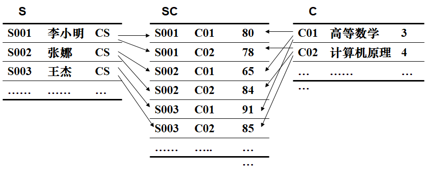
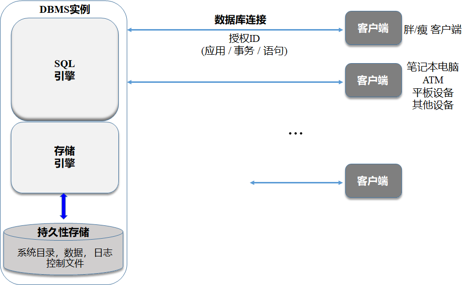
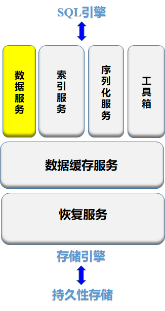

## 数据库内核概述

### 关系型数据库

数据管理技术三个阶段

- 人工管理
- 文件系统
- 数据库系统

数据库系统（DBMS）

- 数据库 DB
- 数据库管理系统 DBMS：管理数据库软件
- 数据库系统 DBS：引入数据库后的计算机系统

DBMS 主要功能：1️⃣ 数据定义功能 2️⃣ 数据组织、存储和管理 3️⃣ 数据操纵 4️⃣ 数据控制 5️⃣ 数据库的建立和维护

DBMS 主要构成

关系型数据库数据模型：是严格定义的一组概念的集合。精确描述了系统的静态特性、动态特性和完整性约束条件

数据模型三要素

1. 数据结构
2. 数据操纵
3. 数据完整性约束

按照模型应用的不同目的，数据模型可分为

- 概念模型：用于数据库设计
- 逻辑模型：数据库存储
- 物理模型：底层存储

#### 概念模型

常用的概念模型：E-R 图

联系的类型

完整的 E-R 图

#### 逻辑模型

数据库领域常用的逻辑数据模型

1. 层次模型
2. 网状模型
3. 关系模型
4. 面向对象模型
5. 对象关系模型

层次模型示意图，每个节点的双亲是唯一的，多对多表示不自然

网状模型的实现

- 将多对多联系分解成两个一对多联系
- 对于带属性的联系单独作为一组记录

结构比较复杂，而且随着应用环境的扩大，数据库的结构就变得越来越复杂，不利于最终用户掌握

关系模型：关系型数据库所用的模型，就是 MySQL 这类数据库使用的逻辑模型

优点

- 建立在严格的数学概念的基础上
- 概念单一，数据结构简单、清晰，用户易懂易用
  - 实体和各类联系都用关系来表示
  - 对数据的检索结果也是关系
- 关系模型的存取路径对用户透明
  - 具有更高的数据独立性，更好的安全保密性
  - 简化了程序员的工作和数据库开发建立的工作

缺点：存取路径对用户透明导致查询效率往往不如非关系数据模型，为提高性能，必须对用户的查询请求进行优化（例如索引），增加了开发数据库管理系统的难度

### 关系型数据库内部架构

#### 总体环境

C/S 模型

一般场景

进程模型和代理池

DBMS实例是一个可重入的系统：相同的代码副本由子进程/线程共享

DBMS系统通常带有“主”进程

- 维护一个“代理”池，每个代理本质上都是 DBMS 本身的副本
- 代理 = 进程模型（90年代早期）：每个 DB 代理都是一个子进程
- 代理 = 线程模型（90年代中期）：每个 DB 代理都是一个子线程
- 代理 = 协程模型（现在）：每个代理都是一个子协程
  - 监听传入的连接请求
  - 为新的连接请求分配一个可用的代理
  - 为了自我保护，对收到的请求进行截流
  - 在连接结束时，使代理退出执行，并存放到到代理池中

#### SQL 引擎

在刚刚的主从结构中，每个 DBMS 实例都由 SQL 引擎、存储引擎和持久性存储三个部分组成

SQL 引擎

其中

1. 系统目录服务本质上是通过一些系统表来定义数据库内容的机制
2. 编译器的功能是将一条SQL语句编译成执行计划
3. 计划服务将程序文件进行预编译和包绑定
4. 语句缓存服务保留之前SQL的编译结果（执行计划），从而避免重复编译同一条SQL语句
5. 执行服务用来执行编译的结果，即执行计划

#### 存储引擎

存储引擎承接 SQL 引擎，管理整个系统的共享资源

一个典型的存储引擎包括六个子部件

- 数据服务：针对用户数据，提供高效的访问机制
- 索引服务：针对索引，提供高效的访问机制
- 序列化服务：管理共享资源，解决访问冲突
- 工具箱：包含管理共享资源的常用工具，如磁盘碎片整理工具等
- 数据缓存服务：起到桥梁作用，上述四个服务从缓存服务读取数据；同时，缓存服务将数据从底层存储加载到内存中
- 恢复服务：当数据库服务器发生宕机时，恢复服务对用户已经提交成功的数据进行恢复

#### 垂直服务部件

垂直服务部件通常横跨 SQL 引擎和存储引擎

他包括

- 事务服务
  - 有关事务的管理，包括事务的开始、结束、写日志记录等
  - 事务的开始和结束时在SQL引擎完成的，很多任务是在存储引擎完成的
- 仪器服务
  - 数据库包含很多计数器，记录数据库运行的行为数据
  - 例如增删改SQL语句的数量、缓存命中率等
  - 这些行为数据即涉及SQL引擎，也涉及存储引擎
- 负载服务
  - 数据库允许用户从业务出发来定义负载，设置不同事务（TP、批量作业和AP）的优先级
  - 因此，需要赋予负载服务一定的权限来保证优先级的执行

#### 多节点数据库

多节点服务器

- 数据存储在多个服务器，计算也可以在多个服务器上并发进行，可以满足高可扩展性和高可用性
- 集群架构：共享一切（share everything），即多节点之间共享数据库所有数据，每个节点能访问和处理数据库中所有数据
- 分布式架构：无共享（share nothing），数据库数据分布到不同节点，并且数据不能共享，但是元数据是共享的

集群架构

耦合设施（处理全局结构） → 快速连接数据库节点

实现两级控制

- 全局级控制：进行跨节点的控制
- 节点级控制：与单节点数据库的控制一致

结构

- 时钟：快速访问全局锁
- 序列化
  1. 任何数据从磁盘读到缓存，以及从缓存写到磁盘，都需要通过耦合设施；
  2. 进行数据更新时，需要使用锁机制：加锁前要先在耦合设施中注册，声明拥有某一页的副本及对该副本的意图；在没有其它节点对对该副本进行更新操作或仅有只读操作时，才能进行加锁；加锁以后，耦合设施使其它数据副本失效，从而保证数据一致性
  3. 对数据缓存、目录缓存和语句缓存等共享数据的访问，也需要进行序列化
- 日志：本地日志文件，日志合并
- 事务：全局事务 ID，全局日志记录序列号（log record sequence number, LRSN）

高可用性（CAP 原则中的 A）：在任何情况下，特别是节点宕机、硬件升级维护和软件升级维护时，数据库系统都可以做到不关闭、相关业务和应用不中断

- 自动**容灾机制**
  - 当出现节点失效时，系统可以通过共识协议来接管失效节点，使失效节点上未提交的事务失败
  - 系统释放失效节点的主本节点角色，并为其上的主本数据分配新的主本节点
  - 其余的DB节点共享其工作负载
- 硬件升级维护
  - 加入/退出一个 DB 节点
  - 重新为下线的数据分区分配主本节点
- 软件迁移维护
  - 退出一个DB节点并迁移软件（例如：DB释放迁移）
  - 加入这个DB节点并以“共存”模式运行在DB集群中
  - 重复相同的过程，直到所有节点都成功迁移

分布式架构（CAP 原则中的 P）

分布式协议

- 分布式数据库底层通过共识协议实现去中心化
- 分布式架构没有耦合设施的概念，它的每一个节点是对称的

缺点

- 由于主副本的存在，在执行 SQL 语句时，主本节点多出了等待日志传输完成的动作
- 由于分布式存储，上层并不清楚数据的具体存放位置，在计算执行时，需要通过额外的计算来获取数据的存储位置
- 在执行时，可能要进行跨节点数据访问，而跨节点访问通过 TCP/IP 协议实现，因此效率很低
- 分布式数据库适用于互联网和物联网应用场景（高可扩展性、大量并发读操作、少量写操作），这与传统的数据库应用场景有很大差异

## 存储和索引技术

### 物理存储介质

传统磁盘 HDD 的性能标准：访问时间、传输速率、磁盘块大小

顺序访问和随机访问

### 面向磁盘的数据结构设计

> 页间组织和页内存储

页间组织结构：链表堆文件

业内存储

1️⃣ 面向元组的存储方式

- 定长元组存储
- 变长元组存储：分槽页面结构
- 超长元组存储

2️⃣ 面向列的存储

行存并不是 DB 的标准，在特定类别的负载上不是最优的选择

- OLTP：简单独写少量数据；通常只涉及一个或少量元组；点查询
- OLAP：读取大量数据；涉及大量元组；通常周期性执行于 OLTP 应用形成的充足数据上
- HTAP（OLTP + OLAP）

### 缓冲池

什么是缓冲池

- 内存中的一部分空间
- 一系列相同大小 pages 构成的数组
- 数组元素—帧（frame）

缓冲池的优化设计

- 多缓冲池
- 预取 Prefetching
- 共享游标
- 略过
- OS 页面缓存

缓存替换策略 / 页面替换算法

- LRU 最久未使用
- CLOCK 时钟置换

一些缓存问题

1. 顺序洪泛
2. 锁（脏页面）

### 索引

索引的设计目标

- 组织：如何在内存及页面中布局；存储什么信息以加速访问
- 并发：如何支持多线程的并发访问

索引分类

- 聚簇索引（主索引）
  - 搜索码还定义了文件的次序，即元组在文件中的存储按聚簇索引的搜索码顺序组织
  - 聚簇索引的搜索码通常是主键，但也可以是其他属性（组）
- 非聚簇索引（辅助索引）**:** 其搜索码的顺序与文件内元组顺序不同

索引顺序文件**:** 按照某种搜索码顺序存储的文件

- 稠密索引
- 稀疏索引

常见索引类型

- 顺序索引：搜索码按顺序组织
- B+ 树索引：平衡树结构
- 哈希表索引：搜索码按照某个哈希函数平均分布到若干个桶中

B+ 树索引

哈希表

## 查询处理和优化

SQL 引擎的工作

### 解析查询

### 逻辑重写

### 查询优化 CBO

## 工业级存储引擎

以开务数据库为例

KV Store

- 将关系数据转化为Key-Value（KV）数据
- 典型：RocksDB

分布式存储

- 分布式 KV Store
- 高可用性：数据复制
- 一致性协议：**Raft**

Raft 协议：Consul 和 Nacos 的 CP 模式使用的一致性协议

### 关系的键值存储

### RocksDB

## 事务引擎

事务处理、并发和恢复

### 事务概述

### 事务调度

### 并发控制技术

### 数据库日志和恢复

