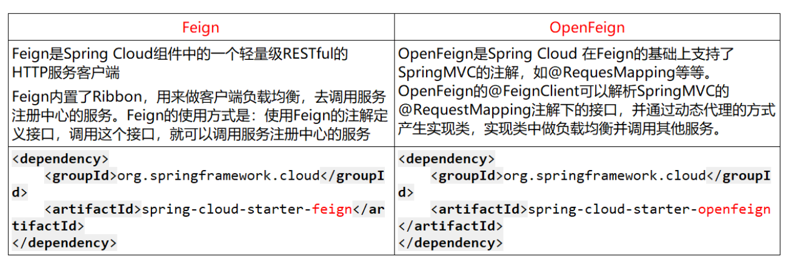

## 深入 RPC 框架

### CAP 原则

基于 CAP 原则:一致性（Consistency）、可用性（Availability）和分区容忍性（Partition Tolerance）三者不可兼得

什么是一致性、可用性和分区容忍性?

- C - 一致性：所有节点在同一时间看到的数据相同
- A - 可用性：每个请求都能得到响应（即使部分节点故障），但不保证是最新数据
- P - 分区容忍性：指系统能够处理网络分区（节点间通信中断）的情况，即使部分节点无法通信，系统仍能正常运行

CAP 理论的核心是：一个分布式系统不可能同时很好的满足一致性，可用性和分区容错性这三个需求，因此，根据 CAP 原理将 NoSQL 数据库分成了满足 CA 原则、满足 CP 原则和满足 AP 原则三大类

- CA：单点集群，满足一致性，可用性的系统，通常在可扩展性上不太强大
- CP：满足一致性，分区容忍性的系统，通常性能不是特别高
- AP：满足可用性，分区容忍性的系统，通常可能对一致性要求低一些

AP 系统和 CP 系统的例子

| 系统            | 一致性                                                       | 可用性                                                       | 分区容忍性                                          |
| --------------- | ------------------------------------------------------------ | ------------------------------------------------------------ | --------------------------------------------------- |
| Eureka（AP）    | Eureka 节点之间的数据复制是**异步的**，因此在网络分区或延迟的情况下，不同节点之间的数据可能会暂时不一致，例如，某个服务实例在一个节点上注册，但可能不会立即同步到其他节点 | Eureka 的设计目标是确保服务注册和发现功能始终可用，即使部分节点或网络出现故障；他会通过本地缓存去请求服务，以保证即使注册中心挂了，也可以获取可用的服务实例信息 | Eureka 支持多节点集群部署，节点之间通过异步复制数据 |
| Zookeeper（CP） |                                                              |                                                              |                                                     |

### 注册中心的选择

注册中心可以说是微服务架构中的”通讯录“，它记录了服务和服务地址的映射关系，一般包含如下功能

服务发现

- 服务注册/反注册：保存服务提供者和服务调用者的信息
- 服务订阅/取消订阅：服务调用者订阅服务提供者的信息，最好有实时推送的功能
- 服务路由（可选）：具有筛选整合服务提供者的能力

服务配置

- 配置订阅：服务提供者和服务调用者订阅微服务相关的配置
- 配置下发：主动将配置推送给服务提供者和服务调用者

服务健康检测：检测服务提供者的健康情况

#### Eureka

前面提到过，Eureka 是一个 AP 系统，是 Netflix 开源的**服务发现组件**，它的设计目标是高可用性和弹性，因此在 CAP 中选择了 AP

Eureka 包含两个组件：Eureka Server 和 Eureka Client

- Eureka Server 提供服务注册服务：各个微服务节点通过配置启动后，会在 EurekaServer 中进行注册，这样 EurekaServer 中的服务注册表中将会存储所有可用服务节点的信息，服务节点的信息可以在界面中直观看到
- Eureka Client 通过注册中心进行访问：本质上是一个 Java 客户端，用于简化 Eureka Server 的交互，客户端同时也具备一个内置的、使用轮询（round-robin）负载算法的负载均衡器。在应用启动后，将会向 Eureka Server 发送心跳（默认周期为30秒）。**如果 Eureka Server 在多个心跳周期内没有接收到某个节点的心跳，EurekaServer 将会从服务注册表中把这个服务节点移除（默认90秒）**

Eureka 有一个重要的特性叫**自我保护机制**（Self-Preservation），这是它作为 AP 系统的核心设计之一

- 触发条件：当 Eureka 服务器节点在短时间内丢失过多客户端心跳（例如网络分区或大规模服务故障），Eureka 会进入自我保护模式
- 行为：在自我保护模式下，Eureka 不会立即注销丢失心跳的服务实例，**而是保留这些实例，即使它们可能已经不可用**
- 目的：这是为了防止因网络分区或临时故障导致的服务实例被错误地注销，从而避免大规模服务不可用
- 影响：在自我保护模式下，Eureka 的数据可能不一致（例如保留了已宕机的服务实例），但保证了系统的可用性

#### Zookeeper

> Zookeeper 遵循 CP 原则，保证一致性和分区容错性

ZooKeeper 是一个树形目录服务，其数据模型和 Unix 的文件系统目录树很类似，拥有一个层次化结构，数据以节点的形式存放在树中

Zookeeper 服务端常用命令

- 启动 ZooKeeper 服务: ./zkServer.sh start
- 查看 ZooKeeper 服务状态: ./zkServer.sh status
- 停止 ZooKeeper 服务: ./zkServer.sh stop
- 重启 ZooKeeper 服务: ./zkServer.sh restart

Curator API：建立连接；添加节点；删除节点；修改节点；查询节点

Zookeeper 分布式锁，和 Redis 的分布式锁（Redission）类似，通过拿取/删除临时节点（Redis 是键值对）来实现锁，Curator 提供了基于五种基于 Zookeeper 的分布式锁方案

- InterProcessSemaphoreMutex：分布式排它锁（非可重入锁）
- InterProcessMutex：分布式可重入排它锁
- InterProcessReadWriteLock：分布式读写锁
- InterProcessMultiLock：将多个锁作为单个实体管理的容器
- InterProcessSemaphoreV2：共享信号量

Watch 事件监听：ZooKeeper 允许用户在指定节点上注册一些 Watcher，并且在一些特定事件触发的时候，ZooKeeper 服务端会将事件通知到感兴趣的客户端上去，该机制是 ZooKeeper 实现分布式协调服务的重要特性

ZooKeeper 提供了三种 Watcher

1. NodeCache：只是监听某一个特定的节点
2. PathChildrenCache：监控一个 ZNode 的子节点
3. TreeCache：可以监控整个树上的所有节点，类似于 PathChildrenCache 和 NodeCache 的组合

在 ZooKeeper **集群**服务中有三个角色，这是一个经典的**主从架构**

- Leader 领导者：Leader 是集群的核心，负责处理所有写请求（如创建、更新、删除节点）和事务性操作，Leader 负责将写操作同步到所有 Follower 和 Observer 节点，确保数据一致性
- Follower 跟随者：处理客户端的读请求，参与写请求的投票（ZooKeeper 使用 Zab 协议，写请求需要大多数节点确认），参与 Leader 选举
- Observer 观察者：处理客户端的读请求，不参与写请求的投票，也不参与 Leader 选举。Observer 的**主要作用是扩展 ZooKeeper 集群的读能力**，而不会增加写操作的开销

就是说，Leader 负责写，Follower 和 Observer 负责读，并且通过同步复制（区别于 Eureka 的异步复制）从 Leader 节点中同步数据，以保证系统的一致性

- Leader 相当于经典的主从架构中的 Master，而 Follower 相当于 Slave

Zookeeper 集群的读写流程

1. 写请求流程：
   - 客户端发送写请求到任意节点（Leader 或 Follower）
   - 如果请求发送到 Follower，Follower 会将请求转发给 Leader
   - Leader 将写请求作为提案（Proposal）广播给所有 Follower
   - Follower 收到提案后，会进行投票（ACK）
   - 当大多数节点（包括 Leader 自己）确认后，Leader 会提交（Commit）该写操作，并通知所有 Follower 和 Observer 同步数据
2. 读请求流程：
   - 客户端发送读请求到任意节点（Leader、Follower 或 Observer）
   - 节点直接返回本地数据，不需要与其他节点协商

Leader 的选举：Zookeeper 集群的 Leader 是动态选举的，而不是静态指派

- Serverid：服务器 ID，比如有三台服务器，编号分别为`1,2,3`，编号越大在选择算法中的权重越大
- Zxid：数据 ID，服务器中存放的最大数据 ID 值越大说明数据越新，在选举算法中数据越新权重越大

在 Leader 选举的过程中，如果某台 ZooKeeper 获得了超过半数的选票，则此 ZooKeeper 就可以成为 Leader 了

⁉ 我突然想到了 Nginx 的主进程和工作进程（因为看到了 Master 和 Slave），这是否也是一种主从架构？似乎不是，Nginx 就是一个主进程作为管理者，工作进程之间相互平等，无主从关系，实际做事的都是工作进程。就像 FTP 协议，21 端口控制，20 端口传输，你不能说这是一个主从吧

- 实际上，Nginx 是一个**单主多进程**的架构，并不涉及数据一致性和分布式协调问题，而是专注于高效处理网络请求

在 Zookeeper 集群中

#### Consul

> Consul 由 HashiCorp 公司推出，提供服务发现与配置，Consul 遵循 CP 原则，使用 Raft 算法保证数据的强一致性

Consul 的特点

- 服务发现：服务可以通过 Consul 注册自己，其他服务可以通过 Consul 发现并调用这些服务，支持 **HTTP** 和 **DNS** 两种服务发现方式
- 健康检查：Consul 提供了强大的健康检查机制，可以定期检查服务的健康状态（类似于 Eureka 的心跳检测），如果服务不可用，Consul 会自动将其从服务列表中移除（而不是 Eureka 的自我保护机制），以保证一致性，同时失去高可用性
- 键值存储：Consul 提供了一个分布式的键值存储（KV Store），可以用于存储配置信息或共享数据
- 多数据中心支持：Consul 原生支持多数据中心部署，能够跨数据中心进行服务发现和配置管理
- 一致性协议：Consul 使用 **Raft 协议** 来保证数据的一致性和高可用性（Zookeeper 用的是 Zab 算法），因此它是一个 CP 系统
- 安全性：支持 ACL（访问控制列表）和 TLS 加密，确保服务通信的安全性

和 Zookeeper 一样，是一个 CP 系统，强调一致性（C）而放弃一定的弹性（可用性 A）

#### Nacos

> Nacos 支持两种模式：**AP 模式**（基于 Distro 协议）和 **CP 模式**（基于 Raft 协议）

Nacos 是阿里巴巴开源的一款 Java 实现的动态服务发现、配置管理和服务管理平台，是 Spring Cloud Alibaba 生态的核心组件之一，支持多种服务注册与发现模式

核心特性

- 服务发现：支持基于 DNS 和 RPC 的服务发现，提供服务的注册、注销和查询功能
- 动态 DNS：支持将服务名解析为具体的 IP 地址和端口
- **一致性协议**
  - Nacos 支持两种模式：**AP 模式**（基于 Distro 协议）和 **CP 模式**（基于 Raft 协议）
  - 默认情况下，Nacos 使用 AP 模式，适合需要高可用性的场景，CP 模式适合需要强一致性的场景
- 健康检查：支持多种健康检查机制，包括心跳检测和主动探测

模式的切换是 Nacos 的核心卖点，适合需要灵活选择 AP 或 CP 模式的场景

#### 总结

几种注册中心的区别

| 组件名    | 语言 | CAP     | 服务健康检查 | 对外暴露接口 | Spring Cloud 集成 |
| --------- | ---- | ------- | ------------ | ------------ | ----------------- |
| Eureka    | Java | AP      | 可配         | HTTP         | √                 |
| Consul    | Go   | CP      | 支持         | HTTP / DNS   | √                 |
| Zookeeper | Java | CP      | 支持         | 客户端       | √                 |
| Nacos     | Java | AP / CP | 支持         | RPC / DNS    | √                 |

CA 是单点集群，满足一致性和可用性，不支持分区，仅能用于单机系统（本地玩具）

在分布式系统中，分区容忍性一定是要满足的，所以注册中心的选取实际上就是在一致性和可用性之间的选取，通常而言，要满足一致性就要牺牲一定的性能（即 CP 的性能会略逊于 AP），或者说，“弹性”

Eureka 是网飞（Netflex）开源的，某知名视频网站，这样的网站处理讲究一个实时性、讲究一个弹性，而不需要高度的一致性，比如我去请求一个视频，我管你新的旧的，先打回来再说，我都上膛了，不得不起飞，所以可以选择 AP 系统，放弃一定的一致性而换来高可用性，以保证用户不管什么时候都不会请求炸膛

但是在一些强调一致性的场景下，比如支付，一定是不能有吞订单、吞付款记录的情况出现，他的一致性一定是要优先保障的，一定是要选择所谓的 CP 系统，当订单出现异常时，一定是拒绝服务（可能是引入熔断机制），而不能随随便便进行后台数据的读写

### 服务调用的选择

#### RestTemplate

`RestTemplate` 是 Spring 提供的一个用于同步 HTTP 请求的客户端工具，**它封装了 HTTP 请求的细节**，例如请求方式（Get / Post）、请求格式（Json）等，支持 RESTful 风格的调用

核心特性

1. 同步调用：`RestTemplate` 是同步阻塞的，适合简单的 HTTP 请求场景
2. 支持多种 HTTP 方法：如 GET、POST、PUT、DELETE 等
3. 集成 Spring 生态：与 Spring 框架无缝集成，支持消息转换（如 JSON、XML）
4. 简单易用：适合快速开发和小规模项目

就像傻软奥联给的密码机接口，就是封装的 RestTemplate 打

#### Ribbon

`Ribbon` 是 Netflix 开源的客户端负载均衡器，通常与 `RestTemplate` 或 `Feign` 结合使用，用于在微服务架构中实现服务调用的负载均衡

- 什么是负载均衡？让我们回顾一下 Nginx 的负载均衡，简单的处理就是在多个后端服务中进行轮询请求，请求`1, 2, 3, 4`分别请求服务`A.1, A.2, A.1, A.2`，其中`A.1, A.2`就是两个相同功能的微服务接口

核心特性

1. 客户端负载均衡：`Ribbon` 在客户端实现负载均衡，支持多种负载均衡策略（如轮询、随机、加权等）
2. 服务发现集成：与 Eureka、Consul 等服务注册中心集成，动态获取服务实例列表
3. 故障容错：支持超时、重试等机制，提高系统的容错能力

#### Feign / OpenFeign

`Feign` 是 Netflix 开源的一个声明式的 HTTP 客户端，旨在简化服务调用。它通过注解的方式定义接口，自动生成 HTTP 请求

- 值得注意的是，Feign 内置了 Ribbon，自带负载均衡配置项

核心特性

1. 声明式调用：通过注解定义接口，无需编写具体的 HTTP 请求代码
2. 集成 Ribbon：默认集成了 Ribbon，支持客户端负载均衡
3. 支持多种编码器/解码器：如 JSON、XML 等

我理解为 HTTP 请求的一层封装，通过注解定义接口，而无需编写复杂的 HTTP 请求代码，但本质上是一样的，都是 HTTP 的同步阻塞调用

`OpenFeign` 是 `Feign` 的社区维护版本，Spring Cloud 对其进行了增强和集成。它继承了 `Feign` 的所有特性，并增加了对 Spring 生态的支持（可以理解为更适合 Spring 宝宝体质的 Feign）



核心特性

1. 声明式调用：与 `Feign` 相同，通过注解定义接口
2. 集成 Spring Cloud：支持 Spring Cloud 的**服务发现、负载均衡、熔断器、超时控制**等特性
3. 扩展性强：支持自定义编码器、解码器、拦截器等

与 Feign 的区别就是，集成在 Spring Cloud 生态中，与微服务调用相结合，并支持更多的功能和扩展性

#### Dubbo

`Dubbo` 是阿里巴巴开源的一款高性能 Java RPC 框架，主要用于分布式服务之间的远程调用，这里也说了，Dubbo 是一个 RPC 框架，他并不是打的 HTTP 请求，而是某种二进制协议（好像就叫 Dubbo 协议）

核心特性

1. 高性能 RPC：基于 Netty 实现，性能优异
2. 服务治理：支持负载均衡、服务降级、熔断、限流等功能
3. 服务发现：支持多种注册中心（如 Zookeeper、Nacos）
4. 多协议支持：支持 Dubbo 协议、HTTP、REST 等
5. 分布式事务：支持分布式事务解决方案（如 Seata）

适用于高性能的分布式服务调用和需要强大服务治理能力的场景

注册中心挂了之后，Dubbo 还能访问到服务吗？

- 分情况，如果之前调用过，Dubbo 会把服务地址缓存在本地，再次调用时不会访问注册中心，这里存在一致性的问题？

#### 总结

几种服务调用的异同

| 特性         | RestTemplate   | Ribbon                 | Feign                  | OpenFeign              | Dubbo                            |
| :----------- | :------------- | :--------------------- | :--------------------- | :--------------------- | :------------------------------- |
| **调用方式** | 同步 HTTP 调用 | 客户端负载均衡         | 声明式 HTTP 调用       | 声明式 HTTP 调用       | 高性能 RPC 调用                  |
| **负载均衡** | 不支持         | 支持                   | 支持（集成 Ribbon）    | 支持（集成 Ribbon）    | 支持                             |
| **服务发现** | 不支持         | 支持（集成 Eureka 等） | 支持（集成 Eureka 等） | 支持（集成 Eureka 等） | 支持（集成 Zookeeper、Nacos 等） |
| **性能**     | 较低           | 中等                   | 中等                   | 中等                   | 高                               |
| **适用场景** | 简单 HTTP 请求 | 客户端负载均衡         | 声明式 HTTP 调用       | Spring Cloud 生态      | 高性能分布式服务调用             |

服务调用的选择

- 如果需要简单的 HTTP 请求，选择 **RestTemplate**
- 如果需要客户端负载均衡，选择 **Ribbon**
- 如果需要声明式 HTTP 调用，选择 **Feign** 或 **OpenFeign**
- 如果需要高性能的 RPC 调用和强大的服务治理能力，选择 **Dubbo**

## 深入 Redis 集群

### 主从架构如何避免脏读

在 Redis 主从架构中：

- **主节点**：负责处理写操作（如 SET、DEL），并将写操作同步到从节点
- **从节点**：负责处理读操作（如 GET），并提供数据的副本

可以参考 Eureka 集群和 Zookeeper 集群的设计，感觉是差不多的（同属于 NoSQL）：主节点负责写，通过**复制**将数据同步到副节点，而副节点只负责数据的读取

这里的复制加粗了，为什么呢？因为在 Eureka 中是异步复制，而 Zookeeper 中是同步复制，这造就了二者**一致性**的差别，前者是 AP 系统，而后者是 CP 系统

在 Redis 集群中，这样的复制和 Eureka 一样，属于异步复制

- 由于主从同步是异步的，写操作在主节点完成后，并不会立即同步到从节点。因此，在同步完成之前，从节点可能会返回旧数据，导致**脏读**

一个很经典的避免脏读的方法：**读写锁**（写时禁止读）

这样会有很多局限性，存在以下问题：

1. **性能瓶颈**：写操作期间禁止读操作，会导致读请求被阻塞，降低系统的并发性能
2. **系统卡住**：如果主节点的写 I/O 阻塞，整个系统可能会卡住，影响可用性
3. **复杂性**：实现**分布式读写锁**会增加系统的复杂性

主从结构下，避免脏读除了读写锁还有什么方法呢？（天美 /(ㄒoㄒ)/~~）

4️⃣ 强制读主节点

对于敏感数据，强制性的让用户只能读取主节点内容，由于 Redis 是单线程的原子操作，单独读写一个节点，当然不会发生脏读啦

随之而来的是主节点负担增加，从而拖慢读写性能

1️⃣ 写后同步等待

刚刚提到，用读写锁，实际上是分布式锁的一种应用，这与“写后同步等待”不同，“写后同步等待”实际上就类似于 Eureka 的同步复制机制，主节点写完后对所有副节点进行阻塞的同步更新，更新完成后，才可以执行读操作

这可以使用 Redis 的 Wait 命令实现

```sh
SET key value
WAIT 1 1000  # 等待至少 1 个从节点同步完成，超时时间为 1000 毫秒
```

2️⃣ 版本号或时间戳机制

原理：为每个键（Key）添加版本号或时间戳，客户端在读取数据时检查版本号或时间戳，确保读取的是最新数据

优点

- 不需要阻塞读操作，性能较高
- 可以灵活控制数据的一致性级别

缺点

- 需要在客户端实现额外的逻辑
- 增加了数据存储的开销（多一个存储字段）

实现方式

在写操作时，更新键的版本号或时间戳

```sh
SET key:version 1
SET key:value "data"
```

在读操作时，检查版本号或时间戳

```sh
GET key:version
GET key:value
```

这里的读是指一次事务中的前后两次读（脏读的本质），在后一次做一个版本的检查，比如刚进入时读一次数据（这个数据上带一个版本号，或时间戳），然后在退出函数时再读一次，若版本号不同，则按后一次读出的数据为准

3️⃣ 最终一致性容忍

原理：接受一定时间内的脏读，通过业务逻辑容忍最终一致性

优点

- 性能最高，没有额外的同步开销
- 适合对一致性要求不高的场景

缺点：不适用于对一致性要求严格的场景（如金融交易）

实现方式：在业务逻辑中处理脏读问题，例如

- 对脏读不敏感的数据（如用户昵称、文章内容）可以直接使用从节点读取
- 对脏读敏感的数据（如余额、库存）可以从主节点读取

**注意，我们可以强制用户在主节点上读取数据，这样可以保证不会出现脏读，代价是主节点负担较大**，所以这里的实现采取了折中的方案，敏感数据限定读主节点，非敏感数据读副节点

那么“最终一致性容忍”是个什么情况呢，允许了一部分的脏读，但换回了相当一部分的性能

### 限流算法

令牌桶算法、漏桶算法、固定窗口算法、滑动窗口算法以及动态限流算法

- 令牌桶：每秒给多少令牌，同时给定令牌上限，令牌用完了拒绝请求
- 漏桶：每秒处理多少个水滴（请求），类似于消息队列的方式，每秒消费多少个请求
- 固定窗口：固定时间窗口，每个窗口通过的请求有限
- 滑动窗口：细粒的划分时间，在每个大窗口中控制小窗口，并可以通过小窗口的状态判断大窗口的访问控制，详见示例
- 动态限流：根据系统负载动态调节漏桶的流速，负载越高，流速越小

不同算法的异同

| 算法         | 原理                                                         | 优点                                                         | 缺点                                                         | 适用场景                                         | 示例                                                         |
| ------------ | ------------------------------------------------------------ | ------------------------------------------------------------ | ------------------------------------------------------------ | ------------------------------------------------ | ------------------------------------------------------------ |
| 令牌桶算法   | 系统以固定的速率向桶中添加令牌（Token），桶的容量是固定的。 每个请求需要从桶中获取一个令牌，如果桶中有足够的令牌，则允许请求通过；否则拒绝请求。 如果桶满了，新生成的令牌会被丢弃 | 可以应对突发流量，因为桶中的令牌可以累积。 限流速率平滑，适合需要控制平均速率的场景 | 实现相对复杂，需要维护令牌桶的状态。 突发流量可能导致短时间内大量请求通过 | 需要平滑限流的场景，如 API 网关、流量控制        | 假设桶的容量为 10，每秒生成 2 个令牌。 如果桶中有 5 个令牌，同时有 8 个请求到达，则前 5 个请求可以通过，后 3 个请求被拒绝 |
| 漏桶算法     | 请求像水一样流入漏桶，漏桶以固定的速率处理请求（漏水）。 如果桶满了，新的请求会被丢弃或排队等待 | 限流速率非常平滑，适合需要严格控制请求速率的场景。 实现简单，容易理解 | 无法应对突发流量，即使桶中有空闲容量，请求也只能以固定速率通过。 可能导致请求的延迟增加 | 需要严格控制请求速率的场景，如消息队列、任务调度 | 假设漏桶的容量为 10，处理速率为每秒 2 个请求。 如果桶中有 5 个请求，同时有 8 个请求到达，则前 5 个请求可以进入桶中，后 3 个请求被拒绝。 桶中的请求以每秒 2 个的速率被处理 |
| 固定窗口算法 | 将时间划分为固定的窗口（如 1 秒），每个窗口内允许通过的请求数量是固定的。 如果窗口内的请求数量超过限制，则拒绝多余的请求 | 实现简单，容易理解。 适合对限流精度要求不高的场景            | 无法应对窗口边界处的突发流量。例如，如果窗口大小为 1 秒，限制为 100 个请求，则可能在窗口的最后 100ms 内收到 100 个请求，而在下一个窗口的前 100ms 内又收到 100 个请求，导致实际通过的请求数量是限制的两倍。 限流不够平滑 | 对限流精度要求不高的场景，如简单的 API 限流      | 假设窗口大小为 1 秒，限制为 100 个请求。 如果在 1 秒内收到 120 个请求，则前 100 个请求可以通过，后 20 个请求被拒绝 |
| 滑动窗口算法 | 将时间划分为多个小窗口（如 100ms），每个小窗口内允许通过的请求数量是固定的。 通过滑动窗口的方式动态计算当前时间窗口内的请求数量，如果超过限制，则拒绝多余的请求 | 比固定窗口算法更精确，能够更好地应对突发流量。 限流更加平滑  | 实现相对复杂，需要维护滑动窗口的状态。 计算开销较大          | 对限流精度要求较高的场景，如高并发 API 限流      | 假设窗口大小为 1 秒，划分为 10 个小窗口，每个小窗口的限制为 10 个请求。 如果在当前时间窗口内已经收到 90 个请求，则新的请求会被拒绝 |
| 动态限流算法 | 根据系统的实时负载动态调整限流速率。 例如，当系统负载较高时，降低限流速率；当系统负载较低时，提高限流速率 | 能够根据系统状态动态调整限流策略，更加灵活。 适合负载波动较大的场景 | 实现复杂，需要实时监控系统状态。 调整限流速率的策略需要精心设计 | 负载波动较大的场景，如电商大促、秒杀活动         | 假设系统负载超过 80% 时，将限流速率从每秒 100 个请求降低到每秒 50 个请求 |

限流算法的选择

- 如果需要平滑限流并支持突发流量，选择**令牌桶算法**
- 如果需要严格控制请求速率，选择**漏桶算法**
- 如果对限流精度要求不高，选择**固定窗口算法**或**计数器算法**
- 如果对限流精度要求较高，选择**滑动窗口算法**
- 如果需要根据系统状态动态调整限流策略，选择**动态限流算法**

### 缓存穿透、击穿和雪崩

缓存三兄弟，下次再说吧

## Kubernetes

Kubernetes 是用于自动部署、扩展和容器化应用程序的开源系统

容器，**轻量**的虚拟化技术

- 为应用程序提供运行环境
- 隔离运行在主机上不同进程

重点在于：进程之间、进程和宿主操作系统相互隔离、互不影响

容器技术具有**简化部署、快速启动、服务组合、易迁移**等优点

### Docker

Docker 三个最主要的概念

- 容器：运行在虚拟机上的进程
- 镜像：数据的一种存储形式，类似于程序之于进程
- 仓库：镜像库

Docker 能够普遍使用起来，很大程度上个得益于 Docker 的仓库里汇集了很多已经标准化的镜像，大大提升了部署效率

### K3s 集群

当我们使用的容器服务多了，面临的访问量增大以后，我们就需要一种工具把这些容器统一的管理起来，需要实现对这些容器的自动部署、扩展和管理。也就是俗称的容器编排

- Kubernetes 就是这样一种容器编排系统

K3s 是 Rancher 实验室的一个**轻量级** Kubernetes 发行版，是由CNCF完全认证的Kubernetes产品，适合在资源受限的硬件上使用（例如IoT设备），它保留了Kubernetes的核心功能，但通过去除一些不必要的组件（如云服务提供商集成）来减小二进制文件的大小

- K3s 有一个基础二进制包，其大小不到 100MB

当然了，有好就有坏，轻量级带来的是功能的缺失，例如 K3s 目前不支持在主节点上运行除 SQLite 以外的任何其他数据库，也不支持多个主节点（在选择默认容器编排器时，定义需求和目标非常重要）

快速部署

```sh
curl -sfL https://get.k3s.io | sh -

# 检查就绪代码
takes maybe 30 seconds

k3s kubectl get node
```

### K8s 集群

Kubernetes 或 K8s 是最流行的管理容器的编排工具。它具有可移植性、灵活性和可扩展性，同时支持命令式/声明式配置和自动化，作为 CNCF 的一个毕业项目，拥有庞大的生态系统
