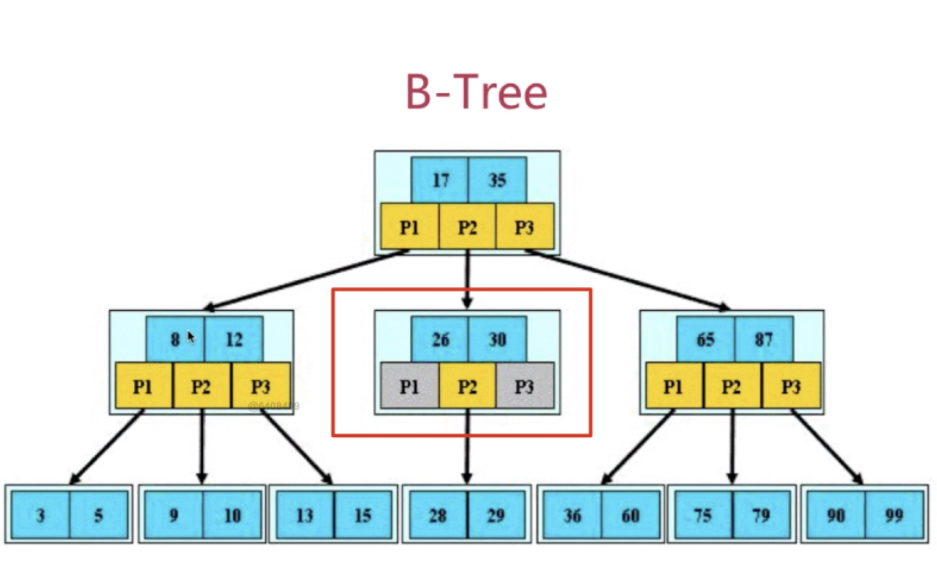
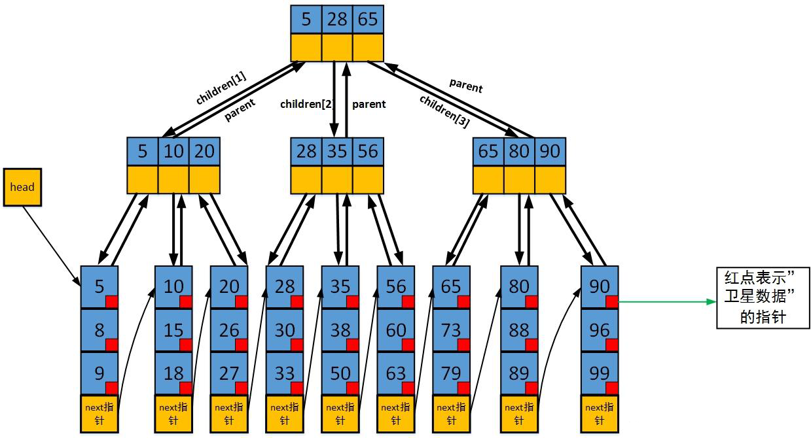

> 软件业的人乐于做这样的事 —— 找一些词汇，并把它们引申到大量微妙而又互相矛盾的意义 —— 《Patterns of Enterprise Application Architecture》

## 分布式系统概述

分布式系统的定义：多个计算机通过网络协同工作而对外表现为一个整体

典型应用

- 分布式数据库（如 MongoDB、HBase）
- 分布式存储（如 Hadoop HDFS、Ceph）
- 分布式计算（如 Spark、Flink）
- 微服务架构（如 Spring Cloud、Dubbo）

### 什么是分布式系统

要解释什么是分布式系统，得从分布式架构说起，它定义了分布式系统的设计与实现方法，它描述了系统的结构、组件如何交互、数据如何存储、计算如何分配等。可以说，架构是钢筋，而系统是楼房，系统依赖于架构

常见的分布式架构模式

1. 主从架构（Master-Slave）：适用于数据库读写分离，如 MySQL 主从复制
2. 分片架构（Sharding）：适用于高并发场景，如 Elasticsearch 数据分片
3. 微服务架构（Microservices）：适用于企业级应用，如 Spring Cloud/Dubbo
4. 事件驱动架构（EDA, Event-Driven Architecture）：适用于高吞吐业务，如 Kafka 消息队列处理日志流

在这些架构模式之上，构建了一个个所谓的分布式系统，如最常见的应用淘宝、京东等，都是采用**微服务架构**的分布式系统

通常，Spring 小子（没错就是我）开发的所谓分布式系统，都是指的微服务架构（Spring Cloud）上的分布式系统

### 为什么要使用分布式设计

分布式系统的核心特点

- 多机协作：任务由多个计算机协作完成，而非单机处理
- 数据共享：不同节点之间共享数据，可能涉及数据一致性问题
- 去中心化：避免单点故障，提高系统可用性
- 并发性：多个节点可以并行处理任务，提高吞吐量
- 容错能力：某些节点宕机时，系统仍能继续运行

说白了，就是扩展性好、稳定性高、容错强 —— 所谓“狡兔三窟”

## Spring Cloud

### 什么是 Spring Cloud

刚刚也说到，Spring Cloud 是 Java 生态中最成熟的**微服务架构**解决方案之一

- **微服务架构（Microservices Architecture）** 是一种软件架构风格，它将应用拆分为**多个独立运行的服务**，每个服务负责单一业务功能，服务之间通过 API（通常是 HTTP+JSON 或 gRPC）进行通信

Spring Cloud 就是专门用于**构建、管理和维护微服务架构**的框架，提供了一整套完整的微服务架构解决方案，涵盖**服务注册发现、负载均衡、配置管理、熔断限流、分布式链路追踪**等关键功能

| 组件                         | 作用           | 具体而言                                 |
| ---------------------------- | -------------- | ---------------------------------------- |
| Spring Cloud Eureka          | 服务注册与发现 | 负责管理微服务实例，类似于 DNS           |
| Spring Cloud LoadBalancer    | 负载均衡       | 让多个实例均衡接收请求                   |
| Spring Cloud OpenFeign       | 服务调用       | 通过 HTTP 远程调用其他微服务             |
| Spring Cloud Gateway         | API 网关       | 统一流量入口，路由请求并提供安全控制     |
| Spring Cloud Config          | 配置管理       | 统一管理分布式系统的配置                 |
| Spring Cloud Sleuth & Zipkin | 分布式链路追踪 | 监控请求的调用链路，排查性能瓶颈         |
| Spring Cloud Resilience4J    | 熔断限流       | 保护服务避免雪崩效应（Circuit Breaker）  |
| Spring Cloud Stream          | 消息队列       | 让服务间异步通信（支持 Kafka、RabbitMQ） |

SpringCloud 主要基于 SpringBoot

### 一个经典的 Spring Cloud 架构

假设我们有一个电商系统，包含

- 用户服务（User Service）
- 订单服务（Order Service）
- 商品服务（Product Service）
- 支付服务（Payment Service）
- 网关（Gateway）

其体系架构如下

```sql
                         +-----------------------+
                         | Spring Cloud Gateway  |
                         +-----------------------+
                                 |
        +------------------+------------------+
        |                  |                  |
+------------+      +------------+      +------------+
| 用户服务    |      | 订单服务    |      | 商品服务    |
| (User)     | <--> | (Order)    | <--> | (Product)  |
+------------+      +------------+      +------------+
        |                  |
        |                  +------------------+
        |                                     |
+------------+                      +----------------+
| 支付服务    |                      | 消息队列(Kafka) |
| (Payment)   | <-----------------> | 事件驱动        |
+------------+                      +----------------+
```

在这个架构中

- **Spring Cloud Gateway** 充当 API 入口，管理所有 HTTP 请求
- **Eureka** 作为注册中心，负责管理所有微服务实例，实现**服务发现**
- **Feign** 让服务之间可以更优雅地相互调用（直接从 Eureka 中寻找），而不用自己写 HTTP 请求
- **Resilience4J** 确保服务故障时自动熔断，防止级联故障
- **Kafka** 实现异步消息通信（如订单完成后通知支付服务）

### NIO 和 Netty

> Spring Cloud 生态中众多微服务组件的底层通信组件

Netty：基于 Java NIO 开发的网络流框架，是 Java 领域非常强大的**高性能网络通信框架**，很多中间件（Dubbo、Elasticsearch、RocketMQ、gRPC 等）都用它作为底层通信组件

简单来说：Netty 是 **一个封装了 Java NIO 的网络框架**，让开发者能轻松构建高性能的 TCP/UDP 网络服务，而不用自己去写繁琐的 Selector、Channel、Buffer 这些低级 API

**什么是 NIO？**

NIO（New Input/Output） 是 Java 1.4 引入的一组 API，用于提供**非阻塞（Asynchronous）**的输入输出操作，它让我们能更高效地处理大量的 I/O 操作。

NIO 主要的优势在于能够**不阻塞线程**来处理 I/O 操作，它是为了弥补传统的阻塞 I/O（BIO）和 高并发场景下性能瓶颈而设计的

- **怎么实现的非阻塞？**

**Selector** 和 **Channel** 是 NIO 的核心组成，通过**事件驱动**实现异步非阻塞 I/O 操作

**Netty 高性能的关键**

🔹 1. 线程池 + 事件驱动

Netty 采用多 Reactor 线程模型，通过 **EventLoopGroup + 线程池**，避免传统 BIO 的**一线程一连接**低效模式

- BIO（阻塞 IO）：一个线程处理一个连接
- NIO（非阻塞 IO）：多个连接共享一个线程
- Netty（多 Reactor 模型）：多个线程池高效管理连接

📌 示例：Netty 线程池

```java
EventLoopGroup bossGroup = new NioEventLoopGroup(1);  // 处理连接
EventLoopGroup workerGroup = new NioEventLoopGroup(); // 处理读写
```

🔹 2. 零拷贝（Zero-Copy）

Netty 通过 **DirectByteBuf、CompositeByteBuf** 进行零拷贝优化

- 减少 CPU 拷贝（避免 `System.arraycopy`）
- 减少内存分配（减少 GC 压力）
- **减少 **Buffer** 复制**（直接操作堆外内存）

📌 **示例：**Netty 直接使用堆外内存

```java
ByteBuf buffer = Unpooled.directBuffer(1024); // 直接分配堆外内存
```

🔹 3. Pooled Buffer（池化内存）

Netty 使用内存池（Buffer Pool），重复利用 ByteBuf，避免反复创建对象。

📌 示例：使用池化的 ByteBuf

```java
ByteBuf pooledBuf = PooledByteBufAllocator.DEFAULT.buffer(256);
```

🔹 4. TCP 粘包/拆包处理

TCP 发送数据时，多个小包可能合并成一个大包（**粘包**），或者一个大包被拆成多个小包（**拆包**）。Netty 通过**解码器**解决此问题。

📌 示例：使用 Netty 提供的拆包解码器

```java
ch.pipeline().addLast(new LengthFieldBasedFrameDecoder(1024, 0, 4, 0, 4));
```

上面这个 LengthFieldBasedFrameDecoder 解码器

- 按照数据包长度字段解析消息
- 避免 TCP 粘包/拆包问题

## 常用组件和中间件

### Nacos

> 注册中心是**微服务通信的核心**，不管是 Eureka、Feign 还是 Dubbo，他们的服务端和客户端均要在注册中心进行动态管理

Nacos 是 SpringCloud Alibaba 的组件，而 SpringCloud Alibaba 遵循 SpringCloud 中定义的服务注册、服务发现规范，因此使用 Nacos 和使用 Eureka 对于微服务接口而言，并没有太大区别

差异无非

- 依赖不同
- 服务地址不同

具体而言，每个微服务通过这样的方式集中管理

1️⃣ 首先引入 Nacos 客户端依赖并进行配置

```xml
<dependency>
    <groupId>com.alibaba.cloud</groupId>
    <artifactId>spring-cloud-starter-alibaba-nacos-discovery</artifactId>
    <version>2022.0.0.0</version> <!-- 根据 Spring Cloud 版本选择 -->
</dependency>
```

```yaml
server:
  port: 8081

spring:
  application:
    name: user-service
  cloud:
    nacos:
      discovery:
        server-addr: localhost:8848  # Nacos 服务器地址
        namespace: public           # 命名空间（默认 public）
        group: DEFAULT_GROUP        # 分组（默认 DEFAULT_GROUP）
```

2️⃣ 在主类中启动 Nacos 注册服务

```java
package com.example.userservice;

import org.springframework.boot.SpringApplication;
import org.springframework.boot.autoconfigure.SpringBootApplication;
import org.springframework.cloud.client.discovery.EnableDiscoveryClient;

@SpringBootApplication
@EnableDiscoveryClient // 启用服务注册与发现（兼容 Nacos）
public class UserServiceApplication {

    public static void main(String[] args) {
        SpringApplication.run(UserServiceApplication.class, args);
    }
}
```

3️⃣ 正常编写`Controller`层代码，如

```java
@RestController
@RequestMapping("/users")
class UserController {

    private final Map<Long, User> userMap = new HashMap<>();

    // 创建用户
    @PostMapping
    public User createUser(@RequestBody User user) {
        userMap.put(user.getId(), user);
        return user;
    }

    // 查询用户
    @GetMapping("/{id}")
    public User getUser(@PathVariable Long id) {
        return userMap.get(id);
    }
}
```

如此，当前项目`user-service`的接口就被注册在地址为`localhost:8848`的 Nacos 中，其他模块可以通过 Feign 客户端对该接口进行调用

```java
@FeignClient(name = "user-service") // 服务名需与目标服务在 Nacos 中的名称一致
public interface UserServiceClient {

    @GetMapping("/{id}}")
    User getUserById(@PathVariable Long userId);
}
```

### Feign

> SpringCloud OpenFeign，本质上是 RestTemplate 的上位替代，封装了 HTTP 请求在各微服务接口之间进行调用，属同步调用，不属于 RPC（远程过程调用）

刚刚简单展示了调用 user-service 的 Feign 客户端编写，以下引入另一个模块 order-service 来更清晰的展示调用过程

以同样的方式，我们创建一个 order-service 模块运行在 8082 端口，并提供一个订单查询接口注册到 Nacos

```yaml
server:
  port: 8082

spring:
  application:
    name: order-service
  cloud:
    nacos:
      discovery:
        server-addr: localhost:8848  # Nacos 服务器地址
        namespace: public           # 命名空间（默认 public）
        group: DEFAULT_GROUP        # 分组（默认 DEFAULT_GROUP）
```

```java
@RestController
@RequestMapping("/orders")
class OrderController {
    // 查询用户账单
    @GetMapping("/{userId}")
    public List<Order> getOrders(@PathVariable Long id) {
        return OrderService.getOrdersByUserId(id);
    }
}
```

以下展示如何在 user-service 模块中调用上面注册到 Nacos 的 order-service 服务

1️⃣ 引入 Feign 依赖并在主类中启用（在 UserService 模块中）

```xml
<dependency>
    <groupId>org.springframework.cloud</groupId>
    <artifactId>spring-cloud-starter-openfeign</artifactId>
</dependency>
```

```java
@SpringBootApplication
@EnableDiscoveryClient
@EnableFeignClients // 启用 Feign 客户端
public class UserServiceApplication {
    // ...
}
```

3️⃣ 编写 Feign 客户端调用上面 order-service 的服务

```java
@FeignClient(name = "order-service") // 服务名需与目标服务在 Nacos 中的名称一致
public interface OrderServiceClient {
    @GetMapping("/orders/{userId}")
    List<Order> getOrdersByUserId(@PathVariable Long userId);
}
```

4️⃣ 在 Controller 层调用 Feign 客户端

```java
@RestController
@RequestMapping("/users")
class UserController {

    @Autowired
    private OrderServiceClient orderServiceClient;

    @GetMapping("/{id}/orders")
    public List<Order> getUserOrders(@PathVariable Long id) {
        return orderServiceClient.getOrdersByUserId(id);
    }
}
```

如此便实现了微服务之间的一次简单的调用，对于用户而言，他请求的实际上是`/users/{id}/orders`接口，在微服务内部，这个请求被转发到`/orders/{id}`接口，并最终将结果通过`/users/{id}/orders`返回

### Gateway

Gateway 网关是微服务的门神，负责

- **权限控制**：网关作为微服务入口，需要校验用户是是否有请求资格，如果没有则进行拦截
- **路由和负载均衡**：一切请求都必须先经过gateway，但网关不处理业务，而是根据某种规则，把请求转发到某个微服务，这个过程叫做路由。当然路由的目标服务有多个时，还需要做负载均衡
- **限流**：当请求流量过高时，在网关中按照下流的微服务能够接受的速度来放行请求，避免服务压力过大

基本架构


maven 引入

```xml
<!--网关-->
<dependency>
    <groupId>org.springframework.cloud</groupId>
    <artifactId>spring-cloud-starter-gateway</artifactId>
</dependency>
<!--nacos服务发现依赖 自己也要注册到nacos-->
<dependency>
    <groupId>com.alibaba.cloud</groupId>
    <artifactId>spring-cloud-starter-alibaba-nacos-discovery</artifactId>
</dependency>
```

application 配置

```yaml
server:
  port: 10010 # 网关端口
spring:
  application:
    name: gateway # 服务名称
  cloud:
    nacos:
      server-addr: localhost:8848 # nacos地址
    gateway:
      routes: # 网关路由配置
        - id: order-service
          uri: lb://orderservice
          predicates:
            - Path=/user/**
            - After=2021-01-20T17:42:47.789-07:00[America/Denver] #断言：只有在这个事件后发送的请求才可以
        - id: user-service # 路由id，自定义，只要唯一即可
          # uri: http://127.0.0.1:8081 # 路由的目标地址 http就是固定地址
          uri: lb://userservice # 路由的目标地址 lb就是负载均衡，后面跟服务名称
          predicates: # 路由断言，也就是判断请求是否符合路由规则的条件
            - Path=/user/** # 这个是按照路径匹配，只要以/user/开头就符合要求
          filters: # 过滤器（当前过滤器写在userservice路由下，因此仅仅对访问userservice的请求有效）
            - AddRequestHeader=Conan, isMe! # 添加请求头
      default-filters: # 默认过滤项（对所有路由都有效）
        - AddRequestHeader=Truth, Itcast is freaking awesome!
```

有一个问题：Gateway 的权限拦截和 SpringSecurity 有什么区别，能否相互替代？

## RPC 框架

RPC（Remote Procedure Call，远程过程调用）是一种**允许分布式系统中的不同服务像调用本地方法一样调用远程服务**的技术。RPC 框架封装了底层的网络通信、序列化和反序列化，使开发者可以透明地进行远程调用，而不需要手动处理复杂的网络编程

### Why RPC?

在分布式系统中，不同的服务可能部署在不同的服务器上，它们需要相互通信。例如

- 电商系统：订单服务需要调用库存服务检查库存，再调用支付服务处理支付
- 微服务架构：多个微服务之间需要相互调用，比如用户认证服务、订单服务、商品服务等

它对标的是 **HTTP/REST** 通信，我们当然可以直接通过打请求的方式获取数据，例如

```java
RestTemplate restTemplate = new RestTemplate();
String result = restTemplate.getForObject("http://server/user?id=1", String.class);
```

当然了，这是原始的实现方式，Spring Cloud 提供有优雅的上位代替 —— Feign，但他仍然是通过 HTTP 实现的服务通信

只要是基于 HTTP，就会存在

- 请求体较大（HTTP 请求头、JSON 序列化等）
- 性能损耗（HTTP 需要解析文本，序列化和反序列化的开销大）
- 协议不够高效（HTTP 是基于文本的，而 RPC 可以采用更高效的二进制协议）

而 RPC 解决了这些问题

- **更高效**：使用**二进制协议**（如 Protobuf），减少数据传输体积
- **更透明**：像调用本地方法一样调用远程服务
- **更易扩展**：内置**负载均衡、服务注册与发现、流量控制**等功能

### 工作原理

RPC 框架主要包含**客户端、服务端、注册中心**三个核心组件

1. 客户端（Client Stub）
   - 发送请求给服务端，就像调用本地方法一样
   - 负责序列化请求数据（将 Java 对象转换成字节流）
2. 服务端（Server Stub）
   - 监听客户端请求，调用对应的本地方法，并返回结果
   - 负责反序列化请求数据（将字节流转换成 Java 对象）
3. 注册中心（Service Registry）
   - 维护所有可用的服务列表
   - 客户端在调用时**动态发现服务**，而不是写死 IP 地址
   - 常用的注册中心：Zookeeper、Nacos

RPC 典型流程

```
1️⃣ 客户端调用本地方法（伪装成普通的 Java 方法）
2️⃣ RPC 框架将请求数据序列化并发送到服务端
3️⃣ 服务端接收请求，反序列化数据，并调用目标方法
4️⃣ 目标方法执行后返回结果
5️⃣ 服务端将返回结果序列化并发送回客户端
6️⃣ 客户端接收结果，返回给调用方
```

常见 RPC 框架

| RPC 框架    | 语言                          | 主要特点                                                   |
| ----------- | ----------------------------- | ---------------------------------------------------------- |
| **gRPC**    | 多语言（Java、Go、Python等）  | Google 开发，基于 HTTP/2 和 Protobuf，高性能，支持流式通信 |
| **Dubbo**   | Java                          | 阿里巴巴开发，支持服务发现、负载均衡、流量控制             |
| **Motan**   | Java                          | 美团开源，轻量级，适用于高并发场景                         |
| **Thrift**  | 多语言（Java、C++、Python等） | Facebook 开发，支持多种语言，适用于跨语言 RPC              |
| **Tars**    | 多语言（Java、C++、Go等）     | 腾讯开源，支持大规模分布式应用                             |
| **Hessian** | Java                          | 简单易用，适用于小型应用，序列化采用二进制格式             |

### Dubbo

Dubbo 是阿里巴巴开源的 Java RPC 框架，基于 Netty 实现，用于微服务间通信，不同 Feign 的 HTTP 通信，Dubbo 采用更加轻量迅捷的二进制协议进行数据传输，故而效率要远高于 Feign

- 和 Feign 一样，Dubbo 也是同步调用

调用流程基本一致

**代码示例**

1️⃣ 添加依赖

```xml
<dependency>
    <groupId>org.apache.dubbo</groupId>
    <artifactId>dubbo-spring-boot-starter</artifactId>
    <version>2.7.8</version>
</dependency>
```

2️⃣ 定义接口

```java
public interface UserService {
    String getUser(int id);
}
```

3️⃣ 实现服务端

```java
@DubboService
public class UserServiceImpl implements UserService {
    @Override
    public String getUser(int id) {
        return "张三";
    }
}
```

4️⃣ 实现客户端

```java
@DubboReference
private UserService userService;

public void test() {
    System.out.println(userService.getUser(1));
}
```

当然了，在客户端需要对注册中心（如 Nacos）在 application.yaml 进行配置，这样在碰到`@DubboReference`注解时，系统会自动去注册中心查询需要的服务地址

```yaml
dubbo:
  application:
    name: consumer-service  # 客户端应用名
  registry:
    address: nacos://127.0.0.1:8848  # 这里配置的是注册中心的地址
  protocol:
    name: dubbo
    port: -1  # -1 表示随机端口
```

具体调用流程是

1. 服务端（Provider）启动时，它会把自己的服务信息（接口、地址、端口等）注册到 Nacos/Zookeeper
2. 客户端（Consumer）启动时，它会去**注册中心查询**需要的服务地址
3. 当代码运行到 `@DubboReference` 时，Dubbo 代理会**根据注册中心的信息找到远程服务**，然后建立连接并执行调用

💡 **当尝试修改服务端的 IP 地址时，客户端能够自动发现请求地址变化，这是注册中心完成的工作，对于 RPC 客户端是完全透明的** 🚀

另外，Dubbo 内置了**负载均衡、重试机制、超时控制**的功能，均可以在 application.yaml 中进行配置

### Zookeeper

与 Nacos 同属于注册中心，Nacos 由阿里开发

- Nacos 和 Zookeeper 的异同？

## 索引与事务

### 索引

在 MySQL 建表是，会对主键（primary key）自动添加索引，实际上就是一个额外的存储主键有序数据结构，采用类似二分搜索的快速规模压缩算法对主键进行检索（实际上是一棵 B+ 树）

这是 B 树：需要保证叶子结点都在同一层



B+ 树在 B 树的基础上

- 把所有的关键字都放在最后一层（叶子层），所有非叶子结点都是“索引”
- 在叶子结点那层加了一个链指针把叶子层连接在一起，可以避免当树规模过大时，搜索效率降低



### 事务

在 Spring 中，可用`@Transactional` 声明事务，它极大地简化了事务管理，直接在 Service 层对应的方法上进行注解，即可完成一次事务的编写

```java
@Deprecated
@Transactional
@Override
public int doWithdrawal(TransactionDTO transactionDTO) {
    int r = accountMapper.updateBalanceById(transactionDTO.getMyAccount(), transactionDTO.getAmount().negate());
    log.info(transactionDTO.toString());
    Transaction transaction = new Transaction(transactionDTO.getMyAccount(),
                                              0L,
                                              transactionDTO.getName(),
                                              "外部账户",
                                              transactionDTO.getAmount(),
                                              "用户取款",
                                              r == 1 ? 0 : 1);
    return transactionMapper.insertTransaction(transaction);
}
```

但在使用时需要注意一些关键点，否则可能导致事务失效或出现意外行为

- `@Transactional` 只能修饰 public 方法
- `@Transactional` 不能自身调用，比如方法 A 和 B 都在 UserService 类中，如果在 A 中调用 B 方法，即使 B 方法有`@Transactional` 修饰，这个事务也不会生效，这和 Java 的动态代理机制有关

设置超时（timeout）：设置事务的超时时间（单位：秒），超过时间未完成则回滚

```java
@Transactional(timeout = 5)
public void methodC() {
    // 事务超时时间为 5 秒
}
```

只读（readOnly）：标记事务为只读，优化数据库性能（如 MySQL 的只读事务会禁用写锁）

- **注意**：只读事务中不能执行写操作，否则会抛出异常

```java
@Transactional(readOnly = true)
public void methodD() {
    // 只读事务
}
```

事务回滚规则：默认情况下，`@Transactional` 回滚的是 RunTimeException，如果需要特殊要求，需要指定

```java
// 回滚 I/O 和 SQL 异常
@Transactional(rollbackFor = {IOException.class, SQLException.class})
// 不回滚空指针异常
@Transactional(noRollbackFor = {NullPointerException.class})
```

`@Transactional` 的 `isolation` 属性用于定义事务的隔离级别，常见的隔离级别如下

| 隔离级别                         | 防止脏读 | 防止不可重复读 | 防止幻读         |
| -------------------------------- | -------- | -------------- | ---------------- |
| **read uncommitted**             | ✗        | ✗              | ✗                |
| **read committed**               | ✓        | ✗              | ✗                |
| **repeatable read** (MySQL 默认) | ✓        | ✓              | 部分 ✓（间隙锁） |
| **serializable**                 | ✓        | ✓              | ✓                |

```java
@Transactional(isolation = Isolation.REPEATABLE_READ)
public void methodB() {
    // 在可重复读隔离级别下执行
}
```

什么是脏读、不可重复读和幻读？

- 脏读：读到了写过程中的临时数据

  解决办法：给写加锁，写时不能读

- 不可重复读：就是说，在一个事务中，前后重复读同一数据，数据存在改变

  原因：读时可写 —> 解决办法：给读加锁

- 幻读：针对多数据，之前给读/写都加了锁，但那个锁是作用于单个数据的，即单个数据项有读/写锁从而防止脏读和不可重复读，但存在多查询的情况，比如`count(*)`操作，即使数据项 a 在被写，数据项 b 在被读，但不影响数据 c 被插入数据表，那么同一事务的前后两次`count(*)`就有可能返回不一样的结果（2 和 3），这就叫幻读

  解决方法：对整个数据表加读写锁，彻底串行执行，效率极低

### Seata

## 熔断和限流

### 熔断：Resilience4J

熔断（Circuit Breaker）和限流（Rate Limiting）是分布式系统中**保障服务高可用性和稳定性**的重要手段，主要用于**防止雪崩效应**，确保在高并发场景下系统能平稳运行

- 熔断（Circuit Breaker）类似于**家里的电路保险丝**，当电流过大时，保险丝会断开电路，以防电器损坏。在**分布式系统**中，熔断机制用于**检测服务是否故障，并在故障严重时自动阻止请求，以防止系统崩溃**

熔断器通常有以下**三种状态**

1. 关闭（Closed）：服务正常运行，请求可以自由通过
2. 打开（Open）：当错误率达到阈值，熔断器打开，所有请求都会被拒绝，防止系统继续崩溃
3. 半开（Half-Open）：经过一段时间后，系统尝试放行部分请求进行测试，如果恢复正常，熔断器关闭，否则保持打开状态

Spring Cloud 以前使用 **Hystrix** 作为熔断组件，但现在推荐使用 **Resilience4J**。

**1️⃣ 添加依赖**

```xml
<dependency>
    <groupId>io.github.resilience4j</groupId>
    <artifactId>resilience4j-spring-boot2</artifactId>
    <version>1.7.1</version>
</dependency>
```

**2️⃣ 代码示例**

```java
@CircuitBreaker(name = "paymentService", fallbackMethod = "fallbackPayment")
public String callPaymentService() {
    // 调用远程支付服务
    return restTemplate.getForObject("http://payment-service/pay", String.class);
}

// 熔断后的降级方法
public String fallbackPayment(Exception e) {
    return "支付服务不可用，请稍后重试";
}
```

**3️⃣ 配置熔断阈值**

```yaml
resilience4j.circuitbreaker:
  instances:
    paymentService:
      failureRateThreshold: 50  # 失败率达到 50% 时触发熔断
      waitDurationInOpenState: 5000ms  # 熔断后 5 秒再尝试恢复
      permittedNumberOfCallsInHalfOpenState: 3  # 半开状态时允许 3 个请求进行尝试
```

👉 这样，当支付服务失败率超过 50% 时，请求会自动走 `fallbackPayment` 方法，而不会继续尝试访问已故障的支付服务

### 限流：Gateway

限流（Rate Limiting）是一种**限制请求速率**的技术，防止单个服务被过量请求拖垮，确保系统能够平稳运行

为什么需要限流？

- 防止流量暴增导致系统崩溃（如双十一购物、秒杀活动）
- 防止恶意攻击（如爬虫、DDoS 攻击）
- 合理分配系统资源，保障 VIP 用户的优先级

Spring Cloud Gateway 内置了基于 **Redis 令牌桶算法**的限流功能

**1️⃣ 添加 Redis 依赖**

```xml
<dependency>
    <groupId>org.springframework.boot</groupId>
    <artifactId>spring-boot-starter-data-redis-reactive</artifactId>
</dependency>
```

**2️⃣ 配置限流规则**

```yaml
spring:
  cloud:
    gateway:
      routes:
        - id: order-service
          uri: lb://order-service
          predicates:
            - Path=/orders/**
          filters:
            - name: RequestRateLimiter
              args:
                redis-rate-limiter.replenishRate: 10  # 每秒补充 10 个令牌
                redis-rate-limiter.burstCapacity: 20  # 允许的最大突发流量
                key-resolver: "#{@apiKeyResolver}"  # 限流的 key 规则
```

**3️⃣ 自定义 Key 解析器**

```java
@Bean
KeyResolver userKeyResolver() {
    return exchange -> Mono.just(exchange.getRequest().getRemoteAddress().getHostName());
}
```

👉 这样，每个 IP 地址每秒最多只能访问 10 次 API，超出后会被限流

| 特性     | 熔断（Circuit Breaker） | 限流（Rate Limiting）       |
| -------- | ----------------------- | --------------------------- |
| 目的     | 保护服务，防止雪崩      | 保护系统，防止过载          |
| 触发条件 | 远程服务故障率高        | 访问量超出限制              |
| 作用     | 暂停访问故障服务        | 限制请求速率                |
| 适用场景 | 微服务间调用            | API 网关、秒杀活动          |
| 实现工具 | Resilience4J、Hystrix   | Spring Cloud Gateway、Redis |

### 熔断 VS 限流

什么时候使用熔断？什么时候使用限流？

- 熔断：当你调用的**远程服务变慢或崩溃**时，防止请求继续堆积导致整个系统挂掉
- 限流：当你的服务**流量暴增**时，防止服务器资源被耗尽

现实案例

- 淘宝双十一：高并发**限流**，防止流量冲垮系统
- 微信支付：如果支付接口故障，启用**熔断**，显示“支付系统繁忙”

**总结**

- 熔断用于**保护服务**，防止雪崩效应
- 限流用于**平稳流量**，防止高并发拖垮系统
- **Spring Cloud Resilience4J** 提供**熔断**机制，**Spring Cloud Gateway** 提供**限流**功能

当然了，也可以用阿里的开源中间件 Seatinel 实现限流熔断，方法多种多样
