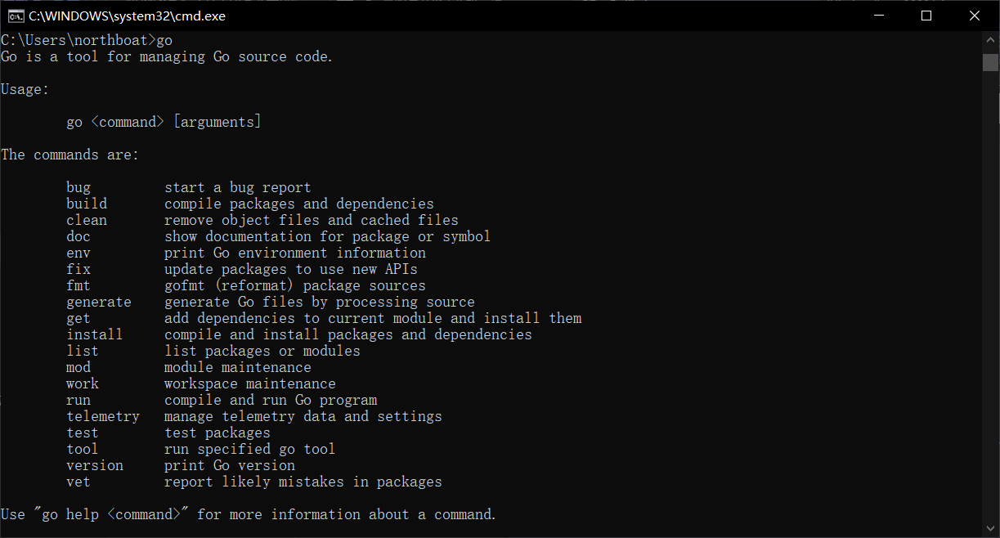
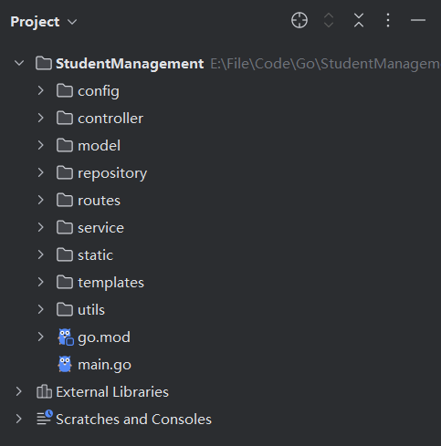

## Gin 基础

实现一个简单的学生管理系统后端

1. 包管理：学习`go mod`进行包管理
2. 接口编写：采用 MVC 架构编写实现一个成绩管理系统后端，暂不考虑数据库交互
3. 系统化理解 Gin

感觉类似于 Flask

### First Gin

在项目根目录命令行导入 gin

```sh
go get -u github.com/gin-gonic/gin
```

Go 的包管理工具整合在 go 命令中，可以通过 go get 直接导入 http 包，并自动更新 go.mod 文件（类似于 pip install）



在 Main 函数中启动 Gin 服务器，定义一个简单的 ping 路由（接口）

```go
package main

import (
	"github.com/gin-gonic/gin"
	"net/http"
)


func main() {
	r := gin.Default()

	// 定义一个简单的路由
	r.GET("/ping", func(c *gin.Context) {
		c.JSON(http.StatusOK, gin.H{
			"message": "pong",
		})
	})

	// 启动服务，监听 8080 端口
	r.Run(":8080")
}
```

在浏览器中访问`localhost://8080/ping`就会得到 Json 格式的返回`{"message":"pong"}`

学生管理系统后端的项目目录结构参考如下



其中

- config 放配置文件 config.yaml 并导入 gin
- utils 编写工具类
- model 编写 dto 等实体类
- repository 编写数据库操作
- service 编写具体业务操作
- controller 编写具体的 api 实现
- routes 整合 controller 方法，向外暴露 http 接口

基本的 MVC 架构，和 Java 类似

### 配置文件 config

安装 yaml 文件解析工具

```sh
go get gopkg.in/yaml.v3
```

在 config 目录下编写配置文件 config.yaml，等同于 application.yaml

```yaml
server:
  port: 12345

mysql:
  host: "127.0.0.1"
  port: 3306
  user: "root"
  password: ""

#redis:
#  host: "127.0.0.1"
#  port: 6379
#  password: ""
#  db: 0
```

而后编写 config.go 通过`yaml.v3`包进行解析，将配置写进全局变量 AppConfig 中

```go
package config

import (
	"fmt"
	"gopkg.in/yaml.v3"
	"os"
)

type Config struct {
	Server ServerConfig `yaml:"server"`
	MySQL  MySQLConfig  `yaml:"mysql"`
}

type ServerConfig struct {
	Port int    `yaml:"port"`
	Host string `yaml:"host"`
}

type MySQLConfig struct {
	Host     string `yaml:"host"`
	Port     int    `yaml:"port"`
	Username string `yaml:"username"`
	Password string `yaml:"password"`
}

var AppConfig Config

func LoadConfig() {
	file, err := os.ReadFile("config/config.yaml")
	if err != nil {
		panic(fmt.Sprintf("无法加载配置文件: %v", err))
	}
	err = yaml.Unmarshal(file, &AppConfig)
	if err != nil {
		panic(fmt.Sprintf("解析 YAML 失败: %v", err))
	}
}
```

我们在其余文件中直接调用这个全局变量 AppConfig 来实现项目的配置

### Model 层

> Pojo / DTO 对象

### Data Access Object

> Dao 层，数据库对象操作，repository 目录

### Service 封装

### 接口和路由

> controller & routes

### 前后端交互

> html/template

## 数据库 CRUD

重构成绩管理系统的 Dao 层

- 数据库连接
  1. MySQL：使用`gorm`（Go 的 ORM 库）进行数据库操作
  2. Redis：使用`github.com/redis/go-redis/v9`
- 重写上述成绩管理系统的数据交互层，从 MySQL 和 Redis 中存取学生数据

只重写下层，保证上层调用不变

### MySQL

MySQL - gorm


### Redis

Redis - github.com/redis/go-redis/v9

### RabbitMQ


## 微服务开发

使用 `Gin` 编写 RESTful API，并实现完整的业务逻辑

- Gin框架基础：路由、请求处理、中间件、JWT 认证
- 服务架构：分层设计（控制器、服务、数据访问）
- 日志与配置管理：使用`viper`进行配置管理，`zap`进行日志记录
- 微服务通信
  1. gRPC：用于高性能服务间通信
  2. Kafka / RabbitMQ：消息队列支持异步任务

搭建一个用户认证微服务，支持 JWT 认证和用户管理

### gRPC

远程调用框架，一些“竞品”

- OpenFeign（HTTP）
- Dubbo（二进制协议）

和注册中心搭配使用，如 Nacos（AP/CP）、Zookeeper（AP）、Eureka（CP）

### 构建与部署

`go build`命令构建

Docker 镜像构建

## K3s 部署运维

学习如何在 k3s 运行 Go 微服务，并进行监控

- K3s 基础：安装 K3s，创建 Pod、Service、Ingress
- 容器化：
  - 使用 `Docker` 构建 Go 微服务
  - 使用 `Helm` 部署微服务
- 服务监控：
  - Prometheus + Grafana 进行监控
  - Loki + Promtail 进行日志采集

### K3s 基础

### 测试部署

