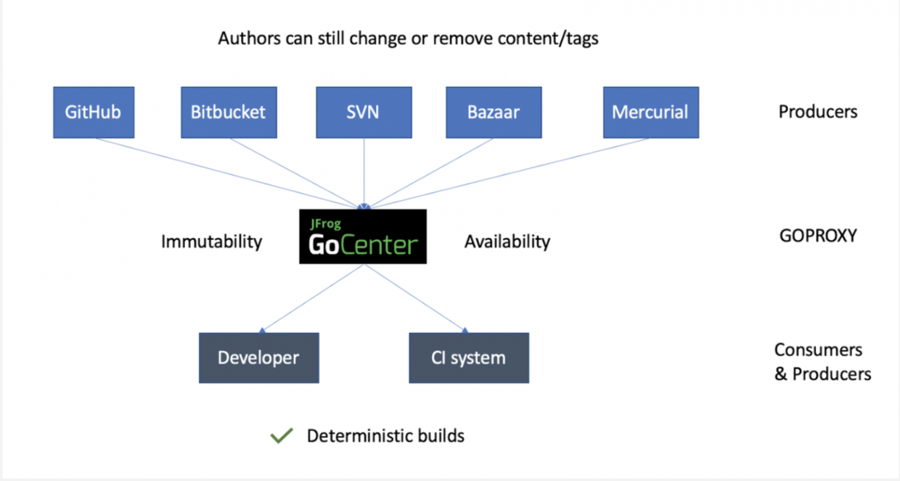

## 环境搭建

### Golang

镜像站下载：[All releases - The Go Programming Language](https://golang.google.cn/dl/)

测试版本环境

```go
go version
go env
```

### Goland

官网下载：[Other Versions - GoLand](https://www.jetbrains.com/go/download/other.html)

破解：[GoLand 2024.3.3 最新破解版安装教程（附激活码，至2099年~） - 犬小哈教程](https://www.quanxiaoha.com/goland-pojie/goland-pojie-202433.html)

🙌 PS：可以下个 Python Community Edition 插件，这玩意儿可以用来写 Python，Python 的环境可参考 Anaconda 的配置

## 语法和包管理

### 基础语法

一个明显的差异，定义变量无需指定变量类型，同时使用`:=`进行定义

```go
s := "Hello Goland"
i := 1
```

语句通过换行分割，不用分号（类似于 Python），但仍然使用括号，并不采用缩进来表示嵌套层级

第一个 Go 程序

```go
package main

import (
	"fmt"
)

func main() {
	s := "Hello Golang!"
	fmt.Println(s)
	for i := 1; i <= 5; i++ {
		fmt.Println("i =", 100/i)
	}
}
```

### 包管理工具

从 Go1.13 开始，Go Module 作为 Golang 中的标准包管理器，在安装时自动启用，并附带一个默认的 GOPROXY

- GOPROXY 即为 GOPROXY 的下载源
- Go Module 通过配置文件 go.mod 进行包管理

公共 GOPROXY 是一个集中式的存储库，全球各地的 Golang 开发者都可以使用它，它缓存了大量开源的 Go 模块，这些模块可以从第三方公开访问的 VCS 项目存储库中获得

- 大多数此类 GOPROXY，比如 JFrog GoCenter，http://Goproxy.cn 都是免费提供给Golang开发者社区的

此类 GOPROXY 的架构拓扑如下图，提供了 Go Module 的一致性以及可用性能力



在 Goland 中配置 GOPROXY

go.mod 配置

## Restful API

### Gin

gin-gonic/gin

### MySQL

database/sql

### Redis

go-redis

## 打包与部署


### Docker Package

将写好的 Go API 服务打包成 Docker 镜像并部署运行

