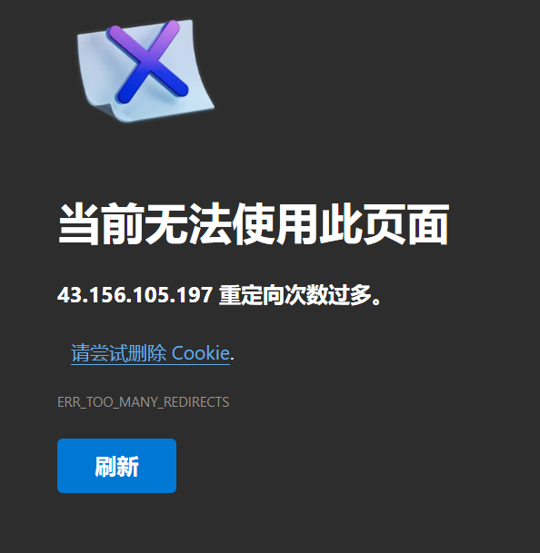

## Spring Date

### JDBC

application.yml 配置 mysql：密码是数字要加双引号

- Hikari 默认，更快
- druid，自带日志监控
- mysql驱动问题：其中 Drive 在 mysql8.x 版本要加上 cj

~~~yml
spring:
  application:
    name: PostOffice
  datasource:
    username: root
    password: "011026"
    url: jdbc:mysql://39.106.160.174:3306/PostOffice?serverTimezone=UTC&useUnicode=true&characterEncoding=utf-8
    driver-class-name: com.mysql.cj.jdbc.Driver
    type: com.alibaba.druid.pool.DruidDataSource
    filters: stat,wall,log4j
~~~

pom.xml

~~~xml
<!--SpringDate-->
<!--jdbc-->
<dependency>
    <groupId>org.springframework.boot</groupId>
    <artifactId>spring-boot-starter-jdbc</artifactId>
</dependency>
<!--MySQL-->
<dependency>
    <groupId>mysql</groupId>
    <artifactId>mysql-connector-java</artifactId>
    <scope>runtime</scope>
</dependency>
<!--日志log4j-->
<dependency>
    <groupId>log4j</groupId>
    <artifactId>log4j</artifactId>
    <version>1.2.17</version>
</dependency>

<!--druid德鲁伊数据源-->
<dependency>
    <groupId>com.alibaba</groupId>
    <artifactId>druid</artifactId>
    <version>1.1.21</version>
</dependency>

<!--测试-->
<dependency>
    <groupId>org.springframework.boot</groupId>
    <artifactId>spring-boot-starter-test</artifactId>
</dependency>
~~~

配置后台监控页面

~~~java
@Configuration
public class DruidConfig {

    @ConfigurationProperties(prefix = "spring.datasource")
    @Bean
    public DataSource druidDataSource(){
        return new DruidDataSource();
    }

    //后台监控
    //相当于web.xml
    @Bean
    public ServletRegistrationBean servlet(){
        ServletRegistrationBean bean = new ServletRegistrationBean<>(new StatViewServlet(), "/druid/*");

        Map<String, String> properties = new HashMap<>();
        properties.put("loginUsername", "admin");
        properties.put("loginPassword", "011026");

        //允许谁能访问
        properties.put("allow", "");
        //禁止谁能访问
        //properties.put("NorthBoat", "39.106.160.174");

        bean.setInitParameters(properties);
        return bean;
    }
}
~~~

log4j报错

~~~bash
log4j:WARN No appenders could be found for logger (org.apache.ibatis.logging.LogFactory).
log4j:WARN Please initialize the log4j system properly.
log4j:WARN See http://logging.apache.org/log4j/1.2/faq.html#noconfig for more info.
~~~

原因：未配置log4j.properties

~~~properties
log4j.rootLogger=debug, stdout, R

log4j.appender.stdout=org.apache.log4j.ConsoleAppender
log4j.appender.stdout.layout=org.apache.log4j.PatternLayout

# Pattern to output the caller's file name and line number.
log4j.appender.stdout.layout.ConversionPattern=%5p [%t] (%F:%L) - %m%n

log4j.appender.R=org.apache.log4j.RollingFileAppender
log4j.appender.R.File=example.log

log4j.appender.R.MaxFileSize=100KB
# Keep one backup file
log4j.appender.R.MaxBackupIndex=5

log4j.appender.R.layout=org.apache.log4j.PatternLayout
log4j.appender.R.layout.ConversionPattern=%p %t %c - %m%n
~~~

使用原生jdbc进行CRUD

注意全局查找返回结果类型`List<Map<String, Object>>`，以及插入列名用飘号括起防止关键字造成sql语句报错

~~~java
@RestController
public class JDBCController {

    @Autowired
    JdbcTemplate jdbcTemplate;

    @GetMapping("/list")
    public List<Map<String, Object>> list(){
        String sql = "select * from Postman";
        return jdbcTemplate.queryForList(sql);
    }
    
    @GetMapping("/add")
    public String add(){
        String sql = "insert into PostOffice.Postman(num,`count`,`name`,`to`,`subject`,`text`) values (3,0,'xzt','1543625674@qq.com','hello','hahaha')";
        jdbcTemplate.update(sql);
        return "add ok";
    }
}
~~~

### Jpa

依赖

```xml
<!-- Spring Boot Starter Data JPA for working with JPA -->
<dependency>
    <groupId>org.springframework.boot</groupId>
    <artifactId>spring-boot-starter-data-jpa</artifactId>
</dependency>

<dependency>
    <groupId>com.mysql</groupId>
    <artifactId>mysql-connector-j</artifactId>
    <scope>runtime</scope>
</dependency>
```

直接继承 JpaRepository 类，自动实现 CRUD 功能，需要将 Pojo 类注解为 Entity，主键注解为 Id 传入（如这里的 User）

```java
@Entity
public class User{
    @Id
    String id;
    String pwd;
}
```


```java
public interface UserRepository extends JpaRepository<User, Long> {
    User findById(String id);
}
```

查看源码，发现自带了常见的 CRDU 方法

- flush
- save
- delete
- get
- find

```java
public interface JpaRepository<T, ID> extends ListCrudRepository<T, ID>, ListPagingAndSortingRepository<T, ID>, QueryByExampleExecutor<T> {
    void flush();

    <S extends T> S saveAndFlush(S entity);

    <S extends T> List<S> saveAllAndFlush(Iterable<S> entities);

    /** @deprecated */
    @Deprecated
    default void deleteInBatch(Iterable<T> entities) {
        this.deleteAllInBatch(entities);
    }

    void deleteAllInBatch(Iterable<T> entities);

    void deleteAllByIdInBatch(Iterable<ID> ids);

    void deleteAllInBatch();

    /** @deprecated */
    @Deprecated
    T getOne(ID id);

    /** @deprecated */
    @Deprecated
    T getById(ID id);

    T getReferenceById(ID id);

    <S extends T> List<S> findAll(Example<S> example);

    <S extends T> List<S> findAll(Example<S> example, Sort sort);
}
```

在 Service 直接用就行

```java
@Service
public class UserService implements UserDetailsService {
    private final UserRepository userRepository;

    @Autowired
    public UserService(UserRepository userRepository){
        this.userRepository = userRepository;
    }


    public User findById(String id){
        User user = userRepository.findById(id);
        if(user == null){
            throw new RuntimeException("User not found");
        }
        return user;
    }
}
```

### MyBatis

> MyBatis 是一款优秀的持久层框架，它支持自定义 SQL、存储过程以及高级映射，并且免除了几乎所有的 JDBC 代码以及设置参数和获取结果集的工作，转而通过简单的 XML 或注解来配置和映射原始类型、接口和 Java POJO（Plain Old Java Objects，普通老式 Java 对象）为数据库中的记录

整合mybatis

~~~xml
<!--mybatis-->
<dependency>
    <groupId>org.mybatis.spring.boot</groupId>
    <artifactId>mybatis-spring-boot-starter</artifactId>
    <version>2.1.1</version>
</dependency>
~~~

#### XML

@Mapper

~~~java
//这个注解表示这是一个mybatis的mapper类
@Mapper
@Repository
public interface MailMapper {
    List<Postman> queryPostmanList();
    int removePostman(int num);
    int addPostman(Postman postman);
}
~~~

在启动类中 @MapperScan

~~~java
@SpringBootApplication
@MapperScan("com.northboat.shadow.mapper")
public class PostOfficeApplication {
    public static void main(String[] args) {
        SpringApplication.run(PostOfficeApplication.class, args);
    }
}
~~~

application.yml

~~~yml
#整合mybatis
mybatis:
  type-aliases-package: com.postoffice.vo
  mapper-locations: classpath:mybatis/mapper/*.xml
~~~

MailMapper

~~~java
//这个注解表示这是一个mybatis的mapper类
@Mapper
@Repository
public interface MailMapper {

    List<Mail> queryMailList();

    void removeMail(int num);

    void addMail(Mail mail);

    void updateMailCount(Map<String, Integer> map);
}
~~~

MailMapper.xml，位于resources/mybatis/mapper：传递多个参数用Map封装，用`#{key}`取值

~~~xml
<?xml version="1.0" encoding="UTF-8" ?>
<!DOCTYPE mapper
        PUBLIC "-//mybatis.org//DTD Mapper 3.0//EN"
        "http://mybatis.org/dtd/mybatis-3-mapper.dtd">
<mapper namespace="com.postoffice.mapper.MailMapper">
    <select id="queryMailList" resultType="Mail">
        select * from `mail`
    </select>

    <delete id="removeMail" parameterType="int">
        delete from mail where `num` = #{num}
    </delete>

    <insert id="addMail" parameterType="Mail">
        insert into mail(`num`, `count`, `name`, `to`, `from`, `subject`, `text`) values(#{num}, #{count}, #{name}, #{to}, #{from}, #{subject}, #{text})
    </insert>

    <update id="updateMailCount" parameterType="java.util.Map">
        update `mail` set `count`=#{count} where `num`=#{num}
    </update>
</mapper>
~~~

字段映射

resultMap

~~~xml
<!-- 通用查询映射结果 -->
<resultMap id="BaseResultMap" type="com.seckill.pojo.User">
    <id column="id" property="id" />
    <result column="nickname" property="nickname" />
    <result column="password" property="password" />
    <result column="slat" property="slat" />
    <result column="head" property="head" />
    <result column="register_date" property="registerDate" />
    <result column="last_login_date" property="lastLoginDate" />
    <result column="login_count" property="loginCount" />
</resultMap>
~~~

sql id

~~~xml
<!-- 通用查询结果列 -->
<sql id="Base_Column_List">
    id, nickname, password, slat, head, register_date, last_login_date, login_count
</sql>
~~~

maven 导出资源问题

~~~xml
<build>
        <resources>
            <resource>
                <directory>src/main/resources</directory>
                <includes>
                    <include>**/*.properties</include>
                    <include>**/*.xml</include>
                </includes>
                <filtering>true</filtering>
            </resource>
            <resource>
                <directory>src/main/java</directory>
                <includes>
                    <include>**/*.properties</include>
                    <include>**/*.xml</include>
                </includes>
                <filtering>true</filtering>
            </resource>
        </resources>
    </build>
~~~

找不到Mapper.xml问题：要用 / 分割

~~~xml
<mappers>
    <mapper resource="com/dao/UserMapper.xml"/>
</mappers>
~~~

#### 注解

可以直接使用注解对相应方法进行映射，如

```java
@Mapper
@Repository
public interface UserMapper {

    /*获取用户列表*/
    @Select("select `name` from `user`")
    List<String> getAllUsersName();

    /*添加用户*/
    @Insert("insert into `user`(`account`, `name`, `password`, `root`, `level`) values(#{account}, #{name}, #{password}, #{root}, #{level})")
    void addUser(User user);

    /*查询用户*/
    //根据昵称查询用户
    @Select("select * from `user` where `name`=#{name}")
    User getUserByName(String name);
    //根据账号查询用户
    @Select("select * from `user` where `account`=#{account}")
    User getUserByAccount(String account);
}
```

### Redis

引入依赖

```xml
<!-- Redis -->
<dependency>
    <groupId>org.springframework.boot</groupId>
    <artifactId>spring-boot-starter-data-redis</artifactId>
</dependency>
```

Redis 服务器配置

```yaml
spring:
  data:
    redis:
      host: localhost
      port: 6379
      password: "123456"
```

编写自己的 Redis Template，即 Redis 配置（RedisConfig.java）

```java
import com.fasterxml.jackson.annotation.JsonAutoDetect;
import com.fasterxml.jackson.annotation.PropertyAccessor;
import com.fasterxml.jackson.databind.ObjectMapper;
import com.fasterxml.jackson.databind.jsontype.impl.LaissezFaireSubTypeValidator;
import org.springframework.context.annotation.Bean;
import org.springframework.context.annotation.Configuration;
import org.springframework.data.redis.connection.RedisConnectionFactory;
import org.springframework.data.redis.core.RedisTemplate;
import org.springframework.data.redis.serializer.Jackson2JsonRedisSerializer;
import org.springframework.data.redis.serializer.StringRedisSerializer;

import java.net.UnknownHostException;

@Configuration
public class RedisConfig {

    // 一个固定的模板，在工作中可以直接使用，几乎包含了所有场景
    // 编写我们自己的RedisTemplate
    @Bean
    @SuppressWarnings("all")
    public RedisTemplate<String, Object> myRedisTemplate(RedisConnectionFactory redisConnectionFactory) throws UnknownHostException {
        RedisTemplate<String, Object> template = new RedisTemplate<>();
        template.setConnectionFactory(redisConnectionFactory);

        //Json序列化配置
        Jackson2JsonRedisSerializer jackson2JsonRedisSerializer = new Jackson2JsonRedisSerializer(Object.class);
        ObjectMapper objectMapper = new ObjectMapper();
        objectMapper.setVisibility(PropertyAccessor.ALL, JsonAutoDetect.Visibility.ANY);
        //objectMapper.enableDefaultTyping(ObjectMapper.DefaultTyping.NON_FINAL);
        objectMapper.activateDefaultTyping(LaissezFaireSubTypeValidator.instance, ObjectMapper.DefaultTyping.NON_FINAL);
        jackson2JsonRedisSerializer.setObjectMapper(objectMapper);

        //String序列化配置
        StringRedisSerializer stringSerializer = new StringRedisSerializer();

        // key和Hash的key使用String序列化
        template.setKeySerializer(stringSerializer);
        template.setHashKeySerializer(stringSerializer);

        // value和Hash的value使用Jackson序列化
        template.setValueSerializer(jackson2JsonRedisSerializer);
        template.setHashValueSerializer(jackson2JsonRedisSerializer);

        template.afterPropertiesSet();
        return template;
    }
}
```

Redis 工具类：[Bears-OJ | Redis Util](https://github.com/northboat/Bears-OJ/blob/master/backend/src/main/java/com/oj/neuqoj/utils/RedisUtil.java)

## Spring Security

什么是 Spring Security

- Spring Security 是一个用于保护应用程序的安全性 Java 框架，提供了一套全面的安全解决方案，包括身份验证、授权、防止攻击等功能
- Spring Security 基于过滤器链的概念，可以轻松地集成到任何基于 Spring 的应用程序中，并且支持多种身份验证选项和授权策略，开发人员可以根据需要选择适合的方式
- 此外，Spring Security 还提供了一些附加功能，如集成第三方身份验证提供商和单点登录，以及会话管理和密码编码等

Maven 依赖

```xml
<dependency>
    <groupId>org.springframework.boot</groupId>
    <artifactId>spring-boot-starter-security</artifactId>
</dependency>
```

在 Spring Boot 3.x 之后，Spring Security 6 废弃了之前继承 WebSecurityConfigurerAdapter 写配置的写法，转而使用基于组件的安全配置，此外，还删除了 `authorizeRequests()` 并代之以 `authorizeHttpRequests()` 来定义授权规则（Authorization Rule）

通过数据库表 User 进行登陆权限认证

### UserDetailService

pojo，需要声明为 Entity

```java
@Data
@AllArgsConstructor
@NoArgsConstructor
@Entity
public class User {
    @Id
    private String id;
    private String pwd;
}
```

dao，继承 JpaRepository

```java
public interface UserRepository extends JpaRepository<User, Long> {
    User findById(String id);
}

```

security，自定义 UserDetails

```java
public class CustomUserDetails implements UserDetails {
    private String id;
    private String pwd;
    private Collection<? extends GrantedAuthority> authorities;

    // 构造函数
    public CustomUserDetails(String id, String pwd, Collection<? extends GrantedAuthority> authorities) {
        this.id = id;
        this.pwd = pwd;
        this.authorities = authorities;
    }

    @Override
    public Collection<? extends GrantedAuthority> getAuthorities() {
        return authorities;
    }

    @Override
    public String getPassword() {
        return pwd;
    }

    @Override
    public String getUsername() {
        return id;
    }

    @Override
    public boolean isAccountNonExpired() {
        return true; // 账号是否过期
    }

    @Override
    public boolean isAccountNonLocked() {
        return true; // 账号是否被锁定
    }

    @Override
    public boolean isCredentialsNonExpired() {
        return true; // 密码是否过期
    }

    @Override
    public boolean isEnabled() {
        return true; // 账号是否可用
    }
}
```

Service，继承 UserDetailsService，实现 loadUserByUsername 方法，返回一个 UserDetails 类

```java
@Service
public class UserService implements UserDetailsService {
    private final UserRepository userRepository;

    @Autowired
    public UserService(UserRepository userRepository){
        this.userRepository = userRepository;
    }

    @Override
    public UserDetails loadUserByUsername(String id) throws UsernameNotFoundException {
        // 从数据库获取用户
        User user = userRepository.findById(id); // 你可以根据id来查找用户
        if (user == null) {
            throw new UsernameNotFoundException("User not found");
        }

        // 这里你可以根据需要设置权限，暂时设置一个默认角色
        return new CustomUserDetails(user.getId(), user.getPwd(), Collections.singletonList(new SimpleGrantedAuthority("ROLE_USER")));
    }
}
```

### SecurityConfig

Config，在配置类中 @Bean 通过 authenticationManager 方法注入

```java
@Configuration
@EnableWebSecurity
public class SecurityConfig {

    private UserService userService;

    @Autowired
    public SecurityConfig(UserService userService){
        this.userService = userService;
    }

    // 规定单向编码方式
    @Bean
    public PasswordEncoder passwordEncoder() {
        return new BCryptPasswordEncoder();
    }

    // 用户权限拦截
    @Bean
    public AuthenticationManager authenticationManager(HttpSecurity http) throws Exception {
        AuthenticationManagerBuilder authenticationManagerBuilder =
                http.getSharedObject(AuthenticationManagerBuilder.class);
        authenticationManagerBuilder.userDetailsService(userService)
                .passwordEncoder(passwordEncoder());  // 配置 UserDetailsService 和密码编码器
        return authenticationManagerBuilder.build();
    }
}
```

页面拦截和资源放行，同样 @Bean 通过 securityFilterChain 方法链式注入

- 注意，通常要把 css、js 等资源放行，可能会出现难以复现的重定向问题

```java
@Configuration
@EnableWebSecurity
public class SecurityConfig {
    @Bean
    public SecurityFilterChain securityFilterChain(HttpSecurity http) throws Exception {
        http
                .authorizeHttpRequests()
                        .requestMatchers("/login", "/image", "/assets/**", "/images/**").permitAll()
                    .anyRequest().authenticated()
                .and()
                .formLogin()
                    .loginPage("/login")
                    .loginProcessingUrl("/customLogin")
                    .defaultSuccessUrl("/home")  // 登录成功后跳转到主页
                    .failureUrl("/login?error=true")  // 登录失败后跳转回登录页面
                    .permitAll()
                .and()
                .logout()
                    .logoutUrl("/logout")
                    .logoutSuccessUrl("/login?logout=true")
                    .invalidateHttpSession(true)  // 注销时使HTTP会话失效
                    .clearAuthentication(true)  // 清除认证信息
                    .deleteCookies("JSESSIONID");  // 删除会话中的cookie（比如JSESSIONID）

        return http.build();
    }
}
```

遇到了一个问题，部署后登录时发生重定向次数过多



疑似是跳转登

## Deploy

### 导出 jar 包

jpbc 导出需要配置 maven

```xml
<!-- JPBC 打包 -->
<dependency>
    <groupId>jpbc.api</groupId>
    <artifactId>api</artifactId>
    <version>2.0.0</version>
    <scope>system</scope>
    <systemPath>${pom.basedir}/lib/jpbc-api-2.0.0.jar</systemPath>
</dependency>

<dependency>
    <groupId>jpbc-plaf</groupId>
    <artifactId>plaf</artifactId>
    <version>2.0.0</version>
    <scope>system</scope>
    <systemPath>${pom.basedir}/lib/jpbc-plaf-2.0.0.jar</systemPath>
</dependency>
```

除此以外，Maven 打包将默认不包含`<scope>`为 system 的包，所以还要额外在 build 插件中配置

```xml
<build>
    <plugins>
        <plugin>
            <groupId>org.springframework.boot</groupId>
            <artifactId>spring-boot-maven-plugin</artifactId>
            <version>${spring-boot.version}</version>
            <configuration>
                <mainClass>cia.northboat.auth.AuthApplication</mainClass>
                <skip>false</skip>
                <includeSystemScope>true</includeSystemScope>
            </configuration>
            <executions>
                <execution>
                    <id>repackage</id>
                    <goals>
                        <goal>repackage</goal>
                    </goals>
                </execution>
            </executions>
        </plugin>
    </plugins>
</build>
```


后台运行

```bash
nohup java -jar Auth-Platform-0.0.1-SNAPSHOT.jar &
```

查看进程

```bash
ps -ef | grep java
```

根据进程号查询

```bash
netstat -anop | grep 3802588
```

根据端口查询状态

```bash
netstat -tuln | grep 8080
```

杀死进程

```bash
kill -9 3802588
```

### 防火墙

防火墙配置，首先是控制台要打开，然后是 iptables 规则

```bash
sudo iptables -L -n
```

确保 8080 端口允许外部访问，若不允许用以下命令开放

```bash
sudo iptables -A INPUT -p tcp --dport 8080 -j ACCEPT
sudo iptables-save
```

最后检查 ufw

```bash
sudo ufw status
sudo ufw allow 8080/tcp
```

### HTTPS

其实是因为我打算从博客里请求`/image`接口去动态的展示随机图片，这个接口从数据库表中随机取一个图片路径，返回图片的二进制流，非常简单捏

但是 GitHub Page 的默认域名，即`xxx.github.io`强制使用 HTTPS，即我直接在服务器上部署 jar 包（HTTP），他会打不过去，从而加载不了图片

所以需要配置 HTTPS，又因为我没域名，所以只能用自生成的证书，步骤如下

服务器上生成证书

```sh
keytool -genkeypair -alias springboot -keyalg RSA -keysize 2048 \
        -dname "CN=localhost, OU=MyOrg, O=MyCompany, L=City, ST=State, C=US" \
        -validity 365 -keystore keystore.p12 -storetype PKCS12 \
        -storepass 123456
```

会在当前目录得到一个 PKCS12 格式的证书 keystore.p12，将这个证书拷入 resources 目录，对 SpringBoot 配置

```yaml
server:
  port: 8443
  ssl:
    key-store: classpath:keystore.p12
    key-store-password: "123456"
    key-store-type: PKCS12
    key-alias: springboot
```

打包上传部署，通过`ip:8443`进行访问，成功，经测试 GitHub Page 同样允许自编译的 SSL 证书
