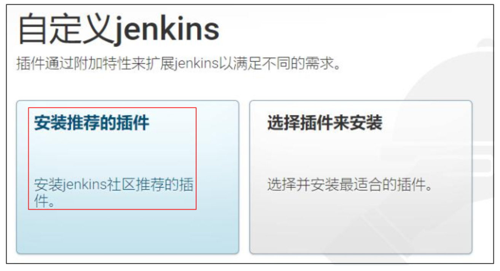

[Jenkins自动化部署入门详细教程 - java老兵 - 博客园](https://www.cnblogs.com/wfd360/p/11314697.html)

## CI/CD 和 Jenkins

### 什么是 CI/CD

CI/CD（Continuous Integration and Continuous Delivery），即持续集成和持续交付

1. 快速交付：CI/CD 自动化流程可以使软件交付过程更快、更频繁，减少了手动操作和人工干预的时间。这样可以更快地将新功能、修复和改进的代码交付给用户，满足市场需求并保持竞争优势
2. 提高质量：持续集成通过频繁地集成和构建代码，并进行自动化测试和静态代码分析，有助于发现和解决问题。通过尽早发现和修复缺陷，可以提高软件的质量和稳定性
3. 自动化部署：持续交付将部署过程自动化，从而减少了手动部署的错误和风险。通过自动化部署流程，可以确保软件在不同环境中的一致性，并减少了部署时间和工作量
4. 可靠性和可重复性：CI/CD 强调自动化和标准化的流程，使软件交付过程变得可靠和可重复。每次构建、测试和部署都是基于相同的流程和环境，减少了人为因素的影响，提高了软件交付的一致性和可靠性
5. 团队协作与反馈：CI/CD 促进了团队成员之间的协作和沟通。通过频繁地集成和交付，团队成员可以及时了解彼此的工作进展和变更，减少代码冲突和集成问题，并能够更好地合作解决出现的问题
6. 可追溯性和回滚能力：由于 CI/CD 自动化流程的记录和版本控制，可以轻松追踪每个构建和部署的结果。这样，在出现问题时可以快速定位和回滚到之前的可用版本，减少了故障修复时间和影响范围。

总而言之，CI/CD 提供了一种高效、可靠和可持续的软件交付方法。它可以加速软件开发和交付的速度，提高软件质量和可靠性，并促进团队之间的协作和反馈。通过使用 CI/CD，组织可以更好地适应市场需求，降低软件交付的风险，并实现持续创新和改进

CI/CD 可以基于各种服务和工具来搭建，具体选择取决于项目需求、[技术栈](https://so.csdn.net/so/search?q=技术栈&spm=1001.2101.3001.7020)和团队偏好。以下是一些常用的服务和工具

1. 版本控制系统：如 Git（例如 GitHub、GitLab、Bitbucket 等）用于管理代码版本和协作开发
2. 持续集成服务：如 Jenkins、CircleCI、Travis CI、GitLab CI/CD 等，用于自动化构建、测试和集成代码
3. 容器化平台：如 Docker 和 Kubernetes，用于创建和管理容器化的应用程序环境，实现应用程序的可移植性和一致性
4. 云平台和部署服务：如 Amazon Web Services（AWS）、Microsoft Azure、Google Cloud Platform（GCP）等，提供了各种云计算服务和部署工具，如 AWS CodePipeline、Azure DevOps、Google Cloud Build 等
5. 自动化测试工具：如 Selenium、JUnit、Pytest 等，用于编写和执行自动化测试脚本，验证代码的功能和质量
6. 静态代码分析工具：如 SonarQube、ESLint、PMD 等，用于静态代码分析和检查，帮助发现潜在的代码质量问题
7. 配置管理工具：如 Ansible、Chef、Puppet 等，用于自动化配置和管理应用程序和基础设施的环境
8. 日志和监控工具：如 ELK Stack（Elasticsearch、Logstash、Kibana）、Prometheus、Grafana 等，用于收集、分析和监控应用程序的日志和指标。

这些服务和工具可以根据具体需求进行组合和配置，形成一个符合项目要求的 CI/CD 工作流程。可以根据团队的技术栈和偏好选择适合的工具，同时考虑集成和兼容性的因素，以确保顺畅的 CI/CD 实施

### Why Jenkins

在实际开发中，我们经常要一边开发一边测试，当然这里说的测试并不是程序员对自己代码的单元测试，而是同组程序员将代码提交后，由测试人员测试

或者前后端分离后，经常会修改接口，然后重新部署，这些情况都会涉及到频繁的打包部署

手动打包常规步骤：

1. 提交代码
2. 问一下同组小伙伴有没有要提交的代码
3. 拉取代码并打包（war 包，或者 jar 包）
4. 上传到 Linux 服务器
5. 查看当前程序是否在运行
6. 关闭当前程序
7. 启动新的 jar 包
8. 观察日志看是否启动成功
9. 如果有同事说，自己还有代码没有提交......再次重复 1-8 的步骤！！！！！（一上午没了）

那么，有一种工具能够实现，将代码提交到 git 后就自动打包部署勒，答案是肯定的：Jenkins

- 当然除了 Jenkins 以外，也还有其他的工具可以实现自动化部署，如 Hudson 等，只是 Jenkins 相对来说，使用得更广泛

实际上，Jenkins 就是一个持续集成工具（CI Service Tool），常与版本控制系统如 Git 和容器化平台如 Kubernetes 等实现企业化的软件迭代部署

### Jenkins 工作流程


首先我们有一个版本控制服务器，如 GitHub，当 push 任务执行后，将触发对 Jenkins 的通知（通知他我代码更新了，你快拉一下重新部署）

- 注意这个工作是版本控制系统实现的

当收到通知后，Jenkins 将调用本地的 Git 和 Maven 插件

1. git pull 拉取远端仓库的新代码
2. mvn package / go build 打包可执行文件
3. 将可执行的打包文件上传到指定服务器的指定目录下

上传到服务器后，Jenkins 将执行事先配置好的 Linux 命令，例如

```bash
cd /home/arkrypto/app
./stop.sh
./start.sh
```

于是任务转变为常规的 sh 脚本部署，事先编写好`stop.sh / start.sh`并放在指定目录即可

## Jenkins 搭建与部署

### 安装及初始化

下载 war 包 [jenkins.war](http://mirrors.jenkins.io/war-stable/latest/jenkins.war)，注意本地 JDK 版本和 Jenkins 的对应


用 Java 启动 Jenkins

```sh
java -jar jenkins.war --httpPort=8090
```

进入浏览器页面`localhost:8090`，根绝页面提示，找到本地密钥文件，填写初始密码，解锁系统


插件安装选择：安装推荐的插件，等待



设置初始用户和密码，初始化完成，进入系统


### 安全及凭证设置

用户手册：[User Handbook Overview](https://www.jenkins.io/doc/book/getting-started/)

安全设置


Security 设置


创建凭证（第一次进入系统凭证栏将是空的），点击 Stores scoped to Jenkins 的“全局”，而后在右上方点击 Add Credentials


创建凭证


ID 为空系统将自动分配，这个凭证之后在创建 Item 时会用到


### 工具插件设置

Tools 配置，主要是 JDK、Git 和 Maven


Plugins 配置，检查 Publish over SSH 和 Deploy to container Plugin 是否安装成功即可

### 系统设置

系统设置，配置需要推送 jar 包的远端服务器


点击 System，翻到最下面，**注意只要在安装好 Publish over SSH 后，在系统配置中才有远程服务器的配置选项**


其中上面仅需填写 Passphrase（远程服务器密码）

点击 SSH Servers 新增服务器


点击右下角测试连接，显示 Success，保存退出即可

## CI 测试

SpringBoot + Maven + GitHub + Jenkins

### 新建 Item

大体步骤：基础配置 → 源码管理 → 构建触发器 → 构建环境 → 构建 → 构建后操作

### Linux 服务器配置


### GitHub 配置
