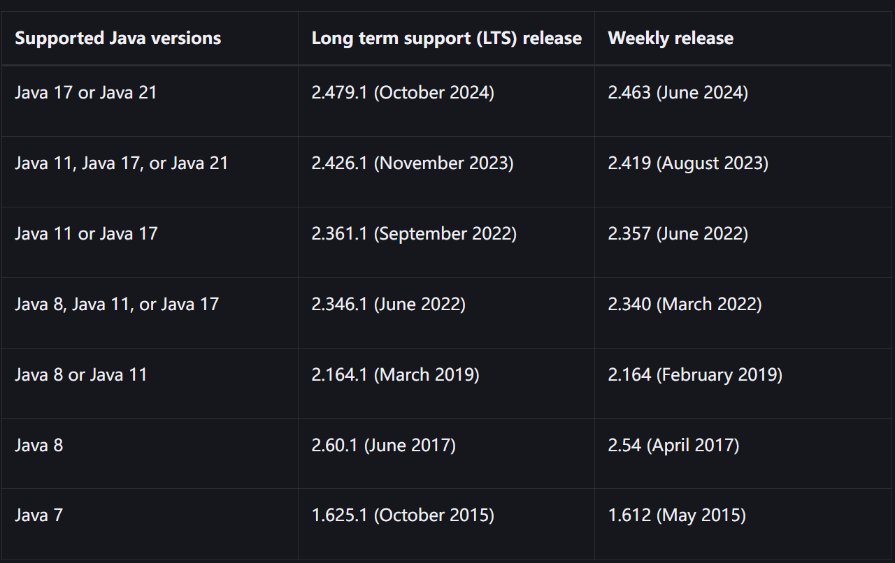
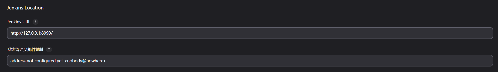
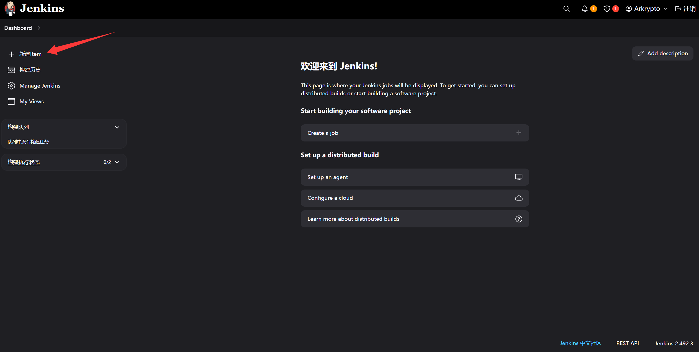
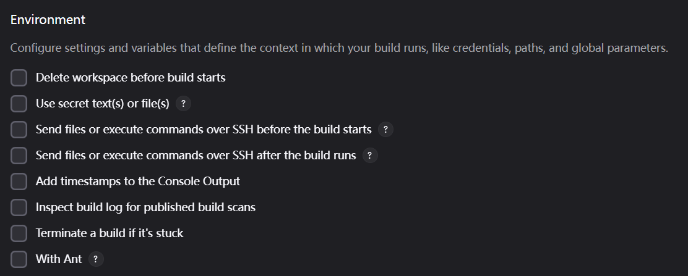
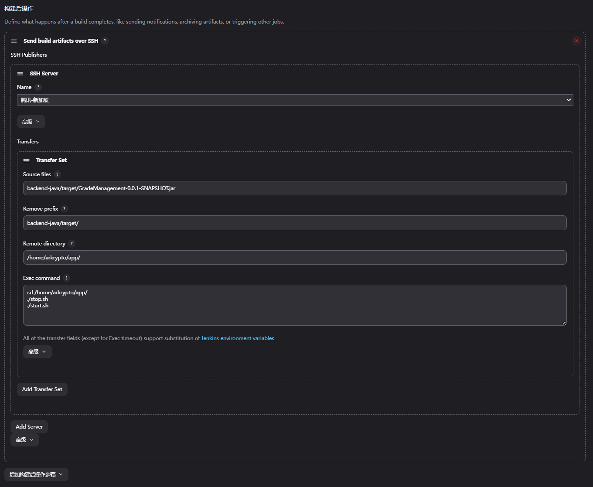
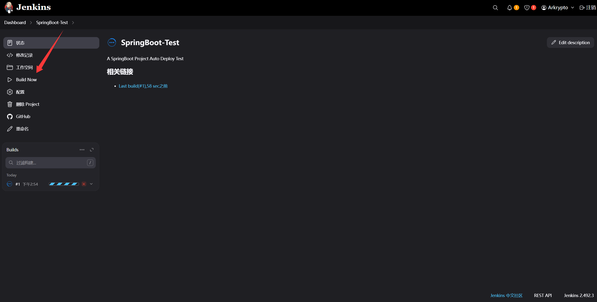
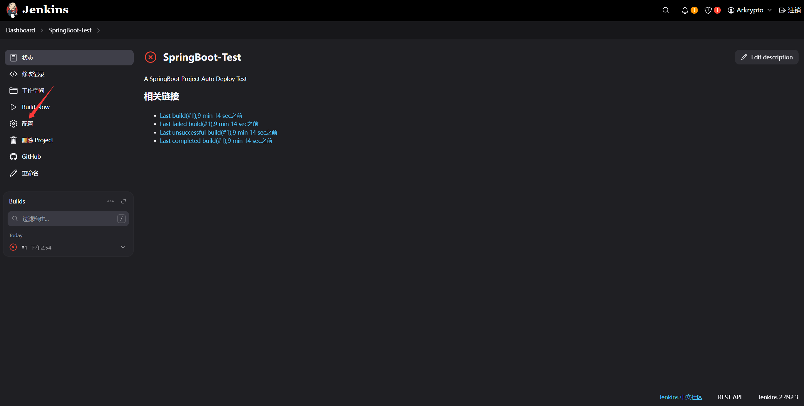
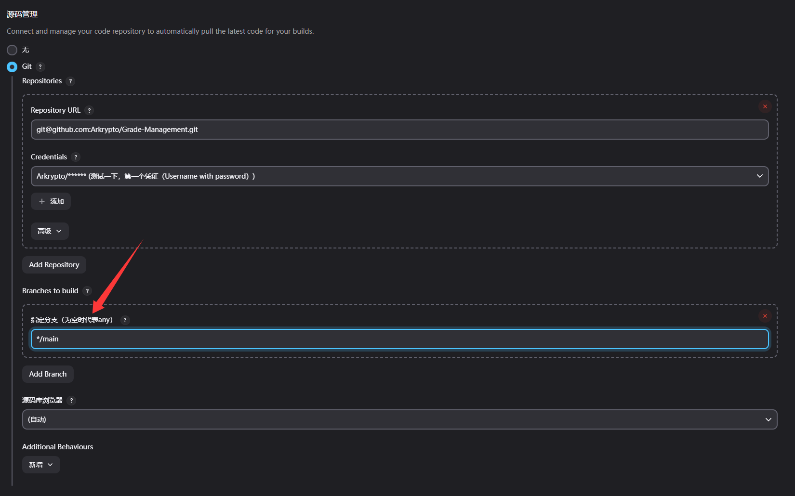
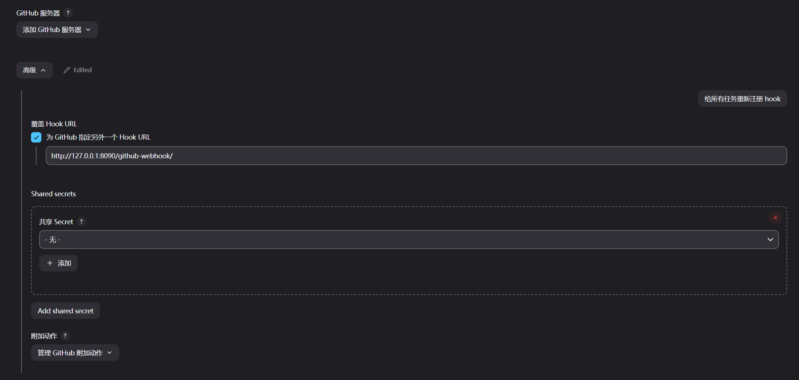

[Jenkins自动化部署入门详细教程 - java老兵 - 博客园](https://www.cnblogs.com/wfd360/p/11314697.html)

## CI/CD 和 Jenkins

### 什么是 CI/CD

CI/CD（Continuous Integration and Continuous Delivery），即持续集成和持续交付

1. 快速交付：CI/CD 自动化流程可以使软件交付过程更快、更频繁，减少了手动操作和人工干预的时间。这样可以更快地将新功能、修复和改进的代码交付给用户，满足市场需求并保持竞争优势
2. 提高质量：持续集成通过频繁地集成和构建代码，并进行自动化测试和静态代码分析，有助于发现和解决问题。通过尽早发现和修复缺陷，可以提高软件的质量和稳定性
3. 自动化部署：持续交付将部署过程自动化，从而减少了手动部署的错误和风险。通过自动化部署流程，可以确保软件在不同环境中的一致性，并减少了部署时间和工作量
4. 可靠性和可重复性：CI/CD 强调自动化和标准化的流程，使软件交付过程变得可靠和可重复。每次构建、测试和部署都是基于相同的流程和环境，减少了人为因素的影响，提高了软件交付的一致性和可靠性
5. 团队协作与反馈：CI/CD 促进了团队成员之间的协作和沟通。通过频繁地集成和交付，团队成员可以及时了解彼此的工作进展和变更，减少代码冲突和集成问题，并能够更好地合作解决出现的问题
6. 可追溯性和回滚能力：由于 CI/CD 自动化流程的记录和版本控制，可以轻松追踪每个构建和部署的结果。这样，在出现问题时可以快速定位和回滚到之前的可用版本，减少了故障修复时间和影响范围。

总而言之，CI/CD 提供了一种高效、可靠和可持续的软件交付方法。它可以加速软件开发和交付的速度，提高软件质量和可靠性，并促进团队之间的协作和反馈。通过使用 CI/CD，组织可以更好地适应市场需求，降低软件交付的风险，并实现持续创新和改进

CI/CD 可以基于各种服务和工具来搭建，具体选择取决于项目需求、[技术栈](https://so.csdn.net/so/search?q=技术栈&spm=1001.2101.3001.7020)和团队偏好。以下是一些常用的服务和工具

1. 版本控制系统：如 Git（例如 GitHub、GitLab、Bitbucket 等）用于管理代码版本和协作开发
2. 持续集成服务：如 Jenkins、CircleCI、Travis CI、GitLab CI/CD 等，用于自动化构建、测试和集成代码
3. 容器化平台：如 Docker 和 Kubernetes，用于创建和管理容器化的应用程序环境，实现应用程序的可移植性和一致性
4. 云平台和部署服务：如 Amazon Web Services（AWS）、Microsoft Azure、Google Cloud Platform（GCP）等，提供了各种云计算服务和部署工具，如 AWS CodePipeline、Azure DevOps、Google Cloud Build 等
5. 自动化测试工具：如 Selenium、JUnit、Pytest 等，用于编写和执行自动化测试脚本，验证代码的功能和质量
6. 静态代码分析工具：如 SonarQube、ESLint、PMD 等，用于静态代码分析和检查，帮助发现潜在的代码质量问题
7. 配置管理工具：如 Ansible、Chef、Puppet 等，用于自动化配置和管理应用程序和基础设施的环境
8. 日志和监控工具：如 ELK Stack（Elasticsearch、Logstash、Kibana）、Prometheus、Grafana 等，用于收集、分析和监控应用程序的日志和指标。

这些服务和工具可以根据具体需求进行组合和配置，形成一个符合项目要求的 CI/CD 工作流程。可以根据团队的技术栈和偏好选择适合的工具，同时考虑集成和兼容性的因素，以确保顺畅的 CI/CD 实施

### Why Jenkins

在实际开发中，我们经常要一边开发一边测试，当然这里说的测试并不是程序员对自己代码的单元测试，而是同组程序员将代码提交后，由测试人员测试

或者前后端分离后，经常会修改接口，然后重新部署，这些情况都会涉及到频繁的打包部署

手动打包常规步骤：

1. 提交代码
2. 问一下同组小伙伴有没有要提交的代码
3. 拉取代码并打包（war 包，或者 jar 包）
4. 上传到 Linux 服务器
5. 查看当前程序是否在运行
6. 关闭当前程序
7. 启动新的 jar 包
8. 观察日志看是否启动成功
9. 如果有同事说，自己还有代码没有提交......再次重复 1-8 的步骤！！！！！（一上午没了）

那么，有一种工具能够实现，将代码提交到 git 后就自动打包部署勒，答案是肯定的：Jenkins

- 当然除了 Jenkins 以外，也还有其他的工具可以实现自动化部署，如 Hudson 等，只是 Jenkins 相对来说，使用得更广泛

实际上，Jenkins 就是一个持续集成工具（CI Service Tool），常与版本控制系统如 Git 和容器化平台如 Kubernetes 等实现企业化的软件迭代部署

### Jenkins 工作流程


首先我们有一个版本控制服务器，如 GitHub，当 push 任务执行后，将触发对 Jenkins 的通知（通知他我代码更新了，你快拉一下重新部署）

- 注意这个工作是版本控制系统实现的

当收到通知后，Jenkins 将调用本地的 Git 和 Maven 插件

1. git pull 拉取远端仓库的新代码
2. mvn package / go build 打包可执行文件
3. 将可执行的打包文件上传到指定服务器的指定目录下

上传到服务器后，Jenkins 将执行事先配置好的 Linux 命令，例如

```bash
cd /home/arkrypto/app
./stop.sh
./start.sh
```

于是任务转变为常规的 sh 脚本部署，事先编写好`stop.sh / start.sh`并放在指定目录即可

## Jenkins 搭建与部署

### 安装及初始化

下载 war 包 [jenkins.war](http://mirrors.jenkins.io/war-stable/latest/jenkins.war)，注意本地 JDK 版本和 Jenkins 的对应



用 Java 启动 Jenkins

```sh
java -jar jenkins.war --httpPort=8090
```

进入浏览器页面`localhost:8090`，根绝页面提示，找到本地密钥文件，填写初始密码，解锁系统


插件安装选择：安装推荐的插件，等待


设置初始用户和密码，初始化完成，进入系统


### 安全及凭证配置

用户手册：[User Handbook Overview](https://www.jenkins.io/doc/book/getting-started/)

安全设置


Security 设置


创建凭证（第一次进入系统凭证栏将是空的），点击 Stores scoped to Jenkins 的“全局”，而后在右上方点击 Add Credentials


创建凭证


ID 为空系统将自动分配，这个凭证之后在创建 Item 时会用到


### 工具插件配置

全局 Tools 配置，主要是 JDK、Git 和 Maven


Plugins 配置，检查 Publish over SSH 和 Deploy to container Plugin 是否安装成功即可

### 系统配置

系统设置，配置需要推送 jar 包的远端服务器


点击 System，翻到最下面，**注意只要在安装好 Publish over SSH 后，在系统配置中才有远程服务器的配置选项**


其中上面仅需填写 Passphrase（远程服务器密码）

点击 SSH Servers 新增服务器


点击右下角测试连接，显示 Success，保存退出即可

另外为了测试方便，将 Jenkins URL 改成本机地址，这个在之后会用到



## CI 测试

SpringBoot + Maven + GitHub + Jenkins

### Linux 服务器配置

将两个脚本放到服务器对应目录下`/home/arkrypto/app/`

stop.sh

```bash
#!/bin/bash
echo "Stop Procedure: GradeManagement-0.0.1-SNAPSHOT.jar.jar"
pid=`ps -ef |grep java|grep GradeManagement-0.0.1-SNAPSHOT.jar|awk '{print $2}'`
echo 'old Procedure pid:'$pid
if [ -n "$pid" ]
then
kill -9 $pid
fi
```

start.sh

```sh
#!/bin/bash
echo 'Start the program: GradeManagement-0.0.1-SNAPSHOT.jar'
chmod 777 /home/arkrypto/app/GradeManagement-0.0.1-SNAPSHOT.jar
echo '-------Starting-------'
cd /home/arkrypto/app/
nohup java -jar GradeManagement-0.0.1-SNAPSHOT.jar > log.out 2>&1 &
echo 'start success'
```

记得给文件加权限

```sh
chmod +x stop.sh start.sh
```

注意启动命令不能用

```sh
nohup java -jar GradeManagement-0.0.1-SNAPSHOT.jar &
```

他是阻塞的，所以最后给 Jenkins 的反馈一定会超时（手动部署惯了，这条命令再回车就可以跑起来，日志将默认输出到当前目录下的 nohup.out）

而应该使用

```sh
nohup java -jar GradeManagement-0.0.1-SNAPSHOT.jar > log.out 2>&1 &
```

### Jenkins Job

大体步骤：基础配置 → 源码管理 → 构建触发器 → 构建环境 → 构建 → 构建后操作

点击新建 Item，选择 Freestyle



#### 基础配置

基础配置：选择 GitHub 项目，填入项目的 HTTP 链接


#### 源码管理

源码管理，配置 Git 仓库，添加凭证（这个凭证是在“安全及凭证设置”处创建的账号密码型凭证）


#### 钩子

构建触发器：这里只需要配置一个身份验证令牌`TOKEN_NAME`，当外部用户访问 URL `JENKINS_URL/job/SpringBoot-Test/build?token=TOKEN_NAME`时，就会触发构建流程（一个简单的 GET 请求）

- 之前系统配置的时候有一个 Jenkins URL，设置为`http://127.0.0.1``
- 所以这里的连接实际上就是`http://127.0.0.1:8080/job/SpringBoot-Test/build?token=SpringBootJenkinsTest`


#### 环境配置

环境配置不管就行



#### 构建设置

构建命令：由于是在 Windows 下模拟，所以使用 bat 脚本进行构建，先进入 java 版本文件夹，再使用 maven 清理、打包

```bash
cd backend-java
mvn clean
mvn package
```


#### 构建后操作

构建后步骤：这里的选择是将 jar 包推送到服务器上（通过 SSH），需要配置一下本地目录和服务器目录，以及服务器 command



一切准备就绪后，点击 Build Now 执行第一次 Jenkins 操作



### Issues

#### 仓库拉取报错

拉仓库报错

```sh
ERROR: Couldn't find any revision to build. Verify the repository and branch configuration for this job.
SSH: Current build result is [FAILURE], not going to run.
Finished: FAILURE
```

原因是：虽然成功拉取了仓库，但没有找到对应的分支，于是终止

刚刚在配置 GitHub 仓库时，有一个分支的选项，默认给的是`*/master`，但现在仓库默认的分支为`main`，所以要修改为`*/main`





#### Maven 报错

```sh
C:\Users\northboat\.jenkins\workspace\SpringBoot-Test\backend-java>mvn package 
'mvn' 不是内部或外部命令，也不是可运行的程序
或批处理文件。

C:\Users\northboat\.jenkins\workspace\SpringBoot-Test\backend-java>exit 9009 
Build step 'Execute Windows batch command' marked build as failure
SSH: Current build result is [FAILURE], not going to run.
Finished: FAILURE
```

采用的`Execute Windows batch command`的方式进行构建，但命令行没有找到 maven，但我配置了环境变量，在本地 cmd 测试也有正确输出

```sh
C:\Users\northboat>mvn -v
Apache Maven 3.9.1 (2e178502fcdbffc201671fb2537d0cb4b4cc58f8)
Maven home: D:\Env\apache-maven-3.9.1
Java version: 17.0.7, vendor: Oracle Corporation, runtime: D:\env\java\jdk17
Default locale: zh_CN, platform encoding: GBK
OS name: "windows 10", version: "10.0", arch: "amd64", family: "windows"
```

**问题本质：虽然在 Jenkins 全局工具里配置了 Maven，但这只对 Jenkins 内部的 “构建步骤类型”为 Maven 的步骤生效**

➡️ **Windows Batch Command** 是在系统的 CMD 中运行命令，它不会自动加载 Jenkins 的工具路径！

所以还是要采用 **Invoke top-level Maven targets** 的方式构建


由于我的 Java 源码并不在根目录，而是在 backend-java 目录下，所以要手动配置 POM 的位置为`backend-java/pom.xml`，这样他就能根据 pom.xml 相对位置正确找到对应源码进行构建了

记得删掉上面那个`Windows Batch`，再次构建，非常好，本地拉取并测试通过

```sh
  __________
 / ___  ___ \
/ / @ \/ @ \ \
\ \___/\___/ /\
 \____\/____/||
 /     /\\\\\//
|     |\\\\\\
 \      \\\\\\
   \______/\\\\
    _||_||_
2025-04-20T15:25:43.866+08:00  INFO 92960 --- [           main] c.a.g.GradeManagementApplicationTests    : Starting GradeManagementApplicationTests using Java 17.0.7 with PID 92960 (started by northboat in C:\Users\northboat\.jenkins\workspace\SpringBoot-Test\backend-java)
2025-04-20T15:25:43.869+08:00  INFO 92960 --- [           main] c.a.g.GradeManagementApplicationTests    : No active profile set, falling back to 1 default profile: "default"
2025-04-20T15:25:45.131+08:00  INFO 92960 --- [           main] o.s.b.a.w.s.WelcomePageHandlerMapping    : Adding welcome page: class path resource [static/index.html]
2025-04-20T15:25:45.336+08:00  INFO 92960 --- [           main] c.a.g.GradeManagementApplicationTests    : Started GradeManagementApplicationTests in 1.841 seconds (process running for 2.887)
[INFO] Tests run: 1, Failures: 0, Errors: 0, Skipped: 0, Time elapsed: 2.897 s - in com.arkrypto.grademanagement.GradeManagementApplicationTests
[INFO] 
[INFO] Results:
[INFO] 
[INFO] Tests run: 1, Failures: 0, Errors: 0, Skipped: 0
[INFO] 
[INFO] 
[INFO] --- jar:3.3.0:jar (default-jar) @ GradeManagement ---
[INFO] Building jar: C:\Users\northboat\.jenkins\workspace\SpringBoot-Test\backend-java\target\GradeManagement-0.0.1-SNAPSHOT.jar
[INFO] 
[INFO] --- spring-boot:3.0.2:repackage (repackage) @ GradeManagement ---
[INFO] ------------------------------------------------------------------------
[INFO] BUILD SUCCESS
[INFO] ------------------------------------------------------------------------
[INFO] Total time:  9.422 s
[INFO] Finished at: 2025-04-20T15:25:46+08:00
[INFO] ------------------------------------------------------------------------
```

但是出现了新的问题

#### 构建后操作报错

服务器在上面配置过，测试连接通过过

```sh
SSH: Connecting from host [DESKTOP-32RH6TB]
SSH: Connecting with configuration [腾讯-新加坡] ...
SSH: EXEC: completed after 218 ms
SSH: Disconnecting configuration [腾讯-新加坡] ...
ERROR: Exception when publishing, exception message [Exec exit status not zero. Status [127]]
Build step 'Send build artifacts over SSH' changed build result to UNSTABLE
Finished: UNSTABLE
```

其中

- `Exec exit status not zero`：说明 Jenkins 尝试执行远程命令时，返回码不为 0，代表执行失败
- `Status [127]`：这个在 Linux 系统中表示 **“命令未找到”**（Command Not Found）

好吧，我他妈忘记把脚本放到服务器了，难绷

不对，放上去了还是不行，我发现 jar 包就没传上去，我重复检查了“构建后操作”的配置，尝试给服务器上文件夹添加写权限

```sh
chmod 755 /home/arkrypto/app
```

如果成功上传的话，Jenkins 控制台会有类似这样的输出

```sh
SSH: Transferred 1 file(s)
```

这次控制台输出似乎很正常

```sh
SSH: Connecting from host [DESKTOP-32RH6TB]
SSH: Connecting with configuration [腾讯-新加坡] ...
SSH: EXEC: completed after 204 ms
SSH: Disconnecting configuration [腾讯-新加坡] ...
SSH: Transferred 1 file(s)
Finished: SUCCESS
```

但是更大的问题来了，我 TM 服务器上死活找不到 jar 包，如传，WTF

OK，我好像发现了问题所在，我在系统服务器配置中 SSH Servers 忘记填根目录了


相应的在项目 Job 中的远程目录置空


gOOd，终于成功传上去了

```sh
root@VM-0-11-debian:/home/arkrypto/app# ls
GradeManagement-0.0.1-SNAPSHOT.jar  nohup.out  start.sh  stop.sh
```

#### Jar 包导出设置

由于是 maven 构造，我们关注点必然是在 pom.xml，这里是 springboot 项目，用到 maven 插件进行导出，有如下配置

```xml
<build>
    <plugins>
        <plugin>
            <groupId>org.apache.maven.plugins</groupId>
            <artifactId>maven-compiler-plugin</artifactId>
            <version>3.8.1</version>
            <configuration>
                <source>17</source>
                <target>17</target>
                <encoding>UTF-8</encoding>
            </configuration>
        </plugin>
        <plugin>
            <groupId>org.springframework.boot</groupId>
            <artifactId>spring-boot-maven-plugin</artifactId>
            <version>${spring-boot.version}</version>
            <configuration>
                <mainClass>com.arkrypto.grademanagement.GradeManagementApplication</mainClass>
                <skip>true</skip>
            </configuration>
            <executions>
                <execution>
                    <id>repackage</id>
                    <goals>
                        <goal>repackage</goal>
                    </goals>
                </execution>
            </executions>
        </plugin>
    </plugins>
</build>
```

这个`pom.xml`配置已经非常接近成功了，问题的关键在于这一句

```xml
<skip>true</skip>
```

💥 **这个配置等于告诉 Maven：跳过 Spring Boot 插件的执行！**
 也就是说，虽然你配置了 `repackage` 目标，**但由于设置了 `skip=true`，这个目标根本没被执行**，所以 JAR 包就成了普通 JAR，没有 `Main-Class`，于是导致启动报错

```sh
no main manifest attribute, in GradeManagement-0.0.1-SNAPSHOT.jar
```

✅ 正确做法：你只需要把 `<skip>true</skip>` **删掉**或者改为

```xml
<skip>false</skip>
```

或者，干脆直接删掉整个`<configuration>`块，如果你不需要手动指定`mainClass`

- Spring Boot 会自动识别带有`@SpringBootApplication`注解的类

### GitHub 配置

还记得那个 URL 吗：`JENKINS_URL/job/SpringBoot-Test/build?token=TOKEN_NAME`

由于我实在本地部署，所以 URL 就是

```sh
http://localhost:8080/job/SpringBoot-Test/build?token=SpringBootJenkinsTest
```

使用[贝锐花生壳管理 - 内网穿透](https://console.hsk.oray.com/forward)将`localhost:8090`穿透到`https://889ehmd12181.vicp.fun`

于是回调 URL 变为

```
https://889ehmd12181.vicp.fun/job/SpringBoot-Test/build?token=SpringBootJenkinsTest
```

点开仓库设置


添加勾子


推送一下，测试一下，然后，失败了

而后我测试了一下在浏览器直接访问 https://889ehmd12181.vicp.fun/job/SpringBoot-Test/build?token=SpringBootJenkinsTest，是能够触发任务的

再一细看，哦，GitHub 的 WebHook 发送的是 Post 请求，而非触发任务的 Get，包成功不了的，这里需要修改 Jenkins Job 的配置，之前在 Jenkins Job / 钩子配置的时候，使用的是“身份验证令牌”


改成`GitHub hook trigger for GITScm polling`


然后在系统设置中，找到 GitHub 插件，点击高级，添加 Hook URL 设置（这里直接用的本机地址 127.0.0.1，反正会被穿出去）



然后修改 GitHub 的 WebHook 配置


总算 NMB 成功了


