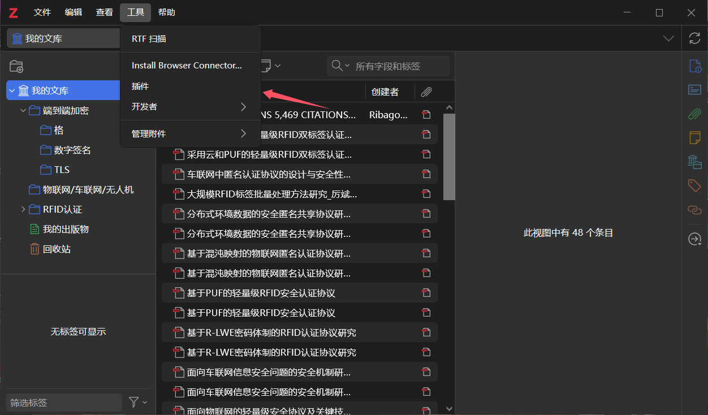
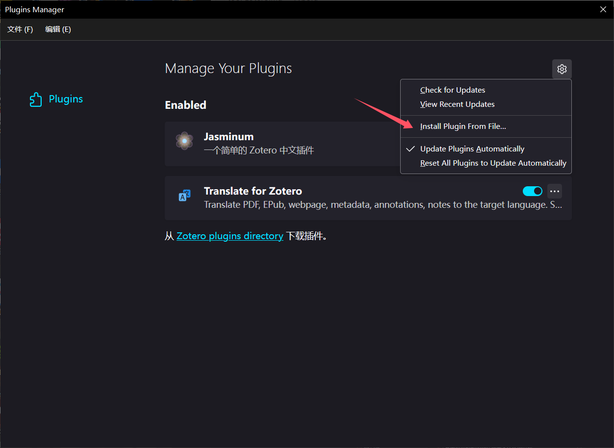
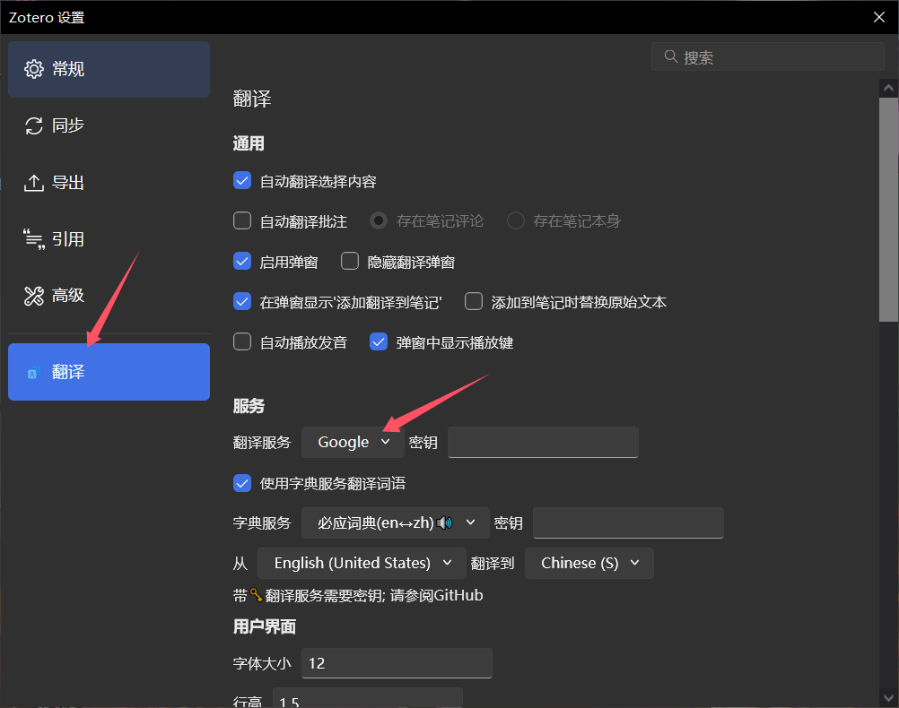
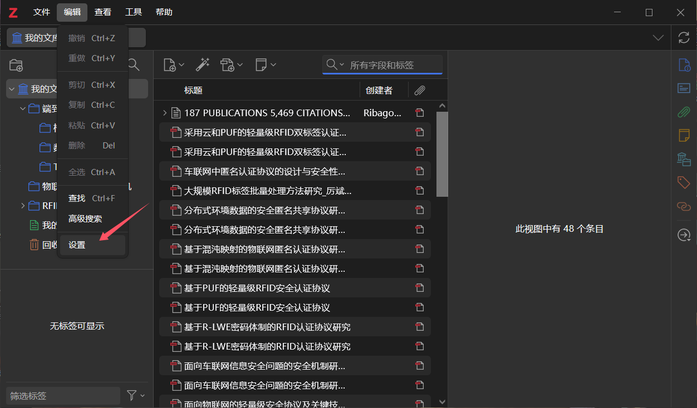
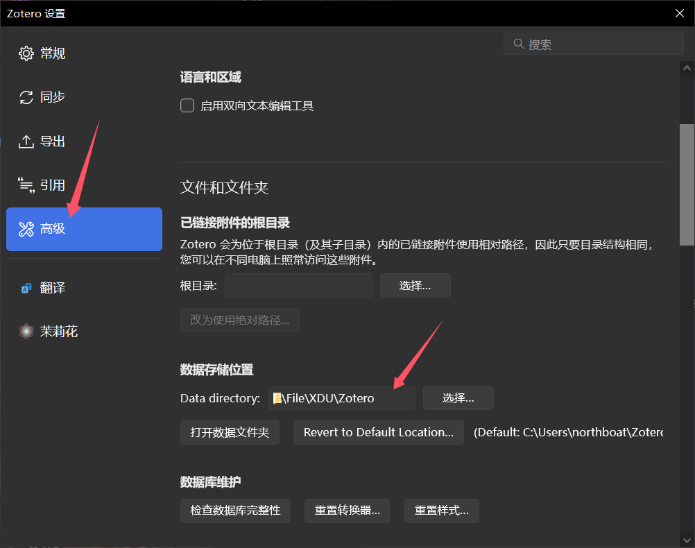

## 基本使用

官网下载：[Zotero | Your personal research assistant](https://www.zotero.org/)

GitHub：[zotero/zotero: Zotero is a free, easy-to-use tool to help you collect, organize, annotate, cite, and share your research sources.](https://github.com/zotero/zotero)

### 翻译

翻译插件：[windingwind/zotero-pdf-translate: Translate PDF, EPub, webpage, metadata, annotations, notes to the target language. Support 20+ translate services.](https://github.com/windingwind/zotero-pdf-translate)

通过`.xpi`导入插件

选择翻译源

### 本地存储

数据存储位置

登录以同步数据（不喜欢）