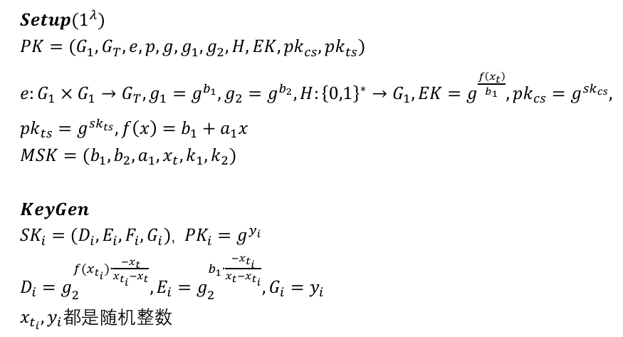
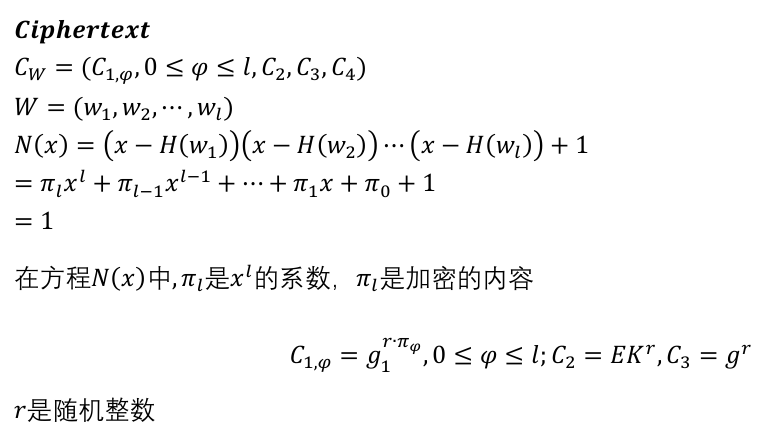
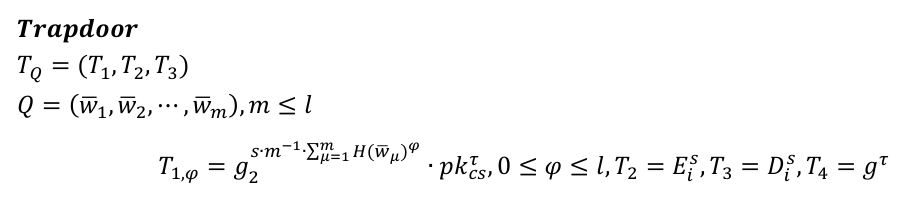

[Searchable-Encryption: 可搜索加密仿真：Java、JPBC](https://github.com/northboat/Searchable-Encryption/)

## 前期工作

### JPBC 导入

新建一个纯净的 Maven 项目，在根目录新建目录 lib，将`jpbc-api-2.0.0.jar`和`jpbc-plaf-2.0.0.jar`放入，然后在 IDEA 添加外部包`File -> Project Structure -> Libraries`，点击 + 号，选择 Java，将 lib 目录添加即可

在`maven`中添加配置以便在打成 jar 包时能够正确识别（当然若只需要运行时环境并不需要这一步）

```xml
<dependency>
    <groupId>jpbc.api</groupId>
    <artifactId>api</artifactId>
    <version>2.0.0</version>
    <scope>system</scope>
    <systemPath>${pom.basedir}/lib/jpbc-api-2.0.0.jar</systemPath>
</dependency>

<dependency>
    <groupId>jpbc-plaf</groupId>
    <artifactId>plaf</artifactId>
    <version>2.0.0</version>
    <scope>system</scope>
    <systemPath>${pom.basedir}/lib/jpbc-plaf-2.0.0.jar</systemPath>
</dependency>
```

### 自定义群参数

为了方便测试时间，选择使用较小阶的循环群，这里需要使用 JPBC 自带的参数生成函数

```java
public static void genParams(){
    // 初始化 type a 类型曲线
    PairingParametersGenerator pg = new TypeACurveGenerator(160, 512);
    // 生成参数
    PairingParameters params = pg.generate();
    // 打印参数
    System.out.println(params.toString());
}
```

160 为整数群的阶数，打印参数为，保存为`a160.properties`

```
type a
q 8780710799663312522437781984754049815806883199414208211028653399266475630880222957078625179422662221423155858769582317459277713367317481324925129998224791
h 12016012264891146079388821366740534204802954401251311822919615131047207289359704531102844802183906537786776
r 730750818665451621361119245571504901405976559617
exp2 159
exp1 107
sign1 1
sign0 1
```

### 初始化

由于各算法尽量要在相同参数下进行时间开销测试，所有的系统参数应在 Main 函数中初始化，而后作为参数传入各自的构造函数进行系统初始化

```java
public class Main {
    private static Pairing bp;
    // 加密单词长度，为 2n
    private static int;
    // 主公钥
    public static Field G1, G2, GT, Zr;
    public static Element g1, g2, gt;

    // 初始化生成元
    static{
        G1 = bp.getG1();
        G2 = bp.getG2();
        GT = bp.getGT();
        Zr = bp.getZr();
        bp = PairingFactory.getPairing("a160.properties");
        n = 12;
        g1 = G1.newRandomElement().getImmutable();
        g2 = G2.newRandomElement().getImmutable();
        gt = GT.newRandomElement().getImmutable();
    }
}
```

需要注意的是，群上元素 g 的操作会改变 g 本身，比如这里在直接运算时，我想要重新定义一个`g1 = g.add(h)`，此时不光`g1 == g.add(h)`，g 本身也会变成`g.add(h)`

解决这个问题有两种办法

1. 在定义 g 时取`getImmutable()`，令其不可变

   ```java
   Element g = G1.newRandomElement().getImmutable();
   
   Element x = Zr.newRandomElement();
   Element g5 = g.powZn(x);
   ```

2. 在计算时取`duplicate()`，复制一份进行计算而不影响其自身

   ```java
   Element g = G1.newRandomElement();
   Element x = Zr.newRandomElement();
   
   Element g6 = g.duplicate().powZn(x)
   ```

在仿真时，我将对所有元素都采取`getImmutable()`的操作以避免一些难以发现的问题

## 抽象类与接口


## PECKS

以 PECKS 实现为例

### Keygen



### Enc



### Trap



### Search


## 测试代码

## 工具类

主要是哈希工具

1. 将用户名/字符串原文映射到`G1,GT,Zr`群上，基本就是通过字符的 ASCII 码先映射到整数群 Zr 上，再通过 G1 或 GT 的生成元做幂运算，实现映射
2. 在群之间进行映射，基本也是通过生成元实现，比如将整数群数组 W 映射到 G1 群，那么就是在生成元 g 上做连续的幂运算得到 W 在 G1 上的映射

但文献上对于字符串实际上给的是`{0,1}*`串，可能是用的布隆过滤器，但这里并不影响仿真，因为我们要做的就是把通用的字符哈希到指定的群上，只要哈希过去，就能进行后续的一系列加密、陷门、匹配操作


而后有一个成功的多项式系数提取


```java
import javax.crypto.Cipher;
import javax.crypto.KeyGenerator;
import javax.crypto.SecretKey;
import javax.crypto.spec.SecretKeySpec;
import java.security.NoSuchAlgorithmException;
import java.security.SecureRandom;
import java.util.Base64;

public class AESUtil {

    public static byte[] getRandomKey() throws NoSuchAlgorithmException {
        KeyGenerator keyGenerator = KeyGenerator.getInstance("AES");

        // 设置密钥长度和随机源
        keyGenerator.init(128, new SecureRandom());
        // 生成密钥
        SecretKey secretKey = keyGenerator.generateKey();
        // 获取密钥内容
        byte[] key = secretKey.getEncoded();

        System.out.println(Base64.getEncoder().encodeToString(key));

        return key;
    }

    public static byte[] enc(byte[] data, byte[] key) throws Exception {
        SecretKeySpec secretKeySpec = new SecretKeySpec(key, "AES");
        Cipher cipher = Cipher.getInstance("AES/ECB/PKCS5Padding");
        cipher.init(Cipher.ENCRYPT_MODE, secretKeySpec);
        return cipher.doFinal(data);
    }

    public static byte[] dec(byte[] data, byte[] key) throws Exception {
        SecretKeySpec secretKeySpec = new SecretKeySpec(key, "AES");
        Cipher cipher = Cipher.getInstance("AES/ECB/PKCS5Padding");
        cipher.init(Cipher.DECRYPT_MODE, secretKeySpec);
        return cipher.doFinal(data);
    }
}
```

位运算：级联、异或操作

```java
import it.unisa.dia.gas.jpbc.Element;
import it.unisa.dia.gas.jpbc.Field;

import java.math.BigInteger;
import java.security.SecureRandom;
import java.util.*;

public class BitUtil {
    public static Element xor(Field Zr, Element e1, Element e2){
        BigInteger i1 = e1.toBigInteger();
        BigInteger i2 = e2.toBigInteger();
        BigInteger res = i1.xor(i2);

        return Zr.newElement(res.mod(Zr.getOrder())).getImmutable();
    }

    public static byte[] connect(byte[] b1, byte[] b2){
        BigInteger bi1 = new BigInteger(b1), bi2 = new BigInteger(b2);
        BigInteger shifted = bi1.shiftLeft(bi2.bitLength());
        BigInteger res =  shifted.or(bi2);
        return res.toByteArray();
    }

    public static Element connect(Field Zr, Element e1, Element e2, Element e3){
        BigInteger b1 = e1.toBigInteger(), b2 = e2.toBigInteger(), b3 = e3.toBigInteger();
        BigInteger shift1 = b1.shiftLeft(b2.bitLength());
        BigInteger or1 = shift1.or(b2);
        BigInteger shift2 = or1.shiftLeft(b3.bitLength());
        BigInteger or2 = shift2.or(b3);

        return Zr.newElement(or2).getImmutable();
    }

    public static Element split(Field Zr, Element msg, Element id, Element sk_id){
        BigInteger m = msg.toBigInteger(), i = id.toBigInteger(), sk = sk_id.toBigInteger();
        int ptLen = m.bitLength() - i.bitLength() - sk.bitLength();


        BigInteger shift = m.shiftRight(sk.bitLength());
        BigInteger mask = BigInteger.ONE.shiftLeft(ptLen).subtract(BigInteger.ONE);
        BigInteger and = shift.and(mask);

        return Zr.newElement(and).getImmutable();
    }


    public static Element random(Field Zr, int q){
        SecureRandom random = new SecureRandom();
        BigInteger randomBigInt = new BigInteger(q, random);
        return Zr.newElement(randomBigInt).getImmutable();
    }

    public static void main(String[] args) {
        int[] nums = {1,2,3,4};
        int n = nums.length;
        List<Integer> r = Arrays.asList(1,2,3,4);
        System.out.println();
        Map<Integer, Integer> map = new HashMap<>();
        
    }
}
```

