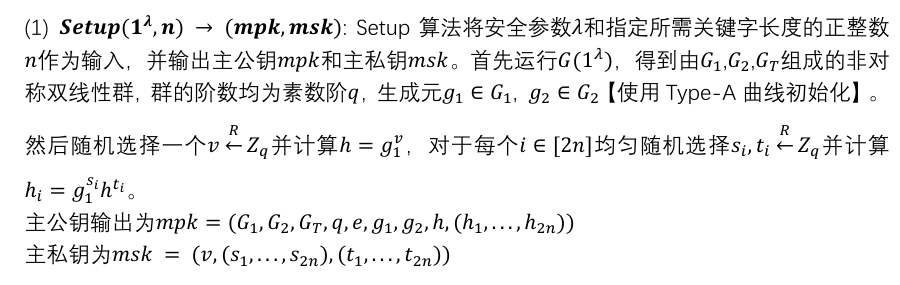
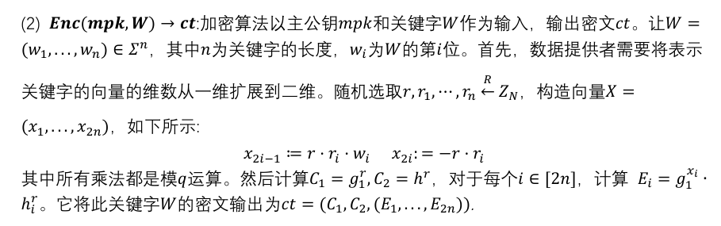
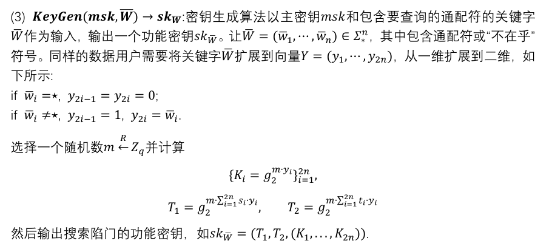
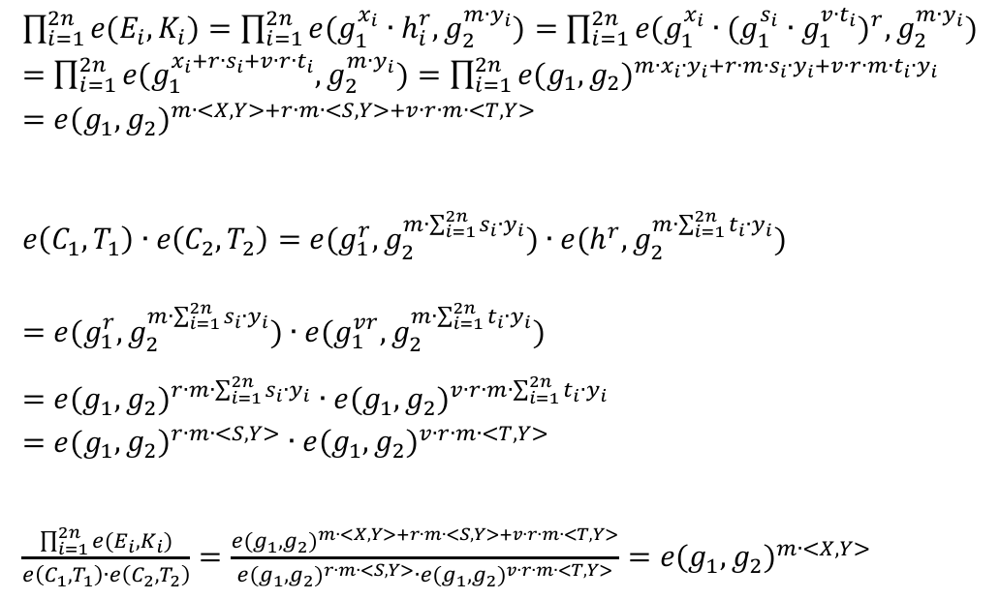
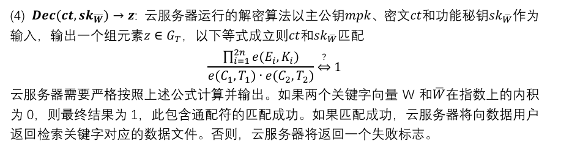
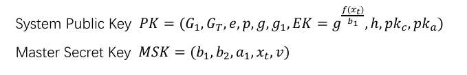
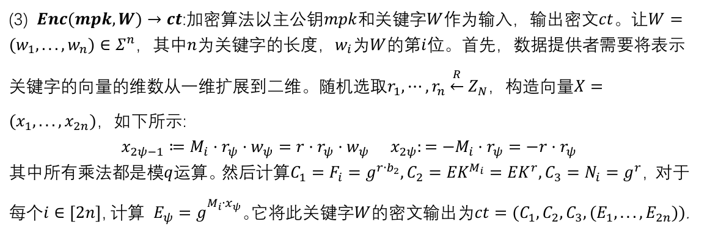
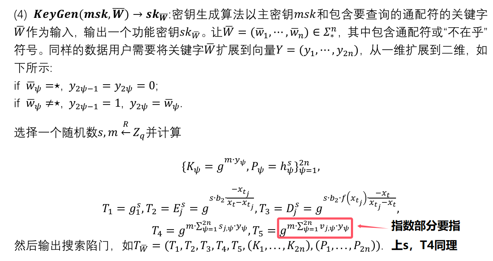
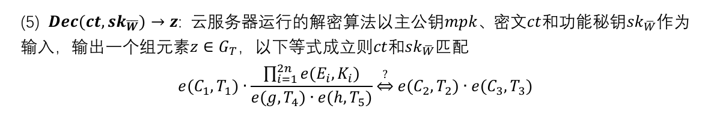

[Searchable-Encryption-Simulation/BP/simulation/src/main/java/cia/northboat/sim at main · northboat/Searchable-Encryption-Simulation](https://github.com/northboat/Searchable-Encryption-Simulation/tree/main/BP/sim/src/main/java/cia/northboat/sim)

## 前置工作

### 导包

在`maven`中添加配置

```xml
<dependency>
    <groupId>jpbc.api</groupId>
    <artifactId>api</artifactId>
    <version>2.0.0</version>
    <scope>system</scope>
    <systemPath>${pom.basedir}/lib/jpbc-api-2.0.0.jar</systemPath>
</dependency>

<dependency>
    <groupId>jpbc-plaf</groupId>
    <artifactId>plaf</artifactId>
    <version>2.0.0</version>
    <scope>system</scope>
    <systemPath>${pom.basedir}/lib/jpbc-plaf-2.0.0.jar</systemPath>
</dependency>
```

在项目根目录新建目录 lib，将`jpbc-api-2.0.0.jar`和`jpbc-plaf-2.0.0.jar`放入，然后在 IDEA 添加外部包`File -> Project Structure -> Libraries`，点击 + 号，选择 Java，将 lib 目录添加，即可

### 使用较小的阶

为了方便测试时间，选择使用较小阶的循环群，这里需要使用 JPBC 自带的参数生成函数

```java
public static void genParams(){
    // 初始化 type a 类型曲线
    PairingParametersGenerator pg = new TypeACurveGenerator(160, 512);
    // 生成参数
    PairingParameters params = pg.generate();
    // 打印参数
    System.out.println(params.toString());
}
```

160 为整数群的阶数，打印参数为

```
type a
q 8780710799663312522437781984754049815806883199414208211028653399266475630880222957078625179422662221423155858769582317459277713367317481324925129998224791
h 12016012264891146079388821366740534204802954401251311822919615131047207289359704531102844802183906537786776
r 730750818665451621361119245571504901405976559617
exp2 159
exp1 107
sign1 1
sign0 1
```

## SPWSE

### 初始化

由于两个算法要在同一参数下进行时间开销测试，所以所有的系统参数在 Main 中进行初始化，再由各自的构造函数进行系统初始化

```java
public class Main {
    private static final Pairing bp = PairingFactory.getPairing("a160.properties");
    // 加密单词长度，为 2n
    private static final int n = 20;
    // 主公钥
    public static Field G1, G2, GT, Zr;
    public static Element g1, g2;

    // 主私钥
    private static Element v;
    private static Element[] S, T;

    // 算法二要添加的公钥和私钥
    public static Element pkc, pka;
    private static Element a1, b1, b2, xt, xti;

    // 一组用于加密的随机数
    private static Element r, m, s;
    private static Element[] R;

    // 初始化生成元
    static{
        G1 = bp.getG1();
        G2 = bp.getG2();
        GT = bp.getGT();
        Zr = bp.getZr();
        g1 = G1.newRandomElement().getImmutable();
        g2 = G2.newRandomElement().getImmutable();

        v = Zr.newRandomElement().getImmutable();

        S = new Element[2*n];
        T = new Element[2*n];

        for(int i = 0; i < 2*n; i++){
            S[i] = Zr.newRandomElement().getImmutable();
            T[i] = Zr.newRandomElement().getImmutable();
        }

        pkc = G1.newRandomElement().getImmutable();
        pka = G1.newRandomElement().getImmutable();
        a1 = Zr.newRandomElement().getImmutable();
        b1 = Zr.newRandomElement().getImmutable();
        b2 = Zr.newRandomElement().getImmutable();
        xt = Zr.newRandomElement().getImmutable();
        xti = Zr.newRandomElement().getImmutable();

        // 一组用于加密的随机数和随机数组
        // 在算法一/二中作为加密的参数
        r = Zr.newRandomElement().getImmutable();
        m = Zr.newRandomElement().getImmutable();
        s = Zr.newRandomElement().getImmutable();
        R = new Element[n];
        for(int i = 0; i < n; i++){
            // 取随机数填充 R
            R[i] = Zr.newRandomElement().getImmutable();
        }
    }
}
```

### SPWSE-1

#### 系统初始化



通过构造函数接收 Main 初始化的参数，并进行一些必要的计算，指计算 h 和 H

```java
// 配对函数
private static Pairing bp;

// 加密单词长度
private static int n;
public static void setN(int n){
    Sim1.n = n;
}

// 主公钥
// 循环群 G1、G2、GT，整数群 Zr
public static Field G1, G2, GT, Zr;
public static Element h, g1, g2;
public static Element[] H;


// 主私钥
private static Element v;
private static Element[] S, T;

public static void setup(Pairing bp, int n, Field G1, Field G2, Field GT, Field Zr, Element g1, Element g2, // 公钥
                         Element v, Element[] S, Element[] T, // 私钥
                         Element r, Element[] R, Element m){ // 一些参与计算的随机数
    Sim1.bp = bp;
    Sim1.n = n;
    // 初始化生成元
    Sim1.G1 = G1;
    Sim1.G2 = G2;
    Sim1.GT = GT;
    Sim1.Zr = Zr;
    Sim1.g1 = g1;
    Sim1.g2 = g2;

    Sim1.v = v;
    Sim1.h = Sim1.g1.powZn(Sim1.v).getImmutable();

    Sim1.S = S;
    Sim1.T = T;

    H = new Element[2*n];
    for(int i = 0; i < 2*n; i++){
        H[i] = g1.powZn(S[i]).mul(h.powZn(T[i])).getImmutable();
    }

    Sim1.r = r;
    Sim1.R = R;
    Sim1.m = m;
}
```

#### 关键词加密



对字符串进行映射（通过 ASCII 码）

```java
public class StrUtil {
    // 字符串映射，通过 ASCII 码
    public static Element[] mapping(Field Zr, String word, int n){
        Element[] W = new Element[n];
        for(int i = 0; i < n; i++){
            if(i >= word.length()){
                W[i] = Zr.newZeroElement().getImmutable();
                continue;
            }
            int number = word.charAt(i);
            W[i] = Zr.newElement(number).getImmutable();
        }
        return W;
    }
}
```

加密过程

```java
// 用于加密的随机数和随机数组
public static Element r;
public static Element[] R;

// 加密后的密文
public static Element C1, C2;
public static Element[] E;

public static void encode(String word){
    // 将字符串各个字符映射到整数群 W，长度为 n
    Element[] W = StrUtil.mapping(Zr, word, n);
    Element[] X = new Element[2*n];
    // 通过 W 构造向量 X
    for(int i = 0; i < n; i++){
        // 实际上文档里给的是 x[2i-1] = r*ri*wi，但我从0开始存，所以偶数用这个
        // 即用 x[0] 表示 x1
        X[2*i] = r.mul(R[i]).mul(W[i]).getImmutable();
        // 而奇数用 -r*ri
        X[2*i+1] = r.negate().mul(R[i]).getImmutable();
    }

    // 计算关键词 word 的密文
    C1 = g1.powZn(r).getImmutable();
    C2 = h.powZn(r).getImmutable();
    // 将向量 X 扩展为二维的密文 E
    E = new Element[2*n];
    for(int i = 0; i < 2*n; i++){
        E[i] = g1.powZn(X[i]).mul(H[i].powZn(r)).getImmutable();
    }
}
```

#### 陷门生成



对于填充的部分，统一视为`*`处理

```java
// 参与计算的随机数
public static Element m;
// 计算要查找的关键词的陷门（加密信息）
public static Element T1, T2;
public static Element[] K;

public static void genKey(String word){
    // 将关键词字符串映射为整数群向量，这里的处理和上面一样，用 0 填充多余的位置
    Element[] W = StrUtil.mapping(Zr, word, n);

    // 通过 W 构造关键词对应的向量 Y
    Element[] Y = new Element[2*n];
    for(int i = 0; i < n; i++){
        if(i < word.length() && word.charAt(i) != '*'){
            Y[2*i] = Zr.newOneElement().getImmutable();
            Y[2*i+1] = W[i];
        } else {
            Y[2*i] = Zr.newZeroElement().getImmutable();
            Y[2*i+1] = Zr.newZeroElement().getImmutable();
        }
    }


    // 将 Y 扩展为二维矩阵 K
    Element s1 = Zr.newZeroElement(), s2 = Zr.newZeroElement();
    K = new Element[2*n];
    for(int i = 0; i < 2*n; i++){
        s1.add(S[i].mul(Y[i]));
        s2.add(T[i].mul(Y[i]));
        K[i] = g2.powZn(m.mul(Y[i])).getImmutable();
    }
    T1 = g2.powZn(m.mul(s1)).getImmutable();
    T2 = g2.powZn(m.mul(s2)).getImmutable();

}

```

在进行累加的时候，注意不要使用`getImmutable()`进行固定

#### 双线性验证

配对原理



配对过程



```java
public static boolean pairing(){
    System.out.println("开始匹配\n=====================");
    Element acc = GT.newOneElement();
    for(int i = 0; i < 2*n; i++){
        acc.mul(bp.pairing(E[i], K[i]));
    }
    Element d = bp.pairing(C1, T1).mul(bp.pairing(C2, T2)).getImmutable();

    Element ans = acc.div(d).getImmutable();
    System.out.println("等式左侧: " + ans);
    System.out.println("等式右侧: " + GT.newOneElement());
    System.out.println("=====================\n\n");
    return ans.isEqual(GT.newOneElement());
}
```

同样的在累积的时候，不使用`getImmutable()`固定，另外，对于已经固定的元素 e，直接令新的元素等于 e1 = e，即可，无需重复固定

### SPWSE-2

#### 系统初始化

系统密钥



其中
$$
g_1 = g^{b_1}\quad h=g^v\quad g,pk_c,pk_a\in G_1
$$
f 为一个线性函数，有
$$
f(x) = a_1x+b_1
$$
a1、b1、b2、xt、v 均为整数域上的元素

用户密钥


其中 si、vi、hi 均为整数数组

与 Sim1 一样，采用构造函数的方式初始化系统

```java
private static Pairing bp;
// 加密单词长度，为 2n
private static int n;

// 系统公钥
public static Field G1, GT, Zr;
public static Element h, g, g1, pkc, pka, EK;
// 系统私钥
private static Element b1, b2, a1, xt, v;


// 用户公钥
public static Element Ni, Fi;
public static Element[] H;
// 用户私钥
private static Element[] S, V;
private static Element Ei, Di, Mi, xti;

// 用于加密的随机数组
private static Element[] R;

public static Element f(Element x){
    return a1.mul(x).add(b1).getImmutable();
}

public static void setup(Pairing bp, int n, Field G1, Field GT, Field Zr, // 系统公钥
                         Element g, Element pkc, Element pka,
                         Element a1, Element b1, Element b2, Element xt, Element v, // 系统私钥
                         Element r, Element xti, Element[] S, Element[] V,
                         Element[] R, Element m, Element s){ // 参与计算的随机数

    // 系统私钥
    Sim2.a1 = a1;
    Sim2.b1 = b1;
    Sim2.b2 = b2;
    Sim2.xt = xt;
    Sim2.v = v;

    // 系统公钥
    Sim2.bp = bp;
    Sim2.n = n;
    Sim2.G1 = G1;
    Sim2.GT = GT;
    Sim2.Zr = Zr;
    Sim2.g = g;
    Sim2.g1 = g.powZn(b1).getImmutable();
    Sim2.EK = g.powZn(f(xt).div(b1)).getImmutable();
    // 这里从g1改成了g
    Sim2.h = g.powZn(v).getImmutable();
    Sim2.pkc = pkc;
    Sim2.pka = pka;


    // 初始化用户私钥
    Sim2.Mi = r;
    Sim2.xti = xti;
    Sim2.Di = g.powZn(b2.mul(f(xti)).mul(xt.negate().div(xti.sub(xt)))).getImmutable();
    Sim2.Ei = g1.powZn(b2.mul(xti.negate().div(xt.sub(xti)))).getImmutable();
    Sim2.S = S;
    Sim2.V = V;

    // 用户公钥
    Sim2.Ni = g.powZn(r).getImmutable();
    Sim2.Fi = g.powZn(r.mul(b2)).getImmutable();

    H = new Element[2*n];
    for(int i = 0; i < 2*n; i++){
        H[i] = g.powZn(S[i]).mul(h.powZn(V[i])).getImmutable();
    }

    Sim2.R = R;
    Sim2.m = m;
    Sim2.s = s;
}

```

#### 关键词加密

加密过程与 Sim1 类似，同样从 n 扩展到 2n，再从 2n 扩展成二维



```java
// 密文
public static Element C1, C2, C3;
public static Element[] E;

public static void encode(String word){
    Element[] W = StrUtil.mapping(Zr, word, n);
    Element[] X = new Element[2*n];
    for(int i = 0; i < n; i++){
        X[2*i] = Mi.mul(R[i]).mul(W[i]).getImmutable();
        X[2*i+1] = Mi.negate().mul(R[i]).getImmutable();
    }
    C1 = Fi;
    C2 = EK.powZn(Mi).getImmutable();
    C3 = Ni;
    E = new Element[2*n];
    for(int i = 0; i < 2*n; i++){
        E[i] = g.powZn(Mi.mul(X[i])).getImmutable();
    }
}
```

#### 陷门生成



```java
// 参与计算的随机数
public static Element m, s;
// 陷门
public static Element T1, T2, T3, T4, T5;
public static Element[] K, P;
public static void genKey(String word){
    Element[] W = StrUtil.mapping(Zr, word, n);
    // 构造 2n 长向量 Y
    Element[] Y = new Element[2*n];
    for(int i = 0; i < n; i++){
        if(i < word.length() && word.charAt(i) != '*'){
            Y[2*i] = Zr.newOneElement().getImmutable();
            Y[2*i+1] = W[i];
        } else {
            Y[2*i] = Zr.newZeroElement().getImmutable();
            Y[2*i+1] = Zr.newZeroElement().getImmutable();
        }
    }

    T1 = g1.powZn(s).getImmutable();
    T2 = Ei.powZn(s).getImmutable();
    T3 = Di.powZn(s).getImmutable();


    K = new Element[2*n];
    P = new Element[2*n];
    Element s1 = Zr.newZeroElement(), s2 = Zr.newZeroElement(); // 用于计算和
    for(int i = 0; i < 2*n; i++){
        s1.add(S[i].mul(Y[i]));
        s2.add(V[i].mul(Y[i]));
        K[i] = g.powZn(m.mul(Y[i])).getImmutable();
        P[i] = H[i].powZn(s).getImmutable();
    }
    // 多指了 s
    T4 = g.powZn(s.mul(m.mul(s1))).getImmutable();
    // 这里之前写错了sub，已改
    T5 = g.powZn(s.mul(m.mul(s2))).getImmutable();
}

```

#### 双线性验证



此处公式有误，分子部分应为
$$
\prod_{i=1}^{2n}e(E[i]\cdot P[i],K[i])
$$
验证过程

```java
public static boolean pairing(){
    Element acc = GT.newOneElement();
    for(int i = 0; i < 2*n; i++){
        acc.mul(bp.pairing(E[i].mul(P[i]), K[i]));
    }
    Element d = bp.pairing(g, T4).mul(bp.pairing(h, T5)).getImmutable();
    
    Element part1 = bp.pairing(C1, T1).getImmutable();
    Element part2 = acc.div(d).getImmutable();
    Element part3 = bp.pairing(C2, T2).getImmutable();
    Element part4 = bp.pairing(C3, T3).getImmutable();

    Element left = part1.mul(part2).getImmutable();
    Element right = part3.mul(part4).getImmutable();

    System.out.println("left: " + left + "\nright: " + right + "\n\n");

    return left.isEqual(right);
}
```

其中 part1 应等于 part3 * part4，part2 应等于 1，即
$$
e(C1,T1)=e(C2,T2)\cdot e(C3,T3)\quad\frac{\prod_{i=1}^{2n}e(E[i]\cdot P[i],K[i])}{e(g,T4)\cdot e(h,T5)}=1
$$

### 测试

经测试，功能上没有任何问题，能够正确匹配关键词，对于 * 能够进行正确的模糊处理，时间开销测试如下

单个字母大小：160bit（20B）

时间单位：毫秒（ms）

椭圆曲线类型：Type A

| 关键词\耗时              | 算法1Enc | 算法1Trap | 算法1Match | 算法2Enc | 算法2Trap | 算法2Match |
| ------------------------ | -------- | --------- | ---------- | -------- | --------- | ---------- |
| would(100byte,n=5)       | 206.5    | 108.2     | 58.3       | 97.3     | 201.7     | 63.4       |
| abandonees(200byte,n=10) | 367.2    | 172.4     | 97.5       | 189.3    | 374.5     | 105        |
| would*3(300byte,n=15)    | 540.6    | 244.7     | 128.9      | 267.5    | 545.7     | 143.9      |
| would*4(400byte,n=20)    | 717      | 336.1     | 175.8      | 354.5    | 725.7     | 189.4      |

测试代码

```java
public static void main(String[] args) {
    int k = 10; // 循环次数
    String w = "wouldwouldwouldwould"; // 关键词
    String t = "wouldwo**dwouldwould"; // 搜索字

    Sim1.setup(bp, n, G1, G2, GT, Zr, g1, g2, v, S, T, r, R, m);
    Sim2.setup(bp, n, G1, GT, Zr, g1, pkc, pka, a1, b1, b2, xt, v, r, xti, S, T, R, m, s);
    test1(w, t, k);
    test2(w, t, k);
}

public static void test1(String w, String t, int m){

    long startTime1 = System.currentTimeMillis();
    for(int i = 0; i < m; i++){ Sim1.encode(w); }
    long endTime1 = System.currentTimeMillis();

    long startTime2 = System.currentTimeMillis();
    for(int i = 0; i < m; i++){ Sim1.genKey(t); }
    long endTime2 = System.currentTimeMillis();


    boolean flag = false;
    long startTime3 = System.currentTimeMillis();
    for(int i = 0; i < m; i++){ flag = Sim1.pairing(); }
    long endTime3 = System.currentTimeMillis();


    printRes(1, flag, w, t, (double)(endTime1 - startTime1)/m, (double)(endTime2 - startTime2)/m, (double)(endTime3 - startTime3)/m);
}


public static void test2(String w, String t, int m){

    long startTime1 = System.currentTimeMillis();
    for(int i = 0; i < m; i++){ Sim2.encode(w); }
    long endTime1 = System.currentTimeMillis();


    long startTime2 = System.currentTimeMillis();
    for(int i = 0; i < m; i++){ Sim2.genKey(t); }
    long endTime2 = System.currentTimeMillis();


    boolean flag = false;
    long startTime3 = System.currentTimeMillis();
    for(int i = 0; i < m; i++){ flag = Sim2.pairing(); }
    long endTime3 = System.currentTimeMillis();
	printRes(2, flag, w, t, (double)(endTime1 - startTime1)/m, (double)(endTime2 - startTime2)/m, (double)(endTime3 - startTime3)/m);

}

static void printRes(int type, boolean flag, String w, String t, double t1, double t2, double t3){
    System.out.println("算法 " + type + " 对 " + w + " 和 " + t + " 的测试");
    System.out.println("==========================");
    System.out.println("验证结果: " + flag);
    System.out.println("加密 " + w + " 时长: " + t1 + "ms");
    System.out.println("计算 " + t + " 陷门时长: " + t2 + "ms");
    System.out.println("匹配时长: " + t3 + "ms");
    System.out.println("==========================");
}
```

## 工具类

### AES 加密

AESUtil.java 128 位密钥生成、加解密

```java
import javax.crypto.Cipher;
import javax.crypto.KeyGenerator;
import javax.crypto.SecretKey;
import javax.crypto.spec.SecretKeySpec;
import java.security.NoSuchAlgorithmException;
import java.security.SecureRandom;
import java.util.Base64;

public class AESUtil {

    public static byte[] getRandomKey() throws NoSuchAlgorithmException {
        KeyGenerator keyGenerator = KeyGenerator.getInstance("AES");

        // 设置密钥长度和随机源
        keyGenerator.init(128, new SecureRandom());
        // 生成密钥
        SecretKey secretKey = keyGenerator.generateKey();
        // 获取密钥内容
        byte[] key = secretKey.getEncoded();

        System.out.println(Base64.getEncoder().encodeToString(key));

        return key;
    }

    public static byte[] enc(byte[] data, byte[] key) throws Exception {
        SecretKeySpec secretKeySpec = new SecretKeySpec(key, "AES");
        Cipher cipher = Cipher.getInstance("AES/ECB/PKCS5Padding");
        cipher.init(Cipher.ENCRYPT_MODE, secretKeySpec);
        return cipher.doFinal(data);
    }

    public static byte[] dec(byte[] data, byte[] key) throws Exception {
        SecretKeySpec secretKeySpec = new SecretKeySpec(key, "AES");
        Cipher cipher = Cipher.getInstance("AES/ECB/PKCS5Padding");
        cipher.init(Cipher.DECRYPT_MODE, secretKeySpec);
        return cipher.doFinal(data);
    }
}
```

### 位运算

BitUtil.java 级联、异或

```java
import it.unisa.dia.gas.jpbc.Element;
import it.unisa.dia.gas.jpbc.Field;

import java.math.BigInteger;
import java.security.SecureRandom;
import java.util.*;

public class BitUtil {
    public static Element xor(Field Zr, Element e1, Element e2){
        BigInteger i1 = e1.toBigInteger();
        BigInteger i2 = e2.toBigInteger();
        BigInteger res = i1.xor(i2);

        return Zr.newElement(res.mod(Zr.getOrder())).getImmutable();
    }

    public static byte[] connect(byte[] b1, byte[] b2){
        BigInteger bi1 = new BigInteger(b1), bi2 = new BigInteger(b2);
        BigInteger shifted = bi1.shiftLeft(bi2.bitLength());
        BigInteger res =  shifted.or(bi2);
        return res.toByteArray();
    }

    public static Element connect(Field Zr, Element e1, Element e2, Element e3){
        BigInteger b1 = e1.toBigInteger(), b2 = e2.toBigInteger(), b3 = e3.toBigInteger();
        BigInteger shift1 = b1.shiftLeft(b2.bitLength());
        BigInteger or1 = shift1.or(b2);
        BigInteger shift2 = or1.shiftLeft(b3.bitLength());
        BigInteger or2 = shift2.or(b3);

        return Zr.newElement(or2).getImmutable();
    }

    public static Element split(Field Zr, Element msg, Element id, Element sk_id){
        BigInteger m = msg.toBigInteger(), i = id.toBigInteger(), sk = sk_id.toBigInteger();
        int ptLen = m.bitLength() - i.bitLength() - sk.bitLength();


        BigInteger shift = m.shiftRight(sk.bitLength());
        BigInteger mask = BigInteger.ONE.shiftLeft(ptLen).subtract(BigInteger.ONE);
        BigInteger and = shift.and(mask);

        return Zr.newElement(and).getImmutable();
    }


    public static Element random(Field Zr, int q){
        SecureRandom random = new SecureRandom();
        BigInteger randomBigInt = new BigInteger(q, random);
        return Zr.newElement(randomBigInt).getImmutable();
    }

    public static void main(String[] args) {
        int[] nums = {1,2,3,4};
        int n = nums.length;
        List<Integer> r = Arrays.asList(1,2,3,4);
        System.out.println();
        Map<Integer, Integer> map = new HashMap<>();
        
    }
}
```

### 群映射

HashUtil.java 在循环群 G、GT、Zr 之间相互映射

```java
import it.unisa.dia.gas.jpbc.Element;
import it.unisa.dia.gas.jpbc.Field;

import java.math.BigInteger;

public class HashUtil {

    // 字符串映射，通过 ASCII 码将每个字符映射到 Zr 群上
    // 映射为 Zr 群上的整数数组，但文献上给的 {0,1} 串（可能是布隆过滤器）
    public static Element[] hashStr2ZrArr(Field Zr, String word, int n){
        Element[] W = new Element[n];
        for(int i = 0; i < n; i++){
            if(i >= word.length()){
                W[i] = Zr.newZeroElement().getImmutable();
                continue;
            }
            // ASCII 码
            int number = word.charAt(i);
            W[i] = Zr.newElement(number).getImmutable();
        }
        return W;
    }

    // 四个 G 上的元素通过累乘哈希为一个 G 上的元素
    public static Element hash4G(Element g1, Element g2, Element g3, Element g4){
        return g1.mul(g2).mul(g3).mul(g4).getImmutable();
    }

    // 将 Zr 群上的数组 w 通过 G 上的生成元 g 映射为 Zr 群上的单个元素
    public static Element hashZrArr2Zr(Field Zr, Element g, Element[] w){
        Element h = g.duplicate();
        for(Element e: w){
            h.powZn(e);
        }
//        System.out.println(h);
        return HashUtil.hashG2Zr(Zr, h);
    }

    // 将 G 上元素 e 映射到 Zr 群上
    public static Element hashG2Zr(Field Zr, Element e){
        byte[] hash = e.toBytes();
        return Zr.newElementFromHash(hash, 0, hash.length).getImmutable();
    }

    // 把 Zr 群上元素 r 通过 G 上生成元 g 映射到 G 上
    public static Element hashZr2G(Element g, Element r){
        return g.powZn(r).getImmutable();
    }

    // 通过生成元 g 把 {0,1}* 映射到 G 上
    public static Element hashZrArr2G(Element g, Element[] w){
        Element h = g.duplicate();
        for(Element e: w){
            h.powZn(e);
        }
        return h.getImmutable();
    }

    public static Element hashZrArr2GWithTwoFact(Element pk1, Element pk2, Element[] w){
        Element h = pk1.mul(pk2).duplicate();
        for(Element e: w){
            h.powZn(e);
        }
        System.out.println(h);
        return h;
    }


    // 将 GT 上元素 gt 和 Zr 群上数组 w 映射到群 G 上
    public static Element hashGT2GWithZrArr(Field G, Element gt, Element[] w){
        Element h = gt.duplicate();
        for(Element e: w){
            h.powZn(e);
        }
        byte[] bytes = h.toBytes();
        return G.newElementFromHash(bytes, 0, bytes.length).getImmutable();
    }

    public static Element hashGT2G(Field G, Element gt){
        byte[] bytes = gt.toBytes();
        return G.newElementFromHash(bytes, 0, bytes.length).getImmutable();
    }

    public static Element hashG2ZrWithZr(Field Zr, Element g, Element r){
        return hashG2Zr(Zr, g.powZn(r)).getImmutable();
    }

    // 将 GT 上元素 gt 映射为 log(q) 位的 Zr 上的整数元素
    public static Element hashGT2ZrWithQ(Field Zr, Element gt, int q){
        byte[] bytes = gt.toBytes();
        BigInteger b = new BigInteger(1, bytes);
        BigInteger qMask = BigInteger.ONE.shiftLeft(q).subtract(BigInteger.ONE); // log(q)位掩码
        BigInteger truncatedHash = b.and(qMask);
        return Zr.newElement(truncatedHash).getImmutable();
    }
}
```

## PAUKS

初始化和密钥生成


关键词加密与陷门计算


匹配与密钥更新


二次关键词加密与陷门生成


二次匹配


## SA-PAEAK

初始化和密钥生成


关键词加密


陷门计算和匹配


## dIBAEKS


## pMatch

系统初始化


密钥生成与加密搜索


## CR-IMA

初始化和密钥生成


关键词加密


陷门生成和匹配


## TuCR

> 这里为了方便将很多参数写死了

初始化和密钥生成


关键词加密和本地匹配


用户认证与授权


联合陷门计算与匹配


## Tu2CKS

初始化和密钥生成


用户 u2、u3 的计算同理

关键词加密


陷门计算和匹配，由于矩阵运算有问题，图方便把 B 写死为 {-5, 11, -6, 1}


用户 u2、u3 的陷门计算同理


