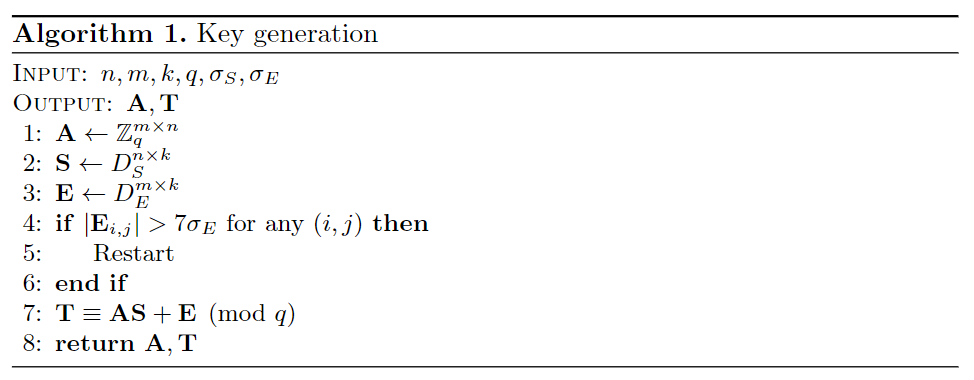
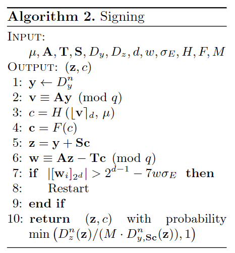
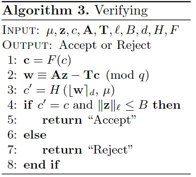
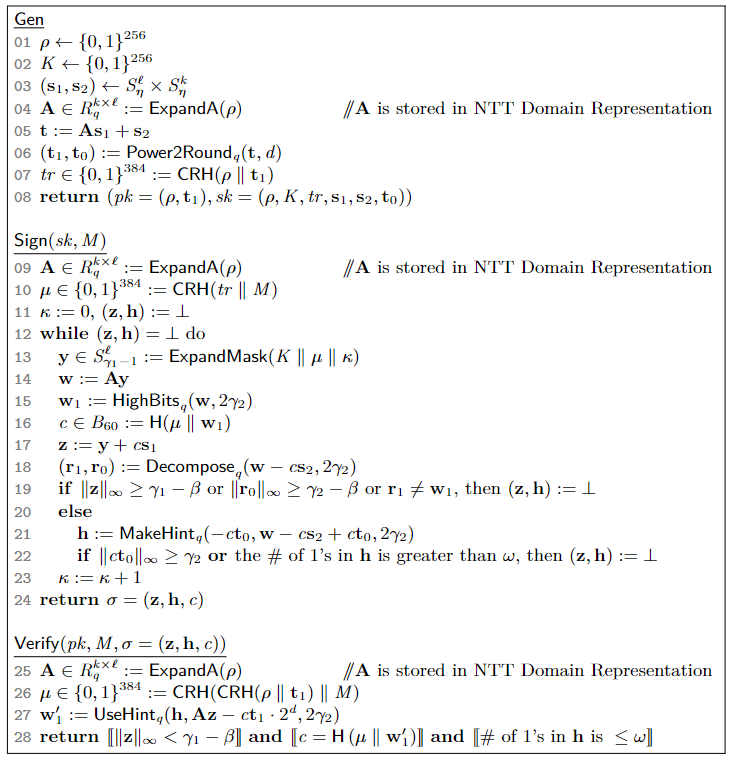

## 抗量子加密概述

### 对称体系

参考对称轻量级密码算法，如 PRESENT、SPARX 等的设计思路，基于格上的 LPN 问题（LWE 问题的特殊情况）也常用于对称加密场景

### 数字签名

后量子数字签名

#### 格基

基于格的问题，如

- 学习错误问题 LWE（Dilithium）
- 短整数解问题 SIS（Falcon）
- 最短向量问题 SVP（NTRU）

被认为对量子计算机具有抗性，因此成为抗量子密码学的热门研究方向

Kyber

1. Kyber 是一个广泛使用的基于 **LWE** 的加密方案，也提供了一种基于 **LWE** 的签名方案（通常与加密协议一同使用）
2. Kyber 签名方案基于基于LWE问题的密钥交换和公钥加密系统
3. 该签名方案适用于公钥加密系统中，并具有较好的效率和紧凑性

Falcon：一种基于 NTRU 格和 SIS 问题的高效抗量子签名方案，其核心思想是

1. 使用格上的短向量作为签名，确保签名的长度较短
2. 引入拒绝采样技术，保证签名的随机性和抗攻击性

[CRYSTALS-Dilithium: A Lattice-Based Digital Signature Scheme | IACR Transactions on Cryptographic Hardware and Embedded Systems](https://tches.iacr.org/index.php/TCHES/article/view/839)

1. 基于 LWE 问题
2. 是 NIST 抗量子密码学标准化项目中的候选算法（现已入选）
3. 特点：签名大小较小，验证速度快，适合通用签名场景
4. 参考场景：抗量子环境下的区块链和身份认证

BLISS（Bimodal Lattice Signature Scheme）

1. 基于格上的离散高斯采样，采用 LWE 的设计思想
2. 优点：签名小，计算速度快，密钥生成相对高效。
3. 缺点：在侧信道攻击下可能存在风险

#### 基于哈希

哈希函数的安全性已经过几十年的广泛研究，基于哈希的签名算法在理论上简单且抗量子攻击

SPHINCS+

- 是 NIST 抗量子密码学标准化项目中的另一候选算法
- 特点：无状态签名，完全基于哈希函数，无需额外的数学假设
- 缺点：签名长度较长，但安全性非常高
- 应用场景：适合需要强安全性保证的系统，如军事和政府通信

Merkle 签名方案

- 使用 Merkle 树作为核心数据结构，支持大批量签名
- 优点：简单、直接
- 缺点：签名效率不高，需要维护状态（改进版如 SPHINCS+ 解决了这一问题）

#### 其他

| 算法    | 数学理论         | 特点                                                         |
| ------- | ---------------- | ------------------------------------------------------------ |
| Rainbow | 基于多变量多项式 | 使用多层多变量多项式系统设计；优点：签名小，验证速度快；缺点：密钥较大，在某些应用中存储成本高；应用：轻量级设备或需要快速签名的场景 |
| Wave    | 基于纠错码       | 基于纠错码和稀疏多项式；优点：签名小，验证速度快；缺点：目前仍处于研究阶段，实际应用较少 |
| SeaSign | 基于等距映射     | 基于超奇异椭圆曲线的等距映射问题；特点：密钥和签名大小非常小，特别适合低带宽环境；缺点：签名生成速度较慢，仍在优化中 |
| Picnic  | 基于组合理论     | 利用组合数学问题的难度构造，基于零知识证明和哈希函数；特点：无需复杂的数学假设，签名大小中等；缺点：验证速度可能较慢；应用：嵌入式设备或资源受限的环境 |

### Shor 算法

> [秀尔算法 - 维基百科，自由的百科全书](https://zh.wikipedia.org/zh-cn/秀爾演算法)

Shor 算法（1994）是量子计算的一个突破性发现，它能在多项式时间内解决一些传统计算难以处理的数学问题，如 RSA 和 ECC

- 量子计算机的出现将使得 Shor 算法成为现实，并使得目前广泛使用的 RSA、ECC、DSA 等基于大数分解和离散对数的加密算法变得不再安全

量子计算的广泛应用可能尚需几十年，但为了避免未来量子计算突破传统加密算法后带来的安全危机，提前准备抗量子签名算法是非常必要的。通过标准化新型抗量子签名算法，能够在量子计算技术逐步成熟的过程中平滑过渡，避免数据泄露和信息丧失

另外，抗量子算法可能在计算复杂度和资源消耗方面存在折衷，即在设计抗量子签名算法时需要考虑算法的效率与安全性，确保其在实际应用中能够平衡计算和存储成本

## Dilithium

> [CRYSTALS-Dilithium: A Lattice-Based Digital Signature Scheme](https://tches.iacr.org/index.php/TCHES/article/view/839)

### LWE 和 SIS 问题

> LWE（Learning With Errors）和 SIS（Short Integer Solution）问题是两种在基于格的密码学（lattice-based cryptography）中常见的困难问题，它们是许多现代抗量子密码学协议的安全基础

LWE 是基于格理论的一种问题，它描述了如何从某些错误的线性关系中学习信息。具体而言，LWE 问题要求从一组添加噪声的线性方程中恢复出未知的密钥或向量，其定义如下

加密方已知 n 长的密钥向量 s，通过 m 长的噪声向量 e 将一个 mxn 的矩阵 A 加密为 b
$$
b = As+e\quad(mod\,q)
$$
比如一个 3x2 的矩阵 A，和 2 长的向量 s，3 长的噪声 e
$$
A=\begin{bmatrix}
1&2\\3&4\\5&6
\end{bmatrix}\quad s=[7\quad 8]\quad e=[9\quad10\quad11]
$$
可加密为
$$
\begin{aligned}
b&=As+e=\begin{bmatrix}
1&2\\3&4\\5&6
\end{bmatrix}\cdot[7\quad8]+[9\quad10\quad11]\\
&=[23\quad53\quad83]+[9\quad10\quad11]\\
&=[32\quad63\quad94]
\end{aligned}
$$
攻击方要想破解该系统，需要从截取的密文 b 中恢复密钥 s，这个操作是极其困难的，其困难性来自于两方面

1. 误差（Noise）：误差向量 e 的引入使得问题变得不再是一个简单的线性方程组，因此从给定的 A 和 b 中恢复出 s 是困难的
2. 高维空间：LWE 的实例通常涉及到大矩阵和向量（高维度），使得算法的时间复杂度和计算复杂度非常高

注意：在 RFID 认证中提到的 LPN（Learning Party with Noise）问题是 LWE 问题在模数 q 为 2 的域上的特例，其计算始终为模二加法（异或运算），故而更适合在轻量场景下使用，如身份认证、对称加密等领域

SIS 问题与 LWE 问题有密切的关系，可以看作是 LWE 问题的一种变种，其定义如下，给定一个 mxn 的矩阵 A 和一个 m 长目标向量 b，其目标是找到一个 n 长的向量 x 使得
$$
Ax=b\quad(mod\,q)
$$
并且 x 是“短”的，即 x 的元素值非常小，也就是说，SIS 问题要求我们找到一个**小整数解**，使得上述方程成立

SIS 问题的困难性在于

1. 寻找短整数解：我们必须在可能的解空间中寻找一个具有小值的解，这使得问题非常难以解决。
2. 矩阵的规模：类似于 LWE，SIS 问题通常涉及到高维度的矩阵，因此解决这个问题需要耗费大量计算资源

### LWE 问题的一般签名形式

> [An Improved Compression Technique for Signatures Based on Learning with Errors](https://link.springer.com/chapter/10.1007/978-3-319-04852-9_2)

公钥生成：得到私钥`SK = S`和公钥`PK = (A, T)`

其中 E 必须是一个足够“小”的噪声，满足短向量性质，否则将**拒绝采样**

签名

1. 要加密的数据为随机生成的向量 y
2. y 先通过公钥矩阵 A 内积为向量 v
3. 而后和随机数 μ 一起经过哈希得到 c，再二次哈希得到 **c**（注意两个 c 通过加粗区分）
4. 再计算密文 z = y + S**c**
5. 签名值为 (z, c)

需要注意的是，这里 c 和 z 必须满足 6~8 的条件，即满足短向量性质，否则将**拒绝采样**

验签：收到的签名值为 (z, c)

1. 先计算二重哈希 **c** = F(c)

2. 由于已知公钥 (A, T)，于是根据 (z, **c**) 计算 w，该 w 实际上等于
   $$
   w=Az-T\pmb{c}=A(y+S\pmb{c})-(AS+E)\pmb{c}=Ay-E\pmb{c}\,(mod\,q)
   $$
   由于 w 的特性，式子中的 E**c** 将被忽略，即有 w ≈ v

3. 进而服务器计算 c' = H([w], μ)，并与哈希值 c 进行比较，若一致且 z 为短向量，则验签通过

### Dilithium 算法

Dilithium 算法的执行过程

密钥生成

- 生成两个 256 位的随机数 ρ,K
- 从随机分布中抽取两个秘密密钥向量 s1 和 s2，这些向量的系数属于环 Rq，且大小不超过 η
- **矩阵扩展**：将种子 ρ 扩展成一个大小为 k×ℓ 的矩阵 A，其中每个元素在多项式环`Rq = Zq[X]/(Xn+1)`上，其中`q = 2^23−2^13+1, n=256`。但为了更快的实现考虑，矩阵 A 实际上是以系数在`Zq^(256)`中的矩阵格式输出并存储的
- 计算`t = As1+s2`
- 将 t 分解为 d 位高位 t1 和余下的低位 t0 两个部分。本方案中公钥的第二部分为 t1 而非 t，使得此时的公钥只需要`⌈log⁡q⌉−d`字节，而非`⌈log⁡q⌉`字节
- 将 ρ 和 t1 打包并使用 SHAKE-256 哈希，得到 384 位的 tr，用于签名时的消息摘要
- 输出密钥对`pk = (ρ, t1), sk = (ρ, K, tr, s1, s2, t0)`

签名

- 由种子 ρ 生成矩阵 A

- 将 tr 和消息 M 打包并使用 SHAKE-256 哈希，得到 384 位的消息摘要 μ

- 初始化`κ = 0, (z, h) = ⊥`，当`(z, h) = ⊥`时重复下述签名过程并累加计数器`κ`，直到生成有效签名

- **生成掩码向量 y**：扩展`K || μ || κ`生成多项式向量 y，其中
  $$
  y\in S_{\gamma_1 - 1}^{\ell}
  $$
  由于签名可能需要重复尝试多次，每次尝试时附加的计数器 κ 可以确保相同消息的多次签名尝试会输出不同的随机数

- 计算`w = Ay`

- **计算 w1**：将 w 的每个系数拆分为高位和低位部分，依照
  $$
  w = w_1 \cdot 2\gamma_2 + w_0
  $$
  提取其高位部分 w1，其中
  $$
  |w_0| \leq \gamma_2
  $$

- **生成挑战值 c**：挑战值 c 由消息 M 和 w1 的哈希值生成，c 是环 Rq 中的多项式，具有 60 个 ±1 的系数，其他系数为 0

- **计算初始签名值 z**

- 分解`w-cs2`的高低位，以进一步检查签名的有效性
  $$
  w-cs_2\Rightarrow (r_1,r_0)
  $$

- **拒绝采样、高低位校验**：

  1. 设置参数 β，其值为 cs1 的最大可能系数。由于 c 只有 60 个 ±1 的系数，且 s1 的最大系数为 η，因此有 β ≤ 60η
  2. 检查`Ay−cs2`的低位部分
  3. 检查`Ay−cs2`的高位部分

  如果 z 的任何系数大于 γ1−β、Ay−cs2 低位部分的任何系数大于 γ2−β、Ay−cs2 高位部分不为 w1 中的任意一项成立，则拒绝此签名

- 生成附加提示 h 用于验证，确保验证者可以正确恢复出高位信息。由于公钥只包含高位部分 t1，验证时无法直接计算`Az−ct`的完整值，而是只能计算
  $$
  Az - ct_1 \cdot 2^d = Az - ct + ct_0
  $$
  为了弥补这一点，签名者需要发送提示 h，告知验证者 ct0 导致进位的位置，从而能够正确恢复`Az−ct`的高位部分。此时，如果 ct0 的任何系数大于 γ2，或是提示 h 中的 1 的数目超出限制 ω，则同样拒绝此签名

- 输出签名`σ = (z, h, c)`

验签：已知公钥 pk，明文消息 M 和签名 σ

- 由种子 ρ 生成矩阵 A

- 将 ρ 和 t1 打包并使用 SHAKE-256 哈希后，整体再和 M 哈希得到 384 位的消息摘要 μ

- **计算 w1′**：使用提示 h 恢复`Az−ct1`的高位部分 w1'。验证者计算
  $$
  Az - ct_1 \cdot 2^d
  $$
  这只包含 Az 和 ct1 的高位部分，并使用 h 中包含的进位信息恢复 w1′

- **验证**

  1. z 的所有系数是否小于 γ1−β
  2. c 是否等于 H(M || w1′)
  3. 提示 h 中的 1 的数目是否超出限制 ω

## Kyber

> CRYSTALS – Kyber: a CCA-secure module-lattice-based KEM

KEM：密钥封装机制

## Falcon

> Falcon: Fast-Fourier Lattice-based Compact Signatures over NTRU

### NTRU 格

NTRU 是一种非对称密码系统，它基于格上的最短向量问题。1996 年由 Hoffstein,、piphher 和 Silverman 提出。2009 年，NTRU 密码系统通过了 IEEE 的标准化认证，是目前已知最快的公钥密码系统之一，并且能够防御 Shor 算法

- 其更快的密钥生成（使用一次性密钥）和低内存使用，使得它可以用于移动设备和智能卡

NTRU 的消息为多项式形式，多项式系数为整数 mod p

### Falcon 算法

基于 NTRU 上的 SIS 问题

## 具体应用场景

网络通信

- TLS/SSL 协议
  - 用于服务器认证和客户端认证，Dilithium 作为后量子签名候选方案，能够替代传统的 RSA 或 ECC 签名
  - 适用于 HTTPS 安全通信，抵抗量子计算可能带来的攻击风险
- VPN 和安全隧道：在构建加密隧道的身份验证阶段，Dilithium 提供快速、轻量化的签名验证

**物联网（IoT）设备**

- 资源受限设备：Dilithium 的签名生成和验证操作均适合嵌入式设备，尤其是在低功耗和有限存储场景下（如智能家居、工业传感器）
- 边缘计算与5G场景：在设备边缘节点进行安全认证时，Dilithium 以其存储和计算效率成为抗量子密码的优选

区块链与电子货币

- 交易认证：在区块链网络中，用于交易签名和节点认证，确保抗量子攻击的安全性
- 数字资产保护：支持智能合约和数字资产的安全签名机制，提供持久的抗量子攻击保障

加密系统

- 长期数据保护：政府机密和军事信息需长期安全存储，Dilithium 提供抗量子签名，保障数据完整性
- 国防通信与安全协议：用于军事通信中的身份认证和加密密钥协商，抵抗未来量子威胁
