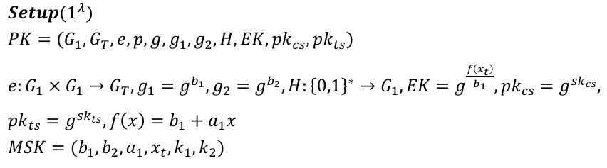
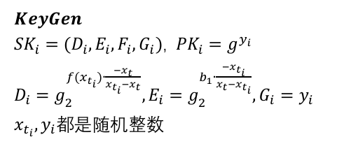
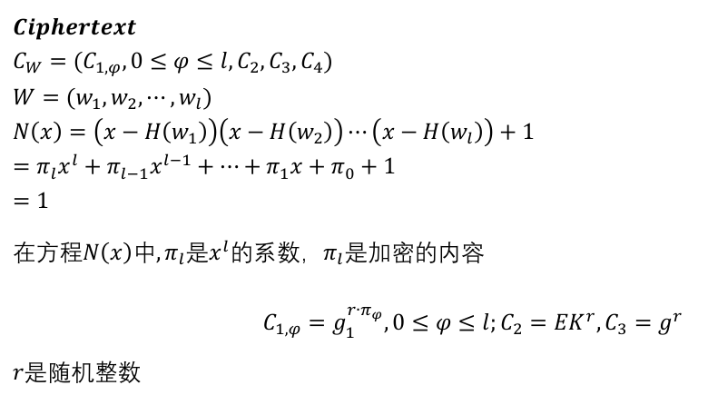
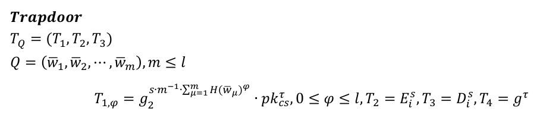

[Searchable-Encryption: 可搜索加密仿真：Java、JPBC](https://github.com/northboat/Searchable-Encryption/)

## 前期工作

### JPBC 导入

新建一个纯净的 Maven 项目，在根目录新建目录 lib，将`jpbc-api-2.0.0.jar`和`jpbc-plaf-2.0.0.jar`放入，然后在 IDEA 添加外部包`File -> Project Structure -> Libraries`，点击 + 号，选择 Java，将 lib 目录添加即可

在`maven`中添加配置以便在打成 jar 包时能够正确识别（当然若只需要运行时环境并不需要这一步）

```xml
<dependency>
    <groupId>jpbc.api</groupId>
    <artifactId>api</artifactId>
    <version>2.0.0</version>
    <scope>system</scope>
    <systemPath>${pom.basedir}/lib/jpbc-api-2.0.0.jar</systemPath>
</dependency>

<dependency>
    <groupId>jpbc-plaf</groupId>
    <artifactId>plaf</artifactId>
    <version>2.0.0</version>
    <scope>system</scope>
    <systemPath>${pom.basedir}/lib/jpbc-plaf-2.0.0.jar</systemPath>
</dependency>
```

### 自定义群参数

为了方便测试时间，选择使用较小阶的循环群，这里需要使用 JPBC 自带的参数生成函数

```java
public static void genParams(){
    // 初始化 type a 类型曲线
    PairingParametersGenerator pg = new TypeACurveGenerator(160, 512);
    // 生成参数
    PairingParameters params = pg.generate();
    // 打印参数
    System.out.println(params.toString());
}
```

160 为整数群的阶数，打印参数为，保存为`a160.properties`

```
type a
q 8780710799663312522437781984754049815806883199414208211028653399266475630880222957078625179422662221423155858769582317459277713367317481324925129998224791
h 12016012264891146079388821366740534204802954401251311822919615131047207289359704531102844802183906537786776
r 730750818665451621361119245571504901405976559617
exp2 159
exp1 107
sign1 1
sign0 1
```

### 初始化

由于各算法尽量要在相同参数下进行时间开销测试，所有的系统参数应在 Main 函数中初始化，而后作为参数传入各自的构造函数进行系统初始化

```java
public class Main {
    private static Pairing bp;
    private static int n;
    // 主公钥
    public static Field G1, G2, GT, Zr;

    // 初始化生成元
    static{
        bp = PairingFactory.getPairing("a160.properties");
        G1 = bp.getG1();
        G2 = bp.getG2();
        GT = bp.getGT();
        Zr = bp.getZr();
        n = 12;
    }
}
```

需要注意的是，群上元素 g 的操作会改变 g 本身，比如这里在直接运算时，我想要重新定义一个`g1 = g.add(h)`，此时不光`g1 == g.add(h)`，g 本身也会变成`g.add(h)`

解决这个问题有两种办法

1. 在定义 g 时取`getImmutable()`，令其不可变

   ```java
   Element g = G1.newRandomElement().getImmutable();
   
   Element x = Zr.newRandomElement();
   Element g5 = g.powZn(x);
   ```

2. 在计算时取`duplicate()`，复制一份进行计算而不影响其自身

   ```java
   Element g = G1.newRandomElement();
   Element x = Zr.newRandomElement();
   
   Element g6 = g.duplicate().powZn(x)
   ```

在仿真时，我将对所有元素都采取`getImmutable()`的操作以避免一些难以发现的问题

## 接口与抽象类

### 接口

SearchableEncryption 接口，基本上 SE 的仿真绕不开这样几个函数

1. setup：系统初始化
2. keygen：密钥生成
3. enc：关键词加密
4. trap：陷门生成
5. search：匹配

若算法具备密钥更新策略，则还有以下函数

1. updateKey：更新密钥
2. updateEnc：重新加密
3. constTrap：重新生成陷门
4. updateSerach：重新匹配

接口设计围绕上面 8 个函数

```java
package cia.northboat.se;

import java.util.List;

public interface SearchableEncryption {
    void setup();

    void keygen();

    default void enc(String w) {
        throw new UnsupportedOperationException("enc(String w) is not supported");
    }
    default void enc(List<String> W) {
        throw new UnsupportedOperationException("enc(List<String> W) is not supported");
    }

    default void trap(String q) {
        throw new UnsupportedOperationException("trap(String q) is not supported");
    }
    default void trap(List<String> Q) {
        throw new UnsupportedOperationException("trap(List<String> Q) is not supported");
    }

    boolean search();

    default void updateKey() {
        throw new UnsupportedOperationException("updateKey() is not supported");
    }
    default void updateEnc() {
        throw new UnsupportedOperationException("updateEnc() is not supported");
    }

    default void constTrap(String q) {
        throw new UnsupportedOperationException("constTrap(String q) is not supported");
    }
    default void constTrap(List<String> Q) {
        throw new UnsupportedOperationException("constTrap(List<String> Q) is not supported");
    }

    default boolean updateSearch() {
        throw new UnsupportedOperationException("updateSearch() is not supported");
    }
}
```

可以注意到，`enc/trap`函数存在重载，因为有的算法传参为单个关键词，而有的为字符串数组，`constTrap`函数同理

### 抽象类

CipherSystem 类，实现 SearchableEncryption 接口，初始化几个基本的系统参数

- `Field G, GT, Zr`：所用到的循环群
- `Pairing bp`：双线性配对函数
- `n`：字符串哈希长度
- `updatable`：是否存在密钥更新策略

还有一些基本的哈希，取随机数、配对的函数

```java
package cia.northboat.se;

import cia.northboat.util.HashUtil;
import it.unisa.dia.gas.jpbc.Element;
import it.unisa.dia.gas.jpbc.Field;
import it.unisa.dia.gas.jpbc.Pairing;

public abstract class CipherSystem implements SearchableEncryption{
    Field G, GT, Zr;
    Pairing bp;
    int n;
    boolean updatable;

    public CipherSystem(Field G, Field GT, Field Zr, Pairing bp, int n) {
        this.G = G;
        this.GT = GT;
        this.Zr = Zr;
        this.bp = bp;
        this.n = n;
        this.updatable = false;
    }
    public CipherSystem(Field G, Field GT, Field Zr, Pairing bp, int n, boolean updatable) {
        this.G = G;
        this.GT = GT;
        this.Zr = Zr;
        this.bp = bp;
        this.n = n;
        this.updatable = updatable;
    }

    public Field getG(){
        return G;
    }

    public Field getGT() {
        return GT;
    }

    public Field getZr() {
        return Zr;
    }

    public int getN() {
        return n;
    }

    public Pairing getBp() {
        return bp;
    }

    public boolean getUpdatable(){
        return updatable;
    }

    public Element[] h(String str){
        return HashUtil.hashStr2ZrArr(Zr, str, n);
    }

    public Element randomZ(){
        return Zr.newRandomElement().getImmutable();
    }

    public Element randomG(){
        return G.newRandomElement().getImmutable();
    }

    public Element randomGT(){
        return GT.newRandomElement().getImmutable();
    }

    public Element pairing(Element u, Element v){
        return bp.pairing(u, v).getImmutable();
    }
}
```

## PECKS

以 PECKS 实现为例

### Setup

继承父类 CipherSystem，重载构造函数

```java
public class PECKS extends CipherSystem {
    public PECKS(Field G, Field GT, Field Zr, Pairing bp, int n){
        super(G, GT, Zr, bp, n);
    }
}
```



实现线性函数 f 和哈希函数 H

```java
public Element f(Element x){
    return b1.add(a1.mul(x)).getImmutable();
}

public Element H(String str){
    Element[] w = h(str);
    return HashUtil.hashZrArr2Zr(this.getZr(), w);
}
```

这个 h 哈希在父类中已经定义过，将一个字符串通过 ASCII 码映射为整数数组

重写 Setup 函数

```java
private Element g, g1, g2, EK, sk_cs, sk_ts, pk_cs, pk_ts, x_t, b1, a1, b2;
@Override
public void setup(){
    g = this.getG().newRandomElement().getImmutable();
    a1 = this.getZr().newRandomElement().getImmutable();
    b1 = this.getZr().newRandomElement().getImmutable();
    b2 = this.getZr().newRandomElement().getImmutable();
    x_t = this.getZr().newRandomElement().getImmutable();
    sk_cs = this.getZr().newRandomElement().getImmutable();
    sk_ts = this.getZr().newRandomElement().getImmutable();

    g1 = g.powZn(b1).getImmutable();
    g2 = g.powZn(b2).getImmutable();
    EK = g.powZn(f(x_t).div(b1)).getImmutable();
    pk_cs = g.powZn(sk_cs).getImmutable();
    pk_ts = g.powZn(sk_ts).getImmutable();
}
```

### Keygen

相对简单，直接定义元素，然后计算就行



重写 keygen 函数

```java
Element D_i, E_i, F_i, G_i, PK_i;
@Override
public void keygen(){
    Element x_ti = this.getZr().newRandomElement().getImmutable();
    Element y_i = this.getZr().newRandomElement().getImmutable();

    D_i = g2.powZn(f(x_ti).mul(x_t.negate().div(x_ti.sub(x_t)))).getImmutable();
    E_i = g2.powZn(b1.mul(x_ti.negate().div(x_t.sub(x_ti)))).getImmutable();
    G_i = y_i.getImmutable();
    PK_i = g.powZn(y_i).getImmutable();
}
```

### Enc

同样的，定义变量，重写 enc 函数，注意入参为`List<String> words`



可以注意到，这里需要计算多项式方程的系数，方程原型为
$$
N(x)=(x-H(w_1))(x-H(w_2))...(x-H(w_l))+1=1
$$
当他变换为多项式形式，则有
$$
\pi_lx^l+\pi_{l-1}x^{l-1}+...+\pi_1x+\pi_0=1
$$
在这参与加密的实际上是多项式系数 π ，而这个 π 实际上只与 H(w) 相关，那么我们的工作转化为，已知 H(w) 这样一个 Element 数组，得到系数数组 π

- 这些系数 π 被称为**初等对称多项式**

对于这样的一个多项式
$$
(x−a_1)(x−a_2)…(x−a_n)=x^n−c_1x^{n−1}+c_2x^{n−2}+⋯+(−1)^nc_n
$$
我们有

- c1 是所有 ai 的和（即 a1+a2+⋯+an）
- c2 是所有 ai 的两两乘积之和（即 a1a2+a1a3+⋯+an−1an）
- c3 是所有 ai 的三三乘积之和（即 a1a2a3+a1a2a4+…）
- 以此类推，直到 cn 是所有 ai 的乘积（即 a1a2…an）

公式化描述为
$$
c_k=(-1)^k\cdot\sum_{1\leq i_1<i_2<...<i_k\leq n}a_{i_1}a_{i_2}...a_{i_k}
$$
采用动态规划求解

```java
public static List<Element> getCoefficients(Field Zr, List<Element> factors){
    int l = factors.size();

    List<Element> coefficients = new ArrayList<>(l+1);
    for (int i = 0; i <= l; i++) {
        coefficients.add(Zr.newZeroElement().getImmutable());
    }

    coefficients.set(0, Zr.newOneElement().getImmutable());
    // 动态规划计算系数
    for (Element factor: factors) {
        for (int j = l; j >= 1; j--) {
            // 更新系数：c_j = c_j + c_{j-1} * a_i
            coefficients.set(j, coefficients.get(j).add(coefficients.get(j - 1).mul(factor)).getImmutable());
        }
    }
    // 添加符号：c_k = (-1)^k * c_k
    for (int k = 1; k <= l; k++) {
        if(k % 2 == 1){
            coefficients.set(k, coefficients.get(k).negate().getImmutable());
        }
    }
    Collections.reverse(coefficients);
    return coefficients;
}
```

最后有一个翻转，因为在加密算法中，最高位恒为 1，最低位为常数位；并且由于多项式在方程中是等于常数 1 的，所以常数位（`pi[0]`）还要人为的加上 One

最后的加密函数长这样

```java
Element[] C1;
Element C2, C3;
int l;
@Override
public void enc(List<String> W) {
    Element r = this.getZr().newRandomElement().getImmutable();
    C2 = EK.powZn(r).getImmutable();
    C3 = g.powZn(r).getImmutable();


    l = W.size();

    List<Element> factors = new ArrayList<>(l);
    for(int i = 0; i < l; i++){
        factors.add(H(W.get(i)));
    }
    System.out.println("function params: " + factors);

    List<Element> pi = PolynomialUtil.getCoefficients(this.getZr(), factors);
    pi.set(0, pi.get(0).add(this.getZr().newOneElement()).getImmutable());
    System.out.println("polynomial coefficients: " + pi);

    C1 = new Element[l+1];
    for(int i = 0; i <= l; i++){
        C1[i] = g1.powZn(r.mul(pi.get(i))).getImmutable();
    }
}
```

### Trap

并不涉及复杂的运算，唯一需要注意的是求和的实现，即
$$
\sum_{\mu=1}^{m}H(\overline w_{\mu})^\varphi
$$
的计算，其实也简单，一个`for(int i = 0; i <= l; i++)`循环套起来，然后每层 φ 都记为 i，再内层循环遍历每一个字符串进行哈希并幂运算，累加得和，计算每一个 Tφ 即可



重写 trap 函数

```java
Element[] T1;
Element T2, T3, T4;
@Override
public void trap(List<String> Q) {
    Element s = this.getZr().newRandomElement().getImmutable(), pi = this.getZr().newRandomElement().getImmutable();
    T2 = E_i.powZn(s).getImmutable();
    T3 = D_i.powZn(s).getImmutable();
    T4 = g.powZn(pi).getImmutable();

    if(Q.size() > l){
        return;
    }

    T1 = new Element[l+1];
    Element m = this.getZr().newElement(Q.size()).getImmutable();

    for(int i = 0; i <= l; i++){
        Element sum = this.getZr().newZeroElement();
        Element fai = this.getZr().newElement(i).getImmutable();

        for (String str: Q) {
            sum.add(H(str).powZn(fai));
        }
        sum.getImmutable();

        T1[i] = g2.powZn(s.mul(m.invert()).mul(sum)).mul(pk_cs.powZn(pi)).getImmutable();
    }
}
```

### Search

最简单的一集，直接调用变量即可


重写 search 函数

```java
@Override
public boolean search() {
    Element left = this.getGT().newOneElement();
    for(int i = 0; i <= l; i++){
        Element cur = this.getBp().pairing(C1[i], T1[i].div(T4.powZn(sk_cs)));
        left.mul(cur);
    }
    left.getImmutable();

    Element right = this.getBp().pairing(C2, T2).mul(this.getBp().pairing(C3, T3)).getImmutable();

    System.out.println("left: " + left);
    System.out.println("right: " + right);

    return left.isEqual(right);
}
```

## 测试代码

创建 CipherSystem 实例，用到初始化阶段创建的全局变量

```java
public static void main(String[] args) {
    String word = "Hello Maven!";
    int round = 1;
    List<String> strs = Arrays.asList("cyber", "information", "security");
    CipherSystem pecks = new PECKS(G1, GT, Zr, bp, n);
    test(pecks, word, strs, round);
    printTime();
}
```

这里用到测试函数`test`，这个函数长这样，他接收一个 CipherSystem 类和需要加密的关键词/关键词数组以及执行的轮次 round

```java
public static void test(CipherSystem cipherSystem, String word, List<String> words, int m){
    System.out.println(cipherSystem.getClass() + " test:");

    cipherSystem.setup();
    cipherSystem.keygen();

    long s1 = System.currentTimeMillis();
    for(int i = 0; i < m; i++) {
        try {
            cipherSystem.enc(word);
        } catch (UnsupportedOperationException e) {
            cipherSystem.enc(words);
        }
    }
    long e1 = System.currentTimeMillis();
    long t1 = e1-s1;

    long s2 = System.currentTimeMillis();
    for(int i = 0; i < m; i++){
        try{
            cipherSystem.trap(word);
        }catch (UnsupportedOperationException e){
            cipherSystem.trap(words);
        }
    }
    long e2 = System.currentTimeMillis();
    long t2 = e2-s2;

    long s3 = System.currentTimeMillis();
    for(int i = 0; i < m; i++)
        System.out.println(cipherSystem.search());
    long e3 = System.currentTimeMillis();
    long t3 = e3-s3;

    if(cipherSystem.getUpdatable()){
        cipherSystem.updateKey();
        long s4 = System.currentTimeMillis();
        for(int i = 0; i < m; i++)
            cipherSystem.updateEnc();
        long e4 = System.currentTimeMillis();
        t1 += e4-s4;


        long s5 = System.currentTimeMillis();
        for(int i = 0; i < m; i++) {
            try {
                cipherSystem.constTrap(word);
            } catch (UnsupportedOperationException e) {
                //                    e.printStackTrace();
                cipherSystem.constTrap(words);
            }
        }
        long e5 = System.currentTimeMillis();
        t2 += e5-s5;

        long s6 = System.currentTimeMillis();
        for(int i = 0; i < m; i++)
            System.out.println(cipherSystem.updateSearch());
        long e6 = System.currentTimeMillis();
        t3 += e6-s6;
    }

    times.add(Arrays.asList(t1/m, t2/m, t3/m));
    System.out.println(cipherSystem.getClass() + " test finished!\n");
}
```

可以注意到，他会先执行 CipherSystem 的`enc(String word)`函数，同时捕捉`UnsupportedOperationException`，若触发，则执行`enc(List<String> words)`函数，trap 和 constTrap 同理

另外，当密码系统支持密钥更新策略时，即`updatable == true`时，将执行额外的四个函数

1. updateKey：更新密钥
2. updateEnc：重新加密
3. constTrap：重新生成陷门
4. updateSerach：重新匹配

并把他们的时间并入加密、陷门和匹配

时间的统计就是用一个`List<List<Long>>`结构来记录，很简单

```java
// 初始化
public static List<List<Long>> times;
static{
    times = new ArrayList<>();
}

// test 执行结束后记录时间
times.add(Arrays.asList(t1/m, t2/m, t3/m));

// 打印时间
public static void printTime(){
    System.out.println("======== Time Cost ========");
    for(List<Long> t: times){
        for(long i: t){
            System.out.print(i + "\t\t\t");
        }
        System.out.println();
    }
}
```

## 工具类

主要其实是哈希工具

1. 将用户名/字符串原文映射到`G1,GT,Zr`群上，基本就是通过字符的 ASCII 码先映射到整数群 Zr 上，再通过 G1 或 GT 的生成元做幂运算，实现映射
2. 在群之间进行映射，基本也是通过生成元实现，比如将整数群数组 W 映射到 G1 群，那么就是在生成元 g 上做连续的幂运算得到 W 在 G1 上的映射

但文献上对于字符串实际上给的是`{0,1}*`串，可能是用的布隆过滤器，但这里并不影响仿真，因为我们要做的就是把通用的字符哈希到指定的群上，只要哈希过去，就能进行后续的一系列加密、陷门、匹配操作

```java
package cia.northboat.util;

import it.unisa.dia.gas.jpbc.Element;
import it.unisa.dia.gas.jpbc.Field;

import java.math.BigInteger;

public class HashUtil {

    // 字符串映射，通过 ASCII 码将每个字符映射到 Zr 群上
    // 映射为 Zr 群上的整数数组，但文献上给的 {0,1} 串（可能是布隆过滤器）
    public static Element[] hashStr2ZrArr(Field Zr, String word, int n){
        Element[] W = new Element[n];
        for(int i = 0; i < n; i++){
            if(i >= word.length()){
                W[i] = Zr.newZeroElement().getImmutable();
                continue;
            }
            // ASCII 码
            int number = word.charAt(i);
            W[i] = Zr.newElement(number).getImmutable();
        }
        return W;
    }

    // 四个 G 上的元素通过累乘哈希为一个 G 上的元素
    public static Element hash4G(Element g1, Element g2, Element g3, Element g4){
        return g1.mul(g2).mul(g3).mul(g4).getImmutable();
    }

    // 将 Zr 群上的数组 w 通过 G 上的生成元 g 映射为 Zr 群上的单个元素
    public static Element hashZrArr2Zr(Field Zr, Element[] w){
        Element h = Zr.newOneElement();
        for(Element e: w){
            if(!e.isZero()){
                h.mul(e);
            }
        }
        return h.getImmutable();
    }

    // 将 G 上元素 e 映射到 Zr 群上
    public static Element hashG2Zr(Field Zr, Element e){
        byte[] hash = e.toBytes();
        return Zr.newElementFromHash(hash, 0, hash.length).getImmutable();
    }

    // 把 Zr 群上元素 r 通过 G 上生成元 g 映射到 G 上
    public static Element hashZr2G(Element g, Element r){
        return g.powZn(r).getImmutable();
    }

    // 通过生成元 g 把 {0,1}* 映射到 G 上
    public static Element hashZrArr2G(Element g, Element[] w){
        Element h = g.duplicate();
        for(Element e: w){
            if(!e.isZero()){
                h.powZn(e);
            }
        }
        return h.getImmutable();
    }

    public static Element hashZrArr2GWithTwoFact(Element pk1, Element pk2, Element[] w){
        Element h = pk1.mul(pk2).duplicate();
        for(Element e: w){
            if(!e.isZero()){
                h.powZn(e);
            }
        }
        return h;
    }

    // 将 GT 上元素 gt 和 Zr 群上数组 w 映射到群 G 上
    public static Element hashGT2GWithZrArr(Field G, Element gt, Element[] w){
        Element h = gt.duplicate();
        for(Element e: w){
            if(!e.isZero()){
                h.powZn(e);
            }
        }
        byte[] bytes = h.toBytes();
        return G.newElementFromHash(bytes, 0, bytes.length).getImmutable();
    }

    public static Element hashGT2G(Field G, Element gt){
        byte[] bytes = gt.toBytes();
        return G.newElementFromHash(bytes, 0, bytes.length).getImmutable();
    }

    public static Element hashG2ZrWithZr(Field Zr, Element g, Element r){
        return hashG2Zr(Zr, g.powZn(r)).getImmutable();
    }

    public static Element hashGT2Zr(Field Zr, Element gt){
        byte[] bytes = gt.toBytes();
        return Zr.newElementFromHash(bytes, 0, bytes.length).getImmutable();
    }

    // 将 GT 上元素 gt 映射为 log(q) 位的 Zr 上的整数元素
    public static Element hashGT2ZrWithQ(Field Zr, Element gt, int q){
        byte[] bytes = gt.toBytes();
        BigInteger b = new BigInteger(1, bytes);
        BigInteger qMask = BigInteger.ONE.shiftLeft(q).subtract(BigInteger.ONE); // log(q)位掩码
        BigInteger truncatedHash = b.and(qMask);
        return Zr.newElement(truncatedHash).getImmutable();
    }

    public static Element getInvModP(Field Zr, Element e, Element p){
        return Zr.newElement(e.toBigInteger().modInverse(p.toBigInteger())).getImmutable();
    }

}
```

多项式工具：多项式系数提取

```java
package cia.northboat.util;

import it.unisa.dia.gas.jpbc.Element;
import it.unisa.dia.gas.jpbc.Field;

import java.util.ArrayList;
import java.util.Collections;
import java.util.List;

public class PolynomialUtil {
    public static List<Element> getCoefficients(Field Zr, List<Element> factors){
        int l = factors.size();

        List<Element> coefficients = new ArrayList<>(l+1);
        for (int i = 0; i <= l; i++) {
            coefficients.add(Zr.newZeroElement().getImmutable());
        }

        coefficients.set(0, Zr.newOneElement().getImmutable());
        // 动态规划计算系数
        for (Element factor: factors) {
            for (int j = l; j >= 1; j--) {
                // 更新系数：c_j = c_j + c_{j-1} * a_i
                coefficients.set(j, coefficients.get(j).add(coefficients.get(j - 1).mul(factor)).getImmutable());
            }
        }
        // 添加符号：c_k = (-1)^k * c_k
        for (int k = 1; k <= l; k++) {
            if(k % 2 == 1){
                coefficients.set(k, coefficients.get(k).negate().getImmutable());
            }
        }
        Collections.reverse(coefficients);
        return coefficients;
    }

    public static List<Integer> getCoefficients(List<Integer> a) {
        int n = a.size();
        // 初始化系数列表，长度为 n + 1，默认值为 0
        List<Integer> coefficients = new ArrayList<>(n + 1);
        for (int i = 0; i <= n; i++) {
            coefficients.add(0);
        }
        // x^n 的系数总是 1
        coefficients.set(0, 1);

        // 动态规划计算系数
        for (Integer ai : a) {
            for (int j = n; j >= 1; j--) {
                // 更新系数：c_j = c_j + c_{j-1} * a_i
                coefficients.set(j, coefficients.get(j) + coefficients.get(j - 1) * ai);
            }
        }

        // 添加符号：c_k = (-1)^k * c_k
        for (int k = 1; k <= n; k++) {
            coefficients.set(k, coefficients.get(k) * (int)Math.pow(-1, k));
        }
        Collections.reverse(coefficients);
        return coefficients;
    }

    // 测试一下，没有问题
    public static void main(String[] args) {
        // 示例：计算 (x - a)(x - b)(x - c) 的系数
        List<Integer> a = List.of(1, 1, 1);
        List<Integer> coefficients = getCoefficients(a);
        // 输出结果
        System.out.println("多项式系数为: " + coefficients);
    }
}
```

AES 加解密工具

```java
import javax.crypto.Cipher;
import javax.crypto.KeyGenerator;
import javax.crypto.SecretKey;
import javax.crypto.spec.SecretKeySpec;
import java.security.NoSuchAlgorithmException;
import java.security.SecureRandom;
import java.util.Base64;

public class AESUtil {

    public static byte[] getRandomKey() throws NoSuchAlgorithmException {
        KeyGenerator keyGenerator = KeyGenerator.getInstance("AES");

        // 设置密钥长度和随机源
        keyGenerator.init(128, new SecureRandom());
        // 生成密钥
        SecretKey secretKey = keyGenerator.generateKey();
        // 获取密钥内容
        byte[] key = secretKey.getEncoded();

        System.out.println(Base64.getEncoder().encodeToString(key));

        return key;
    }

    public static byte[] enc(byte[] data, byte[] key) throws Exception {
        SecretKeySpec secretKeySpec = new SecretKeySpec(key, "AES");
        Cipher cipher = Cipher.getInstance("AES/ECB/PKCS5Padding");
        cipher.init(Cipher.ENCRYPT_MODE, secretKeySpec);
        return cipher.doFinal(data);
    }

    public static byte[] dec(byte[] data, byte[] key) throws Exception {
        SecretKeySpec secretKeySpec = new SecretKeySpec(key, "AES");
        Cipher cipher = Cipher.getInstance("AES/ECB/PKCS5Padding");
        cipher.init(Cipher.DECRYPT_MODE, secretKeySpec);
        return cipher.doFinal(data);
    }
}
```

位运算工具：级联、异或操作（疑似有点问题，DuMSE 没成功）

```java
import it.unisa.dia.gas.jpbc.Element;
import it.unisa.dia.gas.jpbc.Field;

import java.math.BigInteger;
import java.security.SecureRandom;
import java.util.*;

public class BitUtil {
    public static Element xor(Field Zr, Element e1, Element e2){
        BigInteger i1 = e1.toBigInteger();
        BigInteger i2 = e2.toBigInteger();
        BigInteger res = i1.xor(i2);

        return Zr.newElement(res.mod(Zr.getOrder())).getImmutable();
    }

    public static byte[] connect(byte[] b1, byte[] b2){
        BigInteger bi1 = new BigInteger(b1), bi2 = new BigInteger(b2);
        BigInteger shifted = bi1.shiftLeft(bi2.bitLength());
        BigInteger res =  shifted.or(bi2);
        return res.toByteArray();
    }

    public static Element connect(Field Zr, Element e1, Element e2, Element e3){
        BigInteger b1 = e1.toBigInteger(), b2 = e2.toBigInteger(), b3 = e3.toBigInteger();
        BigInteger shift1 = b1.shiftLeft(b2.bitLength());
        BigInteger or1 = shift1.or(b2);
        BigInteger shift2 = or1.shiftLeft(b3.bitLength());
        BigInteger or2 = shift2.or(b3);

        return Zr.newElement(or2).getImmutable();
    }

    public static Element split(Field Zr, Element msg, Element id, Element sk_id){
        BigInteger m = msg.toBigInteger(), i = id.toBigInteger(), sk = sk_id.toBigInteger();
        int ptLen = m.bitLength() - i.bitLength() - sk.bitLength();


        BigInteger shift = m.shiftRight(sk.bitLength());
        BigInteger mask = BigInteger.ONE.shiftLeft(ptLen).subtract(BigInteger.ONE);
        BigInteger and = shift.and(mask);

        return Zr.newElement(and).getImmutable();
    }


    public static Element random(Field Zr, int q){
        SecureRandom random = new SecureRandom();
        BigInteger randomBigInt = new BigInteger(q, random);
        return Zr.newElement(randomBigInt).getImmutable();
    }
}
```

