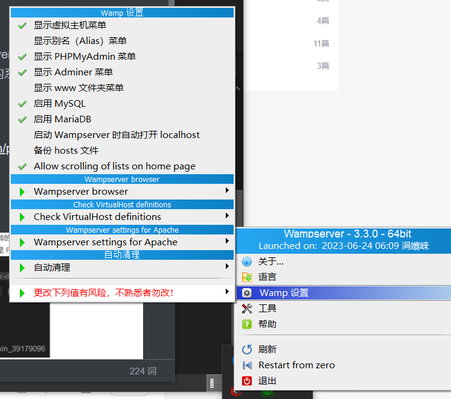

什么年代，还在用传统方法审计，包用 LLM 吧

## Java

### 深入反射机制

通过类本身去创建对象并执行类函数

## PHP

### 基础

PHP（Hypertext Preprocessor），超文本预处理器，原名 Personal Home Page，是一种创建动态交互性站点的强有力的服务器端的开源脚本语言

- PHP 文件可包含文本、HTML、JavaScript代码和 PHP 代码
- PHP 代码在服务器上执行，结果以纯 HTML 形式返回给浏览器

像 JS，但功能更强大，可以面向过程和对象，属 C 语言系，内核为 C，效率不错

环境配置：Windows 系统可以使用 WampServer

- 下载地址：http://www.wampserver.com/

下载完成后，启动 wampmanager.exe，这将启动一系列服务



通过`localhost/index.php`将可以访问到 wamp 根目录 www 目录下的动态 html 文件（php 文件通过 apache 服务器渲染结果）

VSCode 相关插件，JB 家有专用的 PhpStorm


WampServer 有一个内置的 MySQL

语法：简单来说，就是在 HTML 页面里面嵌入 PHP 代码

test_mysql.php

```php
<?php
echo '<h1><center>NMSL<center></h1>';

$user = 'root';
$password = '';
$database = '';
$port = NULL;
$mysqli = new mysqli('127.0.0.1', $user, $password, $database, $port);

if ($mysqli->connect_error) {
    die('Connect Error (' . $mysqli->connect_errno . ') '
            . $mysqli->connect_error);
}
echo '<p>Connection OK '. $mysqli->host_info.'</p>';
echo '<p>Server '.$mysqli->server_info.'</p>';
echo '<p>Initial charset: '.$mysqli->character_set_name().'</p>';

$mysqli->close();
?>
```


### WebShell

一个简单的 PHP WebShell，一般来说，将 webshell 上传至服务器并具有执行权限的 WEB 目录下，就能实现远程访问 webshell 控制服务器的目的

<a src="./assets/webshell.txt">⁉🙌🥰👍</a>

有点小长

## Rust

### 基础

> Rust 语言由 Mozilla 开发，最早发布于 2014 年 9 月。Rust 的编译器是在 MIT License 和 Apache License 2.0 双重协议声明下的免费开源软件
>
> [Rust 官方在线工具](https://play.rust-lang.org/)

Rust 语言是一种高效、可靠的通用高级语言。其高效不仅限于开发效率，它的执行效率也是令人称赞的，是一种少有的兼顾开发效率和执行效率的语言

Rust 语言可用于开发

- 传统命令行程序 - Rust 编译器可以直接生成目标可执行程序，不需要任何解释程序
- Web 应用 - Rust 可以被编译成 WebAssembly，WebAssembly 是一种 JavaScript 的高效替代品
- 网络服务器 - Rust 用极低的资源消耗做到安全高效，且具备很强的大规模并发处理能力，十分适合开发普通或极端的服务器程序。
- 嵌入b式设备 - Rust 同时具有 JavaScript 一般的高效开发语法和 C 语言的执行效率，支持底层平台的开发

环境配置

Manjaro 下使用官方脚本

```sh
curl --proto '=https' --tlsv1.2 -sSf https://sh.rustup.rs | sh
```

更新环境变量

```sh
source ~/.profile
source ~/.cargo/env
```

测试

```sh
rustc --version
cargo --version
```

第一个 rust 程序：hello.rs

```rust
fn main() {
    println!("Hello World!");
}
```

编译执行

```bash
rustc hello.rs
./hello
```

VSCode 插件：rust-analyzer、Native Debug

### Cargo

> Rust 的包管理工具

新建文件夹`runoob-greeting`，通过 vscode 打开，新建终端，新建项目

```sh
cargo new greeing
cd greeing
cargo build
cargo run
```

在 greeing 工程目录下新建 .vscode 文件夹，新建 tasks.json

```json
{ 
    "version":"2.0.0", 
    "tasks":[{ 
        "label":"build", 
        "type":"shell", 
        "command":"cargo", 
        "args":["build"] 
    }] 
}
```

新建 launch.json

```json
{
    "version": "0.2.0",
    "configurations": [
        {
            "name": "Debug",
            "type": "gdb",
            "preLaunchTask":"build",
            "request": "launch",
            "target": "${workspaceFolder}/target/debug/${workspaceFolderBasename}",
            "cwd":"${workspaceFolder}"
        }
    ]
}
```

运行后，可执行文件将生成在 greeing/target/debug 目录下，直接执行即可
