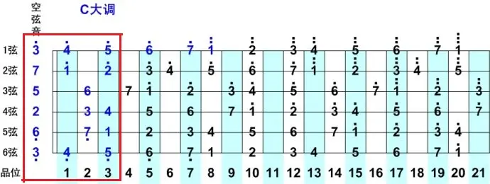
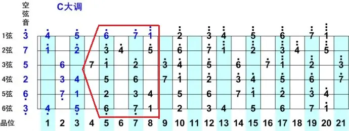
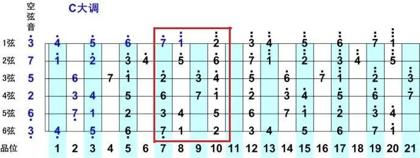
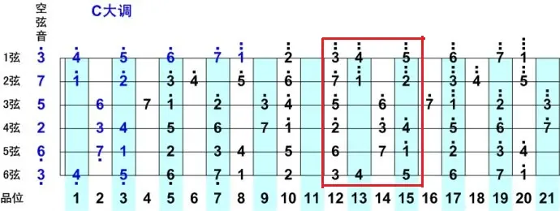

## 乐理

音调（Key）通常指的是调性，也就是某个音乐片段或整首乐曲围绕的主音（Tonic），调性决定了音乐的色彩和情绪，例如

- C 大调（C Major）以 C 音为中心，使用 C 大调音阶的音符
- A 小调（A Minor）以 A 音为中心，使用 A 小调音阶的音符

音阶与音调的关系

1. 音阶是音调的基础：一个音调（调性）通常由一个特定的音阶构成，例如 C 大调使用 C 大调音阶，A 小调使用 A 小调音阶
2. 音调决定了音乐的重心：虽然不同的音阶可以用于不同的调性，但每个调性都会有一个核心的主音，使音乐有归属感
3. 音阶可以用于不同的音调：比如 C 大调音阶不仅可以用于 C 大调，还可以作为 G 大调等调式中的一部分（很大一部分原因是二者均为大调，情绪都是欢快的）

简单来说，**音阶是音符的排列方式，而音调是音乐的基调或中心音**

### 音调

在 Gt 里，可以先简单分为 7 个调，即`C D E F G A B`调，上过一点音乐课我们都知道一个基本的 C 大调音阶`do re mi fa sol la si do`，他以`do`为起始音，上行七个音，其实就是由`C D E F G A B`这七个音组成

- 音阶是一组按照特定音程关系排列的音符，这个特定音程关系其实就是由音调决定的

按照这种逻辑进行推理，D 大调即是以 D 开始上行的七个音，即`G - A - B - C - D - E - F# - G`，同理，E 大调则为`E - F# - G# - A - B - C# - D# - E`

- 自然大调的特点是：音程关系是“全全半全全全半”，可以从 12 个半音之间任意选一个为主音开始构建音阶

以下是 12 个自然大调，大调是指，第一个音（主音）和第三个音之间相差四个半音（三大度）

| 大调名称 | 音阶（主音到主音）                    |
| :------- | :------------------------------------ |
| C 大调   | C - D - E - F - G - A - B - C         |
| G 大调   | G - A - B - C - D - E - F# - G        |
| D 大调   | D - E - F# - G - A - B - C# - D       |
| A 大调   | A - B - C# - D - E - F# - G# - A      |
| E 大调   | E - F# - G# - A - B - C# - D# - E     |
| B 大调   | B - C# - D# - E - F# - G# - A# - B    |
| F# 大调  | F# - G# - A# - B - C# - D# - E# - F#  |
| C# 大调  | C# - D# - E# - F# - G# - A# - B# - C# |
| F 大调   | F - G - A - B♭ - C - D - E - F        |
| B♭ 大调  | B♭ - C - D - E♭ - F - G - A - B♭      |
| E♭ 大调  | E♭ - F - G - A♭ - B♭ - C - D - E♭     |
| A♭ 大调  | A♭ - B♭ - C - D♭ - E♭ - F - G - A♭    |
| D♭ 大调  | D♭ - E♭ - F - G♭ - A♭ - B♭ - C - D♭   |
| G♭ 大调  | G♭ - A♭ - B♭ - C♭ - D♭ - E♭ - F - G♭  |
| C♭ 大调  | C♭ - D♭ - E♭ - F♭ - G♭ - A♭ - B♭ - C♭ |

有大调就有小调，自然可以以 12 个半音为主音构建 12 个自然小调，与自然大调不同，其音程特征为“全半全全半全全”，可以发现主音和第三个音之间相隔为三个半音（小三度）

| 小调名称 | 音阶（主音到主音）                    |
| :------- | :------------------------------------ |
| A 小调   | A - B - C - D - E - F - G - A         |
| E 小调   | E - F# - G - A - B - C - D - E        |
| B 小调   | B - C# - D - E - F# - G - A - B       |
| F# 小调  | F# - G# - A - B - C# - D - E - F#     |
| C# 小调  | C# - D# - E - F# - G# - A - B - C#    |
| G# 小调  | G# - A# - B - C# - D# - E - F# - G#   |
| D# 小调  | D# - E# - F# - G# - A# - B - C# - D#  |
| A# 小调  | A# - B# - C# - D# - E# - F# - G# - A# |
| D 小调   | D - E - F - G - A - B♭ - C - D        |
| G 小调   | G - A - B♭ - C - D - E♭ - F - G       |
| C 小调   | C - D - E♭ - F - G - A♭ - B♭ - C      |
| F 小调   | F - G - A♭ - B♭ - C - D♭ - E♭ - F     |
| B♭ 小调  | B♭ - C - D♭ - E♭ - F - G♭ - A♭ - B♭   |
| E♭ 小调  | E♭ - F - G♭ - A♭ - B♭ - C♭ - D♭ - E♭  |
| A♭ 小调  | A♭ - B♭ - C♭ - D♭ - E♭ - F♭ - G♭ - A♭ |

### 音程

在自然大调音阶（Ionian）中，音与音之间的音程关系是固定的

- E-F and B-C：半音
- else：全音

这种“全全半全全全半”的音程关系是 C 自然大调音阶的特征，因为 C 大调以 C 为起点，如果是 G 大调，那么音程特征就会是“全全半全全半全”（因为是以 G 为起点嘛）

我们很多时候会看到`#`符加在某个音之后，例如`C→C#、F→F#`，这是一个**升号**，将原本音符提高半个音；同样还有`♭`符号，表示降半音

- 半音的存在，在同一音程规则下也可排列组合出超多音符组合，故有上面的 12 中大调/小调

在吉他中，音程和品弦是息息相关的，首先我们明确小三度、大三度和纯四度（以半音为计量单位）

- 小三度：三个半音
- 大三度：四个半音 / 两个全音
- 纯四度：五个半音

OK，然后我们具体到琴上

- 横轴：在同一根弦上，一品为一个半音，两品为一个全音
- 纵轴：在不同弦之间，除开三弦到二弦是**大三度**（四个半音）以外，其余均是**纯四度**（五个半音）

这意味着，当我们确定一个 C 的位置后（比如五弦三品），那么我们就可以推知所有的音所在的品弦

于是就在吉他上构成了一整个 C 大调音阶

我们常说的 C D E F G A B 调，其实指的都是自然大调，对应到指板上，实际上就是在某一处确定 1，而后按照大调音程“全全半全全全半”去推知之后的七个 2、3、4、5、6、7、1

- 常说的高八度的度指的实际上就是 12 个半音（从 1 到 1 的一个循环）→ **十二平均律**

### 音阶

音阶练习，以 C 大调音阶为例

我们一般把挨着的 3-4 品分为一个把位，以某一个音为主音向上/下扩展 7 个音，每个把位对应着一些固定的指法（因为音程固定，一定有一些固定规律）

第一把位

第二把位

第三把位

第四把位

第五把位

第六把位

第七把位

第八把位

## 和弦

**自然大调**下的常用和弦，来源：[弹唱必备 | 吉他常用和弦大全（一） - 知乎](https://zhuanlan.zhihu.com/p/554051070)

### C 调

### D 调

### E 调

### F 调

### G 调

### A 调

### B 调

## 练习

### 二零二五

一月：真的爱你、光辉岁月

二月：匆匆那年、十年、才二十三

三月：回留、讨厌红楼梦

| 备选      |                   |                |
| --------- | ----------------- | -------------- |
| 山丘      | Shape of My Heart | Track in Time  |
| 水星记    | 春日影            | Counting Stars |
| 灰色轨迹· | 你离开的真相      |                |

