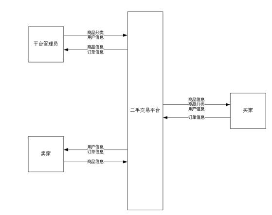
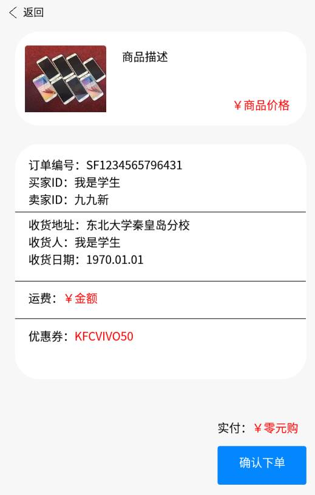

## 跨职能业务流程图

跨职能业务流程图（泳道图）

项目背景

- 人们物质增长需求的当下，需要购买的商品琳琅满目，家中闲置的物品也数量庞大，对二手物品的买卖需求由此诞生。然而，传统的线下二手交易市场存在交易成本高、信息不对称、安全性差、交易范围有限等问题。因此，二手交易平台应运而生。 二手交易平台旨在提供一个安全、便捷、经济的交易环境，使买卖双方可以在平台上进行信息的流通和交易的便捷操作。平台可以为卖家提供展示商品的平台，并且为买家提供商品选择的便利。平台还可以为用户提供购买保障，以及交易评价、投诉处理等后续服务，提高交易效率和交易质量。

建设内容

1. 需求分析和功能设计：在建设二手交换平台时，我们需要考虑以下问题，例如需求分析，用户需要发布、浏览、购买和出售二手商品；平台需要建立用户信息管理系统、商品分类管理、交易信息管理、评论管理等功能，以便为用户提供更好的体验和服务。 
2. 技术建设：需要采用适合的技术工具，例如 web应用程序框架、数据库、安全措施。其中，从用户角度出发，我们需要考虑以下内容，例如安全措施，确保用户数据和交易信息的安全；易用性，软件界面简洁明了，操作简单易懂。

建设意义

1. 满足用户需求: 二手商品交易市场越来越热门，它为个人和企业提供了一个平台，从而使他们可以分享与消费新旧物品，满足他们的消费需求。
2. 激社会资源回收利用: 二手商品交易平台的建立，使得那些被抛弃的物品变成了宝贝，使得这些物品得以利用，而不是浪费社会资源。
3. 经济促进作用：二手商品平台的建立，可以为担心固定资产下跌，企业降低日常管理成本，以及社会低收入人群提供优惠，进而促进经济的进一步发展。
4. 推动社会可持续发展：通过建立二手交易平台，我们可以促进社会的可持续发展，减少废弃物体的排放，减少对环境的压力。同时，也可以减少重复消费，提高利用率。 

因此，建立一个二手交易平台，对于用户、经济和环境来说都具有重要的意义，可以大大促进商业发展，提高社会福利水平，同时也可以减少浪费和环境污染。

## 0 数据流图和 1 层数据流图

> 数据流图，简称 DFD，表明数据的流入和流出（守恒）

0 层数据流图以及部分细化的 1 层数据流图

## 实体关系图

数据库 ER 图

## 程序流程图

> 用户操作逻辑及前端 UI 设计

商品发布界面及流程图

订单确认界面及流程图

