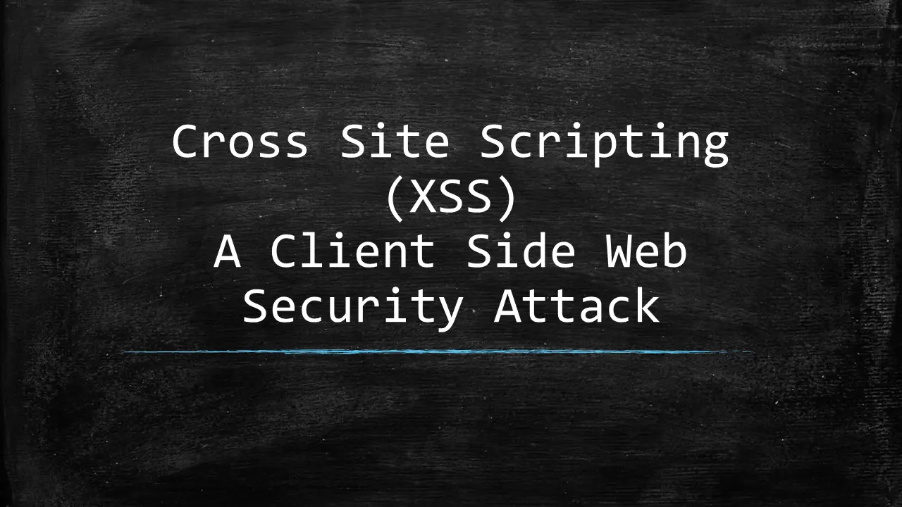

[Hacker101 CTF](https://ctf.hacker101.com/ctf)

## XSS

跨站脚本漏洞



### Micro-CMS v1

CMS（Content Management System）：网站内容管理系统

通过js脚本直接注入html，这是最简单常用的POC（Proof of Concept，漏洞验证）

```html
<script>alert(\xss)</script>
```

通过 img 标签的错误事件（随便请求一张图片）注入js事件

```html
 
```

### Micro-CMS v2
