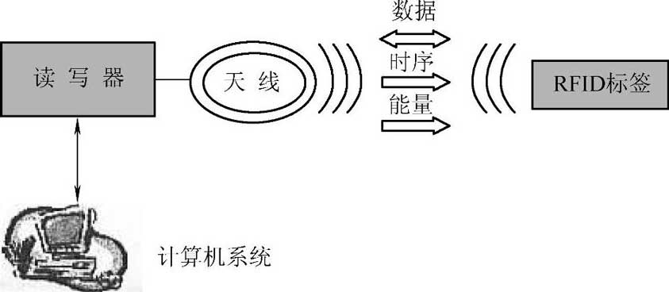
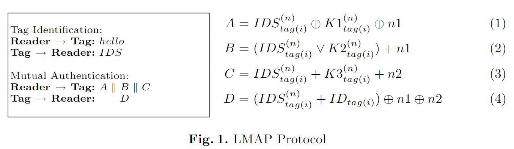
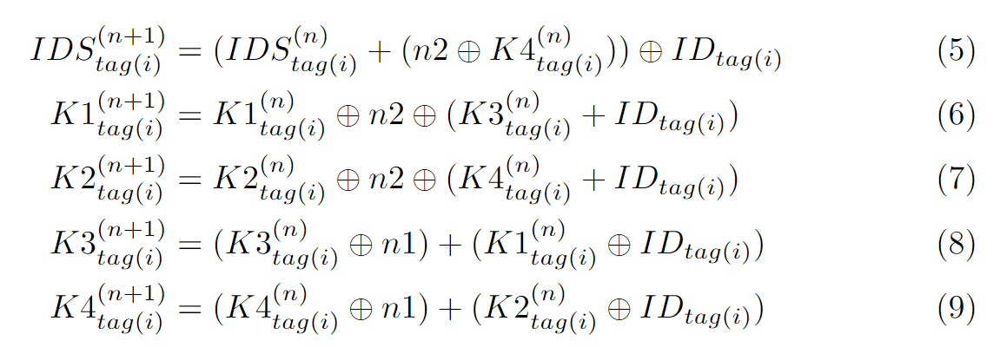
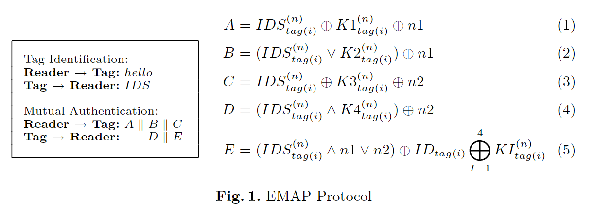
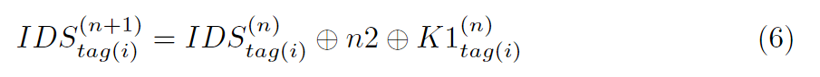
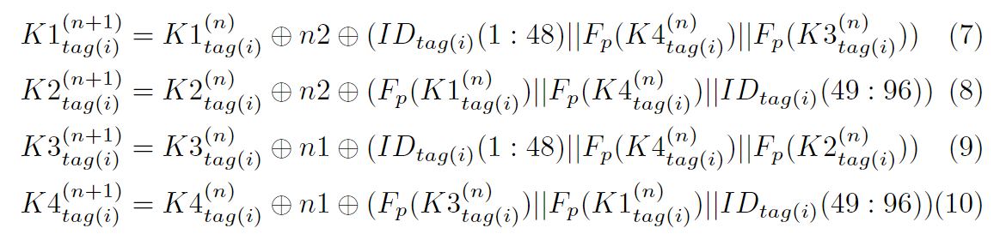
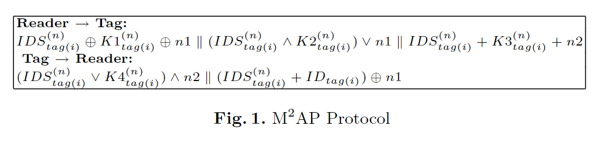
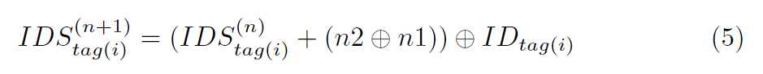
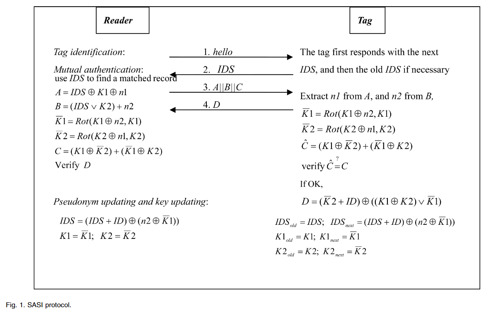
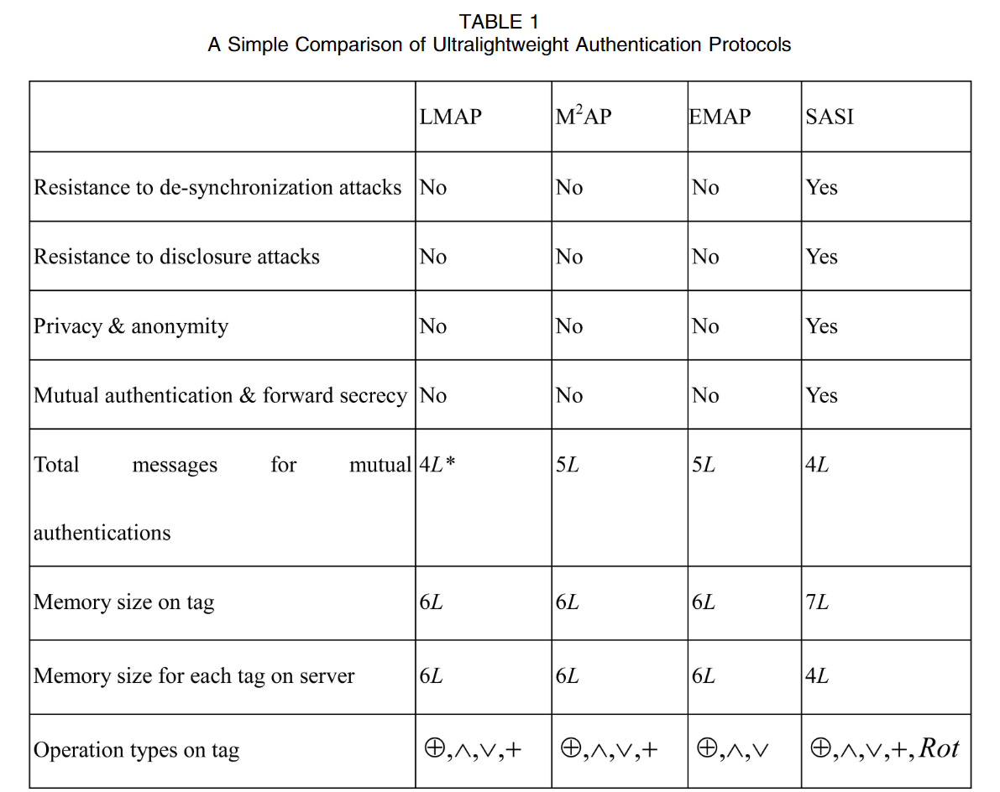

CIA：Confidentiality（数据机密性）、Integrity（完整性）、Availability（有效性）

## RFID 概述

> 射频识别，Radio Frequency Identification

### 简介

下图为 RFID 系统的一般结构，由标签、读头、应用系统组成

说白了，就是一个表单验证，只不过提交的方式不一样，不像 Web 程序通过 HTTP/Post 请求去打，而是通过电磁波进行数据交换

一些应用

- 商场用的防盗的牌，过安检门他会触发警报（独位的检测）
- 二代身份证
- 一卡通（NFC 是 RFID 的子集）

那么和所有的登录验证一样，在传输过程存在一定的安全问题（需要加密传输），并且认证中存在一定的算力限制，因为标签存储的数据量是有限的，密文不能过长、计算量不能过大

类比常见的 Web 协议，如果把 RFID 视作一个 HTTP 的表单提交（他自身是一个很轻量的协议，半双工、不具备安全性、没有状态维护等等），我们的工作大概就是需要在其上再套一层用于实现安全性的协议，如同把 SSL、TSL 套在 HTTP 上（这种类比似乎适用于所有的认证场景）

对于 RFID 而言，主要区别在于硬件资源严重受限，通常标签的存储空间在几字节到几千字节不等，故采用的加密算法和协议仅限于低成本实现，其一系列安全协议并被划分为：完备、简单、轻量级和超级轻量级四类。其中前两类（即完备和简单）协议主要针对有源 RFID 系统，而后两类（即轻量级和超轻量级）则主要针对无源 RFID 系统

- 完备协议
  - 非对称加密：ECC 为主流，较于 RSA 更加轻量
  - 对称加密：AES、XTEA
- 简单协议：轻量化的密码算法并且基于单向散列函数，最明显的特征是此类安全认证协议研究的重点是双向认证
- 轻量协议：主要包括循环冗余校验（Cyclic Redundancy Check, CRC）和随机数生成器（Random Number Generator，RNG）等
- 超轻量协议：如 LAMP、HB 协议族，多为按位运算

师姐建议我的研究重点放在较为重量的协议上

### 针对 RFID 系统的攻击

假冒和欺骗攻击

- 攻击者通过截获合法读写器与电子标签的访问 消息（或者直接攻击物理电子标签），来获得标签的身份信息并对其进行克隆。利用这些非法的克隆标签，攻击者可以伪装成合法的标签访问 RFID 系统
- 类似的， 攻击者同样可以通过窃听等手段获取合法读写器的隐私信息，从而伪装成合法的 读写器进入 RFID 系统

位置与跟踪攻击

- RFID 标签的设计要求规定，电子标签在工作状态下必须要对读写器的访问做 出响应，通过从不同的位置发送查询命令并从标签获得对应的响应，便可确定目标电子标签当前所处的位置（RFID 系统中标签的通信范围有限）。如果不采取有效的安全措施，攻击者同样可以通过上述方法对合法电子标签进行非法跟踪和定位

密码破译攻击

- 为了保证数据与通信安全，RFID 系统中通常采用加密技术来保证传递信息的 机密性和完整性，因此针对加密算法的攻击是安全系统最常见的攻击方式之一

拒绝服务（DoS）攻击

- 在 RFID 系统中，攻击者通过 阻断读写器读取标签信息的方式发动 DoS 攻击

## 超轻量级协议

### HB 协议族

> Secure human identification protocols
>
> HB 协议族最初由 **Hughes** 和 **Boudot** 在 2004 年提出，用于在低计算资源的设备（如 RFID 标签）中实现安全的身份认证。HB 协议族以其高效和简单的设计而闻名，适合在对计算和存储资源有限的环境中使用

#### LPN 问题

> LPN（Learning Parity with Noise），噪声环境下的学习校验，基于格的加密

LPN 的向量元素均为二进制，即 LPN 系统是为模 2 的，其轻量性来源于此

形式化描述

- 设有秘密向量 s，和一组长度为 n 的随机生成的向量 ai
- 我们计算 s · ai（s 和 ai 的内积），并且在计算结果上加入某种噪声 ei，其中 ei 是一个服从某个噪声分布（常为伯努利分布）（通常以微小概率为 1）的随机变量

基于此，我们可以获得一些观测值
$$
y_i=a_i\cdot s+e_i
$$
其中 yi 是一个比特值，当执行 n 轮后，一组观测值蕴含的噪声将符合某种概率分布，而破解的目标是通过这些观测值 yi，恢复出秘密向量 s

#### HB+ 协议

> Authenticating Pervasive Devices with Human Protocols

以 HB+ 协议为例，其采用**提交-挑战-响应-认证**的双密钥结构应用 LPN 问题，其流程大致如下

1. 初始化：认证双方共享两个密钥 X 和 Y（长为 k 的向量）
2. 提交：标签发送随机向量 b 给读写器
3. 挑战：读写器发送随机向量 a 给标签
4. 认证：标签根据概率模型生成独位的噪声 r
   - 标签计算`z = ax+by+r`，并将 z 发回读写器
   - 读写器通过解出`r = ax+by+z`（这样的认证将进行 k 轮），最后对 k 长的噪声 R 进行检验，以判断标签是否合法

显然这是一个读写器对标签的单向认证，标签并不具备识别合法读写器的能力（而且，这里标签需要具有生成随机向量的算力，资源是否有限要画个问号）

#### GRS 攻击

> An Active Attack Against HB+: A Provably Secure Lightweight Authentication Protocol

LPN 问题被证明是抗量子的，其主要的被攻击方式是中间人攻击

因为单边认证在大多数 HB 协议族中执行（如 HB+）。标签阅读器通信总是被认为是安全的，只有 RFID 标签模拟的可能性。然而，物联网需要相互认证。使用两个独立的认证协议会导致中继攻击、重放攻击、非同步攻击、会话劫持等的风险更高

GRS（一种针对 RFID 系统的中间人攻击）攻击的步骤：

1. 被动监听：攻击者被动监听标签和读写器之间的认证交互，收集多个挑战向量`a`和响应值`z`
2. 主动篡改挑战向量：攻击者修改某些挑战向量，并监听相应的响应
3. 噪声消除：利用收集到的数据，攻击者通过统计分析的方式，逐步消除噪声`r`的影响，恢复出密钥`x`

常见的抵抗中间人攻击的方式是基于 HB 协议实现双向认证，这样可以很大程度避免中间人攻击，同时采用距离边界协议

### UMAP 协议族

> Ultralightweight Mutual Authentication Protocol，由 Lopez 等人提出，包括 MMAP（Minimalist Mutual Authentication Protocol）、LMAP（Lightweight Mutual Authentication Protocol）和 EMAP（Efficient Mutual Authentication Protocol）三个协议

基于极简密码学（minimalist cryptography）的思想，作者认为能通过此提升低成本 RFID 的安全性

#### LMAP

> LMAP: A real lightweight mutual authentication protocol

HB 协议在 05 年提出，而这篇论文在 06 年，并且在第一种绪论中有提到 HB 协议族：这种最具有前途的协议 (HB, HB+) 的安全性与噪声问题 (LNP) 的学习奇偶校验有关，但其在随机实例上的困难性仍然是一个悬而未决的问题

在 LMAP 协议中，标签将维护一个长度为 96 位的 IDS 和一个长度为 96 位的密钥 K，K 被均分为 4 份（K1、K2、K3、K4）。为了 IDS 和 K 的更新（新旧各一份），共需 384 位的空间。此外，每个标签还需要 96 位的空间去存储它的静态标识符 ID，故标签所需存储空间为 480bit

高成本的计算，如随机数的生成将在读写器端执行；对应的，标签端仅有按位异或、逐位或、逐位并、有限模加法这样简单的操作

通过 IDS 的限制，只有拥有权限的 Reader 才能够访问标签的密钥 K，认证过程

- 标签识别：读写器向标签 say hello，而后标签将其 IDS 发给读写器，若读写器合法，才可获得标签的密钥 K，这是一次认证（标签认证读写器）
- 双向认证
  1. 读写器生成随机数 n1、n2，结合 IDS 和密钥 K 计算密文 A、B、C 并发送给标签
  2. 标签接收密文 A、B、C，通过 IDS 和 K 解出随机数 n1、n2，最后通过 n1、n2 计算密文 D 发送回读写器
- 最后由读写器判断 D 是否能解出标签的静态标识符 ID 来认证响应，是为第二次认证（读写器认证标签），由于 n1、n2 和 IDS 的混淆，标签的静态标识符 ID 是被安全传输的

显然这是一个基于对称密钥的双向认证协议，通过 IDS 对密钥进行混淆，使用相同的密钥 K 和明文 n1、n2 进行多种加解密，在加解密的过程中实现认证（通过解出的明文是否相同来判断），其中 + 为模 2^m 的加法运算

有一个疑问是，最后 Reader 如何通过 D 来进行认证？实际上，这里除了阅读器和标签，还有一个应用系统，阅读器可以通过合法的 IDS 查询到标签的 K 和 ID，即对于阅读器而言，ID 是已知的，于是在 D 中可以通过 IDS、n1、n2 解出对应的 ID 并和已知的 ID 进行比对，完成认证。在后面的 EMAP 和 MMAP 中最后一步 ID 的认证也都如此

在双向认证成功后，标签对应的 IDS 和密钥 K 将进行更新（这可以有效防止中间人攻击），更新策略如下（通过每次的随机明文 n1、n2 以及标签的静态标识符 ID 进行更新）

至此完成一次完整的认证，这是一个提交 → 明文加密 → 密文解密（标签一次认证）、重新加密 → 解密（读写器二次认证）的认证过程

#### EMAP

> EMAP: An Efficient Mutual-Authentication Protocol for Low-Cost RFID Tags

和 LMAP 的认证过程基本一样，一个 96 位的 IDS 和一个被分为四份的 96 位的密钥 K，进行如下认证

可以看到，这个认证过程和 LMAP 是基本一致的，区别在于

- 密文的计算方法不一样，在 EMAP 协议中并没有采用模 2^m 加法
- 标签的响应分成两部分 D 和 E，其中
  - D 用于认证，读写器通过判断是否能从 D 中解出期望的 n2 来认证响应是否合法
  - E 用于传递标签的静态标识符 ID，通过 IDS、n1、n2 以及 K 的混淆实现安全传输

认证成功后，IDS 的更新策略如下

密钥更新的策略如下

其中 Fp 是一个奇偶校验函数，KI 为 96 位，奇/偶数位 48 位
$$
F_p(K3^{n}_{tag(i)}||F_p(K1^{n}_{tag(i)}||ID_{tag(i)}(49:96))
$$
三个数以某种规则拼接为一个 96 位的数

引用自：T. Dimitriou. A lightweight RFID protocol to protect against traceability and cloning attacks. In Proc. of SECURECOMM'05, 2005.

#### MMAP

> M^2AP: A Minimalist Mutual-Authentication Protocol for Low-Cost RFID Tags

认证过程与 EMAP 类似，读写器发送给标签 A、B、C，标签响应 D、E

IDS 更新

密钥更新

### SASI 协议

> SASI: A New Ultralightweight RFID Authentication Protocol Providing Strong Authentication and Strong Integrity

认证过程，和 UMAP 协议族一样，合法的读写器将可以通过标签的 IDS 从系统中获取该标签的密钥 K 和静态标识符 ID

与 UMAP 一个明显的差异是

- 这里引入了 Rot 运算，对密钥 K1、K2 旋转进行加密和密钥更新
- 这里用到两个密钥 K1 和 K2，均为 96 位，并且为了抵抗可能的去同步攻击，对于 IDS、K1、K2 均需要存储新旧两份，故标签的容量为 96 x 3 x 2 + 96 = 672 位

SASI 和 UMAP 协议族的对比

基于置换的两类安全认证协议，可抵抗去同步攻击，前文的 UMAPs 和 SASI 无法抵抗

- RCIA：RobustConfiden-tiality,Integrity,and Authentication
- RRAP：Reconstructionbased RFID Authentication Protocol

什么是去同步攻击？

## 轻量级协议

> 多数轻量级安全认证协议是为了满足 ISO/IEC18000(EPC C1Gen2) 标准而提出的，EPC C1G2 (Class-1 Gen-2) 类型安全认证协议多使用符合相关标准的简单加密手段，主要包括循环冗余校验（Cyclic Redundancy Check, CRC）和随机数生成器（Random Number Generator，RNG）等

现存的较为经典的轻量级 RFID 安全协议主要包括 Juels 提出的首个适用于  EPC C1Gen2 的安全协议 [1]，Duc 等人提出的基于 CRC 和 PRNG 的安全协议 [2] ，Chien 等人的 CC 协议 [3] 以及其相应的改进协议 [4-6] 等

- [1] A. Juels. Strengthening EPC tags against cloning[C]. Proceedings of the 4th ACM workshop on Wireless security, 2005, 67-76
- [2] D. DUC. Enhancing security of EPCglobal gen-2 RFID tag against traceability and cloning[J]. SCIS, IEICE 2006, 2006:
- [3] H.-Y. Chien, C.-H. Chen. Mutual authentication protocol for RFID conforming to EPC Class 1 Generation 2 standards[J]. Computer Standards & Interfaces, 2007, 29, (2): 254-259
- [4] N.-W. Lo, K.-H. Yeh. An efficient mutual authentication scheme for EPCglobal class-1 generation-2 RFID system[C]. International Conference on Embedded and Ubiquitous Computing, 2007, 43-56
- [5] P. Peris-Lopez, J. C. Hernandez-Castro, J. M. Estevez-Tapiador, et al. Cryptanalysis of a novel authentication protocol conforming to EPC-C1G2 standard[J]. Computer Standards & Interfaces, 2009, 31, (2): 372-380
- [6] T.-C. Yeh, Y.-J. Wang, T.-C. Kuo, et al. Securing RFID systems conforming to EPC Class 1 Generation 2 standard[J]. Expert Systems with Applications, 2010, 37, (12): 7678-7683

### EPC C1Gen2 标准

EPC C1Gen2 标准（即 EPC Class 1 Generation 2，简称 C1G2）是电子产品代码（EPC）体系中的第二代无线射频识别（RFID）标准，用于管理和识别物品的全球统一标识。该标准由 GS1 和 EPC global 组织发布，广泛应用于供应链、仓储、物流和零售等领域。它定义了超高频（UHF）RFID标签和读写器之间的通信协议，旨在提高物品跟踪和识别的效率和准确性

### CRC 和 PRNG

### CC 协议

## 中量级协议

> 中量级安全认证协议相较于前 2 种量级的安全认证协议，由于采用了部分经过轻量化的密码算法且基于单向散列函数，安全性要高于前 2 种协议的，最明显的特征是此类安全认证协议研究的重点是双向认证

比较经典的安全认证协议包括基于单向散列函数的 Hash-Lock 协议、改进的随机 Hash-Lock 协议、Hash 链协议、David 数字图书馆协议 [1-4] 和可抵抗追踪攻击的 YA-TRAP 协议 [5] 等

- [1] SarmaSE,WeisS A,EngelsD W.RFID systems and security and privacy implications[C]∥Proc of International Workshopon Cryptographic Hardwareand EmbeddedSys-tems,2002:454-469
- [2] WeisS A,SarmaSE,RivestR L,etal.Security and privacy aspects of low-cost radio frequency identification systems[C]∥Proc of the 1st International Conference on Security in Pervasive Computing,2004:201-212.
- [3] Ohkubo M, Suzuki K, Kinoshita S.Hash-chain based forward-secure privacy protection scheme for lowcost RFID[C]∥Proc of 2004 Symposium on Cryptography and Information Security,2004:719-724.
- [4] MolnarD,WagnerD.Privacy and security in library RFID: Issues,practices,and architectures[C]∥Proc of the 11th ACM  Conferenceon Computerand Communications Security,2004:210-219.
- [5] G. Tsudik. YA-TRAP: Yet another trivial RFID authentication protocol[C]. Fourth Annual IEEE International Conference on Pervasive Computing and Communications Workshops (PERCOMW'06), 2006, 4 pp.-643

## 重量级协议

> 重量级安全认证协议也被部分文献命名为完备 RFID 安全认证协议，主要分为对称加密算法和非对称加密算法

目前基于非对称算法的 RFID协议主要采用椭圆曲线密码体制（Elliptic Curve Cryptography, ECC）[1-4] 。与 RSA [5] 密码体制相比，ECC 算法速度更快、体积更小、功耗更低，因此更适合于 RFID 系统

- [1] Y.-P. Liao, C.-M. Hsiao. A secure ECC-based RFID authentication scheme integrated with ID-verifier transfer protocol[J]. Ad Hoc Networks, 2014, 18: 133-146
- [2] J. Chou. A secure RFID authentication protocol to enhance patient medication safety using elliptic curve cryptography[J]. J. Supercomput, 2014:
- [3] C. Jin, C. Xu, X. Zhang, et al. A secure RFID mutual authentication protocol for healthcare environments using elliptic curve cryptography[J]. Journal of medical systems, 2015, 39, (3): 24
- [4] M. S. Farash, O. Nawaz, K. Mahmood, et al. A provably secure RFID authentication protocol based on elliptic curve for healthcare environments[J]. Journal of medical systems, 2016, 40, (7): 165
- GolleP,Jakobsson M,JuelsA,etal.Universalre-encryptionformixnets[C]∥Proc of Cryptographers' Trackatthe RSA Conference,2004:163-178

不同研究人员利用 ECC 为 RFID 认证提供服务，并采用了不同的加密和认证方法。大多数研究表明，只使用一 种 ECC 算法的安全认证协议只能提供单向认证，且整个系统容易受到攻击。随着第 2 个 ECC 算法的安全认证协议的加入，双向认证达成，为系统整体提供了更好的安全性。2 个 ECC 安全认证协议耦合的不同导致各个安全认证协议的效率与安全性有差异

虽然 ECC 在计算速度与功耗等方面在非对称密 码体制中具有明显的优势，但将其应用于资源受限的 RFID 系统中仍然显得比较勉 强。于是安全性稍弱但功耗与计算速度具有明显优势的对称加密算法被引入 RFID安全协议中，其中典型的方案有 Feldhofer 等人提出的基于 AES（Advance Encryption Standard）的协议 [5] 和 Kaps 提出的基于 XTEA（Extended Tiny Encryption Algorithm） 的协议 [6] 等

- [5] M. Feldhofer, S. Dominikus, J. Wolkerstorfer. Strong authentication for RFID systems using the AES algorithm[C]. International Workshop on Cryptographic Hardware and Embedded Systems, 2004, 357-370
- [6] J.-P. Kaps. Chai-tea, cryptographic hardware implementations of xtea[C]. International Conference on Cryptology in India, 2008, 363-375

### 非对称加密

### 对称加密

## 双向认证

### 轻量级认证

超轻量级双向认证：An Ultra-Lightweight Mutual Authentication Protocol Based on LPN Problem with Distance Fraud Resistant

2021 年提出的一个基于 HB 协议族、LPN 问题的一个双向认证方案（发表在 Springer 上），结合 DB 协议（距离边界协议）工作，以抗 GRS 攻击

- 对称密钥体系，共享密钥矩阵 X
- 其双向认证过程很像 TCP 三次握手，响应的同时挑战

这是一个发起挑战 → 明文加密、发起挑战 → 解密密文（读写器一次认证）、明文加密 → 解密密文（标签二次认证）的认证过程

### 基于哈希

### 基于异构 ECC

## 发展与展望

近年已有研究人员将基于 ECC 算法的安全认证协议门电路控制在轻量级的水平。目前，在现有技术条件下，RFID 安全认证协议主要有 2 个方向，一个是在前人研究基础上针对部分安全性漏洞进行修补并进行安全性的提升，另一个是保障安全性的基础上对现有协议的效率与通信开销进行优化

同时，有众多研究人员将重心放在 RFID 安全认证协议的防碰撞性研究 [1-3] 上，通常将防碰撞协议与安全协议作为单独的两部分考虑，也有人提出防碰撞的安全认证协议 [4]，利用防碰撞协议的模型可以在判断碰撞的同时嵌入认证协议，能同时实现门电路的优化与认证手段的革新

引入区块链技术也可能给 RFID 带来的变革和影响 [5-9]，将区块链的去中心化思想引入到基于散列的中量级安全认证协议中，将验证计算转移至阅读器和区块链节点中，可以有效降低标签的计算成本

- [1] SuJ,ShengZ,LeungV C M,etal.Energy efficient tag identification algorithms for RFID: Survey,motivation and new design[J].IEEE Wireless Communications,2019,26(3):118-124.
- [2] SuJ,ShengZ,LiuA X,etal.A group-based binary splitting algorithm for UHF RFID anti-collision systems[J].IEEE Transactionson Communications,2019,68(2):998-1012.
- [3] SuJ,ShengZ,XieL,etal.Fast splitting-based tag identification algorithm for anti-collision in UHF RFID system[J].IEEE Transactionson Communications,2018,67(3):2527-2538.
- [4] MbackeA A,Mitton N,Rivano H.A survey of RFID readers anticollision protocols[J].IEEE Journalof Radio Frequency Identification,2018,2(1):38-48.
- [5] RahmanF,Ahamed SI.Efficient detection of counterfeit products in large-scale RFID systems using batch authentication protocols[J].Personaland Ubiquitous Computing,2014,18(1):177-188.
- [6] YueK Q,SunL L,QinY,etal.Designofanti-collisioninte-grated security mechanism based on chaotic sequence in UHF RFID system [J].China Communication,2014,11:137-147.
- [7] LiPeng,Zheng Tian-tian,Xu He,etal.RFID securityau-thentication protocolbased on block chain technology[J].NetinfoSecurity,2021,21(5):1-11.(inChinese)
- [8] Sidorov M,Ong M,Sridharan R,et al.Ultralight-weight mutual authentication RFID protocol for block chain enabled supply chains[J].IEEE Access,2019,19(7):7273-7285.
- [9] JangiralaS,Das A,Vasilakos A.Designing secure light-weightblockchain-enabled RFID-based authentication protocol for supply chains in 5G mobile edge computing environment[J].IEEE Transactions on Industrial Informatics,2019,16(11):7081-7093.

另外，与 PUF 结合的认证也得到一定的关注
