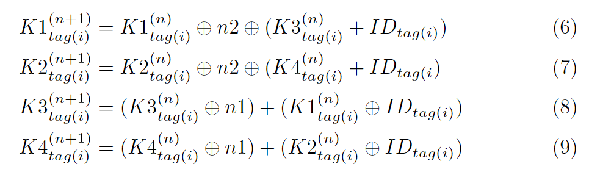

## RFID 概述

下图为 RFID 系统的一般结构，由标签、读头、应用系统组成

说白了，就是一个表单验证，只不过提交的方式不一样，不像 Web 程序通过 HTTP/Post 请求去打，而是通过电磁波进行数据交换

一些应用

- 商场用的防盗的牌，过安检门他会触发警报（独位的检测）
- 二代身份证
- 一卡通（NFC 是 RFID 的子集）

那么和所有的登录验证一样，在传输过程存在一定的安全问题（需要加密传输），并且认证中存在一定的算力限制，因为标签存储的数据量是有限的，密文不能过长、计算量不能过大

类比常见的 Web 协议，如果把 RFID 视作一个 HTTP 的表单提交（他自身是一个很轻量的协议，半双工、不具备安全性、没有状态维护等等），我们的工作大概就是需要在其上再套一层用于实现安全性的协议，如同把 SSL、TSL 套在 HTTP 上（这种类比似乎适用于所有的认证场景）

对于 RFID 而言，主要区别在于硬件资源严重受限，通常标签的存储空间在几字节到几千字节不等，故采用的加密算法和协议仅限于低成本实现，其一系列安全协议并被划分为：完备、简单、轻量级和超级轻量级四类。其中前两类（即完备和简单）协议主要针对有源 RFID 系统，而后两类（即轻量级和超轻量级）则主要针对无源 RFID 系统

- 完备协议
  - 非对称加密：ECC 为主流，较于 RSA 更加轻量
  - 对称加密：AES、XTEA
- 简单协议：轻量化的密码算法并且基于单向散列函数，最明显的特征是此类安全认证协议研究的重点是双向认证
- 轻量协议：主要包括循环冗余校验（Cyclic Redundancy Check, CRC）和随机数生成器（Random Number Generator，RNG）等
- 超轻量协议：如 LAMP、HB 协议族，多为按位运算

师姐建议我的研究重点放在较为重量的协议上

## 超轻量协议

### HB 协议族

> Secure human identification protocols
>
> HB 协议族最初由 **Hughes** 和 **Boudot** 在 2004 年提出，用于在低计算资源的设备（如 RFID 标签）中实现安全的身份认证。HB 协议族以其高效和简单的设计而闻名，适合在对计算和存储资源有限的环境中使用

#### LPN 问题

> LPN（Learning Parity with Noise），噪声环境下的学习校验，基于格的加密

LPN 的向量元素均为二进制，即 LPN 系统是为模 2 的，其轻量性来源于此

形式化描述

- 设有秘密向量 s，和一组长度为 n 的随机生成的向量 ai
- 我们计算 s · ai（s 和 ai 的内积），并且在计算结果上加入某种噪声 ei，其中 ei 是一个服从某个噪声分布（常为伯努利分布）（通常以微小概率为 1）的随机变量

基于此，我们可以获得一些观测值
$$
y_i=a_i\cdot s+e_i
$$
其中 yi 是一个比特值，当执行 n 轮后，一组观测值蕴含的噪声将符合某种概率分布，而破解的目标是通过这些观测值 yi，恢复出秘密向量 s

#### HB+ 协议

> Authenticating Pervasive Devices with Human Protocols

以 HB+ 协议为例，其采用**提交-挑战-响应-认证**的双密钥结构应用 LPN 问题，其流程大致如下

1. 初始化：认证双方共享两个密钥 X 和 Y（长为 k 的向量）
2. 提交：标签发送随机向量 b 给读写器
3. 挑战：读写器发送随机向量 a 给标签
4. 认证：标签根据概率模型生成独位的噪声 r
   - 标签计算`z = ax+by+r`，并将 z 发回读写器
   - 读写器通过解出`r = ax+by+z`（这样的认证将进行 k 轮），最后对 k 长的噪声 R 进行检验，以判断标签是否合法

显然这是一个读写器对标签的单向认证，标签并不具备识别合法读写器的能力（而且，这里标签需要具有生成随机向量的算力，资源是否有限要画个问号）

#### GRS 攻击

> An Active Attack Against HB+: A Provably Secure Lightweight Authentication Protocol

LPN 问题被证明是抗量子的，其主要的被攻击方式是中间人攻击

因为单边认证在大多数 HB 协议族中执行（如 HB+）。标签阅读器通信总是被认为是安全的，只有 RFID 标签模拟的可能性。然而，物联网需要相互认证。使用两个独立的认证协议会导致中继攻击、重放攻击、非同步攻击、会话劫持等的风险更高

GRS（一种针对 RFID 系统的中间人攻击）攻击的步骤：

1. 被动监听：攻击者被动监听标签和读写器之间的认证交互，收集多个挑战向量`a`和响应值`z`
2. 主动篡改挑战向量：攻击者修改某些挑战向量，并监听相应的响应
3. 噪声消除：利用收集到的数据，攻击者通过统计分析的方式，逐步消除噪声`r`的影响，恢复出密钥`x`

常见的抵抗中间人攻击的方式是基于 HB 协议实现双向认证，这样可以很大程度避免中间人攻击，同时采用距离边界协议

#### 前沿研究

> An Ultra-Lightweight Mutual Authentication Protocol Based on LPN Problem with Distance Fraud Resistant

2021 年提出的一个基于 HB 协议族、LPN 问题的一个双向认证方案（发表在 Springer 上），结合 DB 协议（距离边界协议）工作，以抗 GRS 攻击

- 对称密钥体系，共享密钥矩阵 X
- 其双向认证过程很像 TCP 三次握手，响应的同时挑战

这是一个**发起挑战 → 明文加密、发起挑战 → 解密密文（读写器一次认证）、明文加密 → 解密密文（标签二次认证）**的认证过程

### UMAP 协议族

> Ultralightweight Mutual Authentication Protocol，由 Lopez 等人提出，包括 MMAP（Minimalist Mutual Authentication Protocol）、LMAP（Lightweight Mutual Authentication Protocol）和 EMAP（Efficient Mutual Authentication Protocol）三个协议

基于极简密码学（minimalist cryptography）的思想，作者认为能通过此提升低成本 RFID 的安全性

#### LMAP

> LMAP: A real lightweight mutual authentication protocol

HB 协议在 05 年提出，而这篇论文在 06 年，并且在第一种绪论中有提到 HB 协议族：这种最具有前途的协议 (HB, HB+) 的安全性与噪声问题 (LNP) 的学习奇偶校验有关，但其在随机实例上的困难性仍然是一个悬而未决的问题

在 LMAP 协议中，标签将维护一个长度为 96 位的 IDS 和一个长度为 96 位的密钥 K，K 被均分为 4 份（K1、K2、K3、K4）。为了 IDS 和 K 的更新（新旧各一份），共需 384 位的空间。此外，每个标签还需要 96 位的空间去存储它的静态标识符 ID，故标签所需存储空间为 480bit

高成本的计算，如随机数的生成将在读写器端执行；对应的，标签端仅有按位异或、逐位或、逐位并、有限模加法这样简单的操作

通过 IDS 的限制，只有拥有权限的 Reader 才能够访问标签的密钥 K，认证过程

- 标签识别：读写器向标签 say hello，而后标签将其 IDS 发给读写器，若读写器合法，才可获得标签的密钥 K，这是一次认证（标签认证读写器）
- 双向认证
  1. 读写器生成随机数 n1、n2，结合 IDS 和密钥 K 计算密文 A、B、C 并发送给标签
  2. 标签接收密文 A、B、C，通过 IDS 和 K 解出随机数 n1、n2，最后通过 n1、n2 计算密文 D 发送回读写器
- 最后由读写器判断 D 是否能解出标签的静态标识符 ID 来认证响应，是为第二次认证（读写器认证标签），由于 n1、n2 和 IDS 的混淆，标签的静态标识符 ID 是被安全传输的

显然这是一个基于对称密钥的双向认证协议，通过 IDS 对密钥进行混淆，使用相同的密钥 K 和明文 n1、n2 进行多种加解密，在加解密的过程中实现认证（通过解出的明文是否相同来判断），其中 + 为模 2^m 的加法运算

有一个疑问是，最后 Reader 如何通过 D 来进行认证？实际上，这里除了阅读器和标签，还有一个应用系统，阅读器可以通过合法的 IDS 查询到标签的 K 和 ID，即对于阅读器而言，ID 是已知的，于是在 D 中可以通过 IDS、n1、n2 解出对应的 ID 并和已知的 ID 进行比对，完成认证。在后面的 EMAP 和 MMAP 中最后一步 ID 的认证也都如此

在双向认证成功后，标签对应的 IDS 和密钥 K 将进行更新（这可以有效防止中间人攻击），更新策略如下（通过每次的随机明文 n1、n2 以及标签的静态标识符 ID 进行更新）

至此完成一次完整的认证，这是一个提交 → 明文加密 → 密文解密（标签一次认证）、重新加密 → 解密（读写器二次认证）的认证过程

#### EMAP

> EMAP: An Efficient Mutual-Authentication Protocol for Low-Cost RFID Tags

和 LMAP 的认证过程基本一样，一个 96 位的 IDS 和一个被分为四份的 96 位的密钥 K，进行如下认证

可以看到，这个认证过程和 LMAP 是基本一致的，区别在于

- 密文的计算方法不一样，在 EMAP 协议中并没有采用模 2^m 加法
- 标签的响应分成两部分 D 和 E，其中
  - D 用于认证，读写器通过判断是否能从 D 中解出期望的 n2 来认证响应是否合法
  - E 用于传递标签的静态标识符 ID，通过 IDS、n1、n2 以及 K 的混淆实现安全传输

认证成功后，IDS 的更新策略如下

密钥更新的策略如下

其中 Fp 是一个奇偶校验函数，KI 为 96 位，奇/偶数位 48 位
$$
F_p(K3^{n}_{tag(i)}||F_p(K1^{n}_{tag(i)}||ID_{tag(i)}(49:96))
$$
三个数以某种规则拼接为一个 96 位的数

引用自：T. Dimitriou. A lightweight RFID protocol to protect against traceability and cloning attacks. In Proc. of SECURECOMM'05, 2005.

#### MMAP

> M^2AP: A Minimalist Mutual-Authentication Protocol for Low-Cost RFID Tags

认证过程与 EMAP 类似，读写器发送给标签 A、B、C，标签响应 D、E

IDS 更新

密钥更新

### SASI 协议

> SASI: A New Ultralightweight RFID Authentication Protocol Providing Strong Authentication and Strong Integrity

认证过程，和 UMAP 协议族一样，合法的读写器将可以通过标签的 IDS 从系统中获取该标签的密钥 K 和静态标识符 ID

与 UMAP 一个明显的差异是

- 这里引入了 Rot 运算，对密钥 K1、K2 旋转进行加密和密钥更新
- 这里用到两个密钥 K1 和 K2，均为 96 位，并且为了抵抗可能的去同步攻击，对于 IDS、K1、K2 均需要存储新旧两份，故标签的容量为 96 x 3 x 2 + 96 = 672 位

SASI 和 UMAP 协议族的对比

## 轻量协议

> 摘自 SASI: A New Ultralightweight RFID Authentication Protocol Providing Strong Authentication and Strong Integrity，作者认为 HB 协议族并非超轻量，认为 UMAP 协议族为超轻量
>
> The lightweight RFID authentication protocols do not require hashing function on tags; for example, the EPCglobal Class-1 Gen-2 RFID tag [8] supports Pseudo-Random Number Generator (PRNG) and Cyclic Redundancy Code (CRC) checksum but not hashing function. The protocols [7], [12], [15] belong to this class, where the scheme [12] did not take the eavesdropping and privacy issues into consideration, and Chien and Chen [5] had reported the DOS attack, replay attack, tracking attack and spoofing tag problem on the schemes [7], [15], respectively. The HB-series [3], [9], [11], [14], [21], [26] can also be classified into this class, since they demand the support of random number function but not hash function on tags. Hopper and Blum [11], based on the LPN problem, first proposed the HB protocol to defect the passive attacker. Later, the HB protocol was successively attacked and improved by its sister works [3], [9], [14], [21], [26]. Actually, the HB-series cannot be regarded as complete, since these protocols only consider the authentication of tags. They neglected the issue of the authentication of the readers, the tracking problem, and the anonymity issue, and even the privacy of the tag identification.

[8] EPCglobal, http://www.epcglobalinc.org/, 2007.

[7] D.N. Duc, J. Park, H. Lee, and K. Kim, "Enhancing Security of EPCglobal Gen-2 RFID Tag against Traceability and Cloning," Proc. 2006 Symp. Cryptography and Information Security, 2006.

[12] A. Juels, "Strengthening EPC Tag against Cloning," Proc. ACM Workshop Wireless Security (WiSe '05), pp. 67-76, 2005.

[15] S. Karthikeyan and M. Nesterenko, "RFID Security without Extensive Cryptography," Proc. Third ACM Workshop Security of Ad Hoc and Sensor Networks, pp. 63-67, 2005.

[3] J. Bringer, H. Chabanne, and E. Dottax, "HB++: A Lightweight Authentication Protocol Secure against Some Attacks," Proc. IEEE Int'l Conf. Pervasive Service, Workshop Security, Privacy and Trust in Pervasive and Ubiquitous Computing, 2006.

[9] H. Gilbert, M. Robshaw, and H. Sibert, "An Active Attack against HB+-A Provably Secure Lightweight Authentication Protocol," Cryptology ePrint Archive, Report 2005/237, 2005.

[11] N.J. Hopper and M. Blum, "Secure Human Identification Protocols," Proc. Seventh Int'l Conf. Theory and Application of Cryptology and Information Security, pp. 52-66, 2001.

[14] A. Juels and S.A. Weis, "Authenticating Pervasive Devices with Human Protocols," Proc. 25th Ann. Int'l Cryptology Conf. (CRYPTO '05), pp. 293-308, 2005.

[21] J. Munilla and A. Peinado, "HB-MP: A Further Step in the HB-Family of Lightweight Authentication Protocols," Computer Networks, doi:10.1016/ j.comnet.2007.01.011, 2007.

[26] J. Munilla and A. Peinado, "HB-MP: A Further Step in the HB-Family of Lightweight Authentication Protocols," Computer Networks, doi:10.1016/ j.comnet.2007.01.011, 2007.

## 简单协议

> 摘自 SASI: A New Ultralightweight RFID Authentication Protocol Providing Strong Authentication and Strong Integrity
>
> The tags in the protocols of the simple class should support random number function and hash functions but not encryption functions/public key algorithms. Examples are like [4], [10], [20], [22], [27], [28], [29], [30], [31], where Chien [4] had reported the secret key disclosure problem and the violation of anonymity in Weis [28] and Weis et al. [29], Avoine et al. [1] had reported the weakness of Ohkubo et al.'s scheme [22], and the weaknesses of the schemes [10], [20], [27], [30], [31] have been reported.

[4] H.-Y. Chien, "Secure Access Control Schemes for RFID Systems with Anonymity," Proc. 2006 Int'l Workshop Future Mobile and Ubiquitous Information Technologies (FMUIT '06), 2006.

[10] A.D. Henrici and P. Ma ̈uller, "Hash-Based Enhancement of Location Privacy for Radio-Frequency Identification Devices Using Varying Identifiers," Proc. Second IEEE Ann. Conf. Pervasive Computing and Comm. Workshops, pp. 149-153 2004.

[20] D. Molnar and D. Wagner, "Privacy and Security in Library RFID: Issues, Practices, and Architectures," Proc. Conf. Computer and Comm. Security (CCS '04), pp. 210-219, 2004.

[22] M. Ohkubo, K. Suzki, and S. Kinoshita, "Cryptographic Approach to 'Privacy-Friendly' Tags," Proc. RFID Privacy Workshop, 2003.

[27] K. Rhee, J. Kwak, S. Kim, and D. Won, "Challenge-Response Based RFID Authentication Protocol for Distributed Database Environment," Proc. Int'l Conf. Security in Pervasive Computing (SPC '05), pp. 70-84, 2005.

[28] S.A. Weis, "Security and Privacy in Radio-Frequency Identification Devices," master's thesis, MIT, 2003.

[29] S.A. Weis, S.E. Sarma, R.L. Rivest, and D.W. Engels, "Security and Privacy Aspects of Low-Cost Radio Frequency Identification Systems," Security in Pervasive Computing, pp. 201-212, Springer, 2004.

[30] J. Yang, J. Park, H. Lee, K. Ren, and K. Kim, "Mutual Authentication Protocol for Low-Cost RFID," Proc. Ecrypt Workshop RFID and Lightweight Crypto, 2005.

[31] J. Yang, K. Ren, and K. Kim, "Security and Privacy on Authentication Protocol for Low-Cost Radio," Proc. 2005 Symp. Cryptography and Information Security, 2005.

## 完备协议

> 摘自 SASI: A New Ultralightweight RFID Authentication Protocol Providing Strong Authentication and Strong Integrity
>
> The protocols [13], [16], [17] belonging to the full-fledged class support cryptographic functions like hashing, encryption, and even public key algorithms on tags. One of the main applications of these full-fledged protocols is E-passport [13].

[13] A. Juels, D. Molner, and D. Wagner, "Security and Privacy Issues in EPassports," Proc. First Int'l Conf. Security and Privacy for Emerging Areas in Comm. Networks (SecureComm '05), 2005.

[16] S. Kinoshita, M. Ohkubo, F. Hoshino, G. Morohashi, O. Shionoiri, and A. Kanai, "Privacy Enhanced Active RFID Tag," Proc. Int'l Workshop Exploiting Context Histories in Smart Environments, May 2005.

[17] S.S. Kumar and C. Paar, "Are Standards Compliant Elliptic Curve Cryptosystems Feasible on RFID?" Proc. Workshop RFID Security, July 2006.
