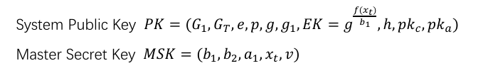

## 前置工作

### 导包

在`maven`中添加配置

```xml
<dependency>
    <groupId>jpbc.api</groupId>
    <artifactId>api</artifactId>
    <version>2.0.0</version>
    <scope>system</scope>
    <systemPath>${pom.basedir}/lib/jpbc-api-2.0.0.jar</systemPath>
</dependency>

<dependency>
    <groupId>jpbc-plaf</groupId>
    <artifactId>plaf</artifactId>
    <version>2.0.0</version>
    <scope>system</scope>
    <systemPath>${pom.basedir}/lib/jpbc-plaf-2.0.0.jar</systemPath>
</dependency>
```

在项目根目录新建目录 lib，将`jpbc-api-2.0.0.jar`和`jpbc-plaf-2.0.0.jar`放入，然后在 IDEA 添加外部包`File -> Project Structure -> Libraries`，点击 + 号，选择 Java，将 lib 目录添加，即可

### 使用较小的阶

为了方便测试时间，选择使用较小阶的循环群，这里需要使用 JPBC 自带的参数生成函数

```java
public static void genParams(){
    // 初始化 type a 类型曲线
    PairingParametersGenerator pg = new TypeACurveGenerator(8, 16);
    // 生成参数
    PairingParameters params = pg.generate();
    // 打印参数
    System.out.println(params.toString());
}
```

8 为整数群的阶数

## 双线性配对Ⅰ

### 系统初始化

系统公钥和私钥
$$
mpk = (G_1,G_2,G_T,g_1,g_2,h,(h_1,h_2,...,h_n))\\\\
msk = (v,(s_1,s_2,...,s_n),(t_1,t_2,...,t_n))
$$
其中

- n 是一个定长，用于将不同的关键字进行映射（填充）
- G1、G2、GT 均为 type a 的循环群
- g1、g2 分别是 G1 和 G2 上的元素，作为生成元
- v 是整数循环群 Zr 上的随机数，h = g1^v
- hi、si、ti 均为 Zr 上的随机数

### 关键词加密

密文/陷门计算

配对原理


### 陷门生成

### 双线性验证

配对原理


## 双线性配对Ⅱ

### 系统初始化

系统密钥



用户密钥


### 关键词加密

### 陷门生成

### 双线性验证

## 测试
