[Searchable-Encryption-Simulation/BP/simulation/src/main/java/cia/northboat/sim at main · northboat/Searchable-Encryption-Simulation](https://github.com/northboat/Searchable-Encryption-Simulation/tree/main/BP/simulation/src/main/java/cia/northboat/sim)

## PAUKS


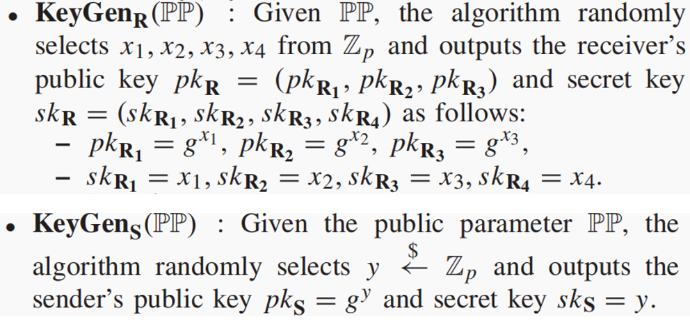

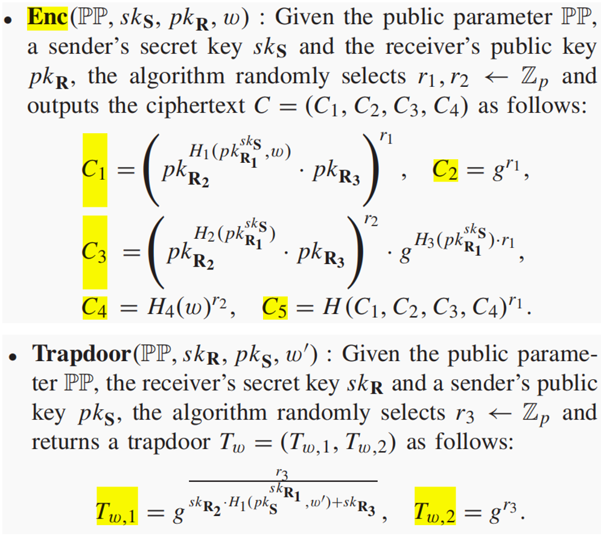

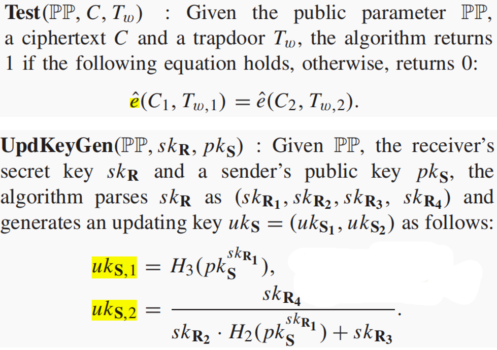

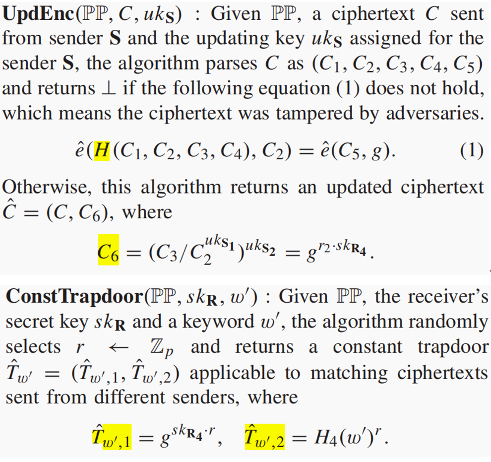

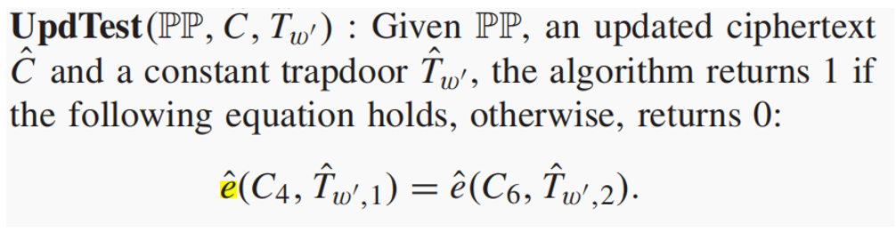


## SA-PAEAK

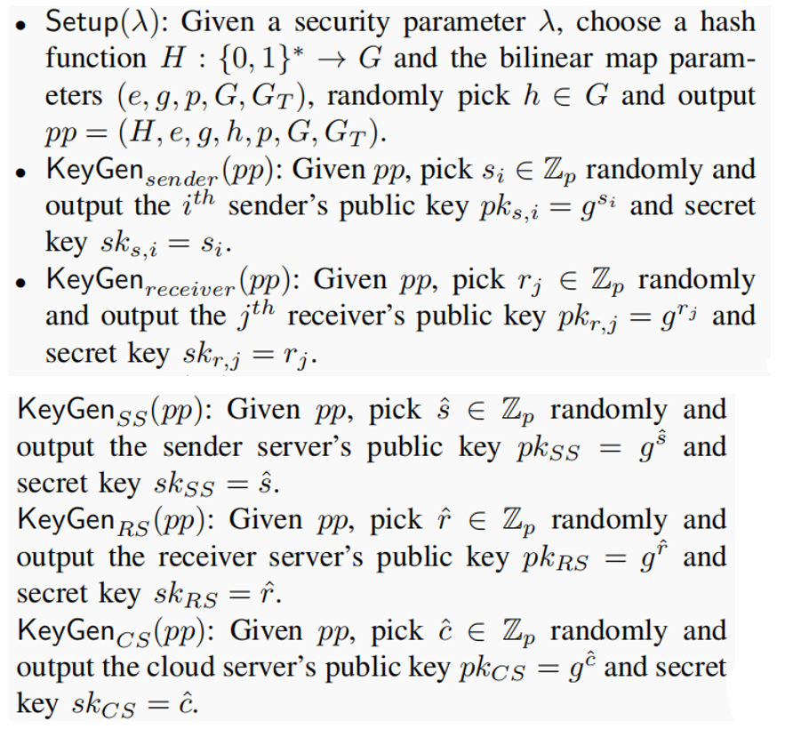

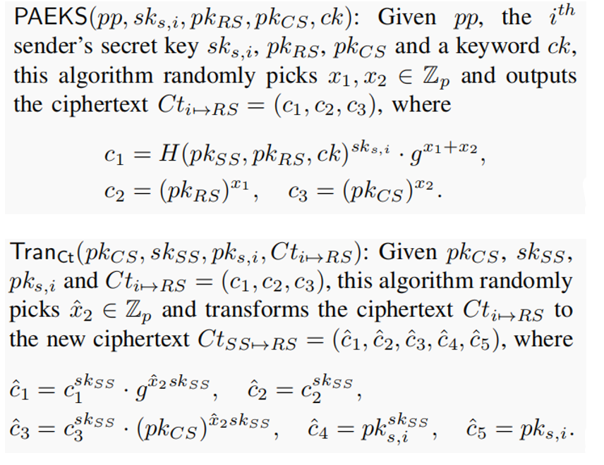

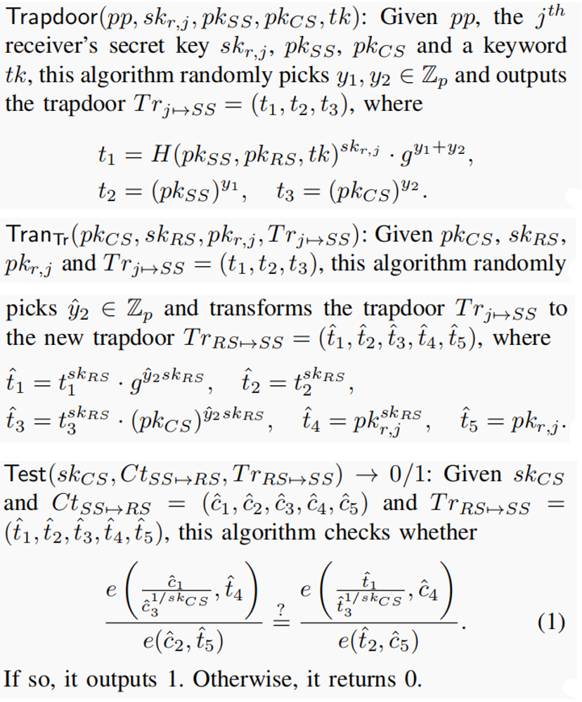

## dIBAEKS

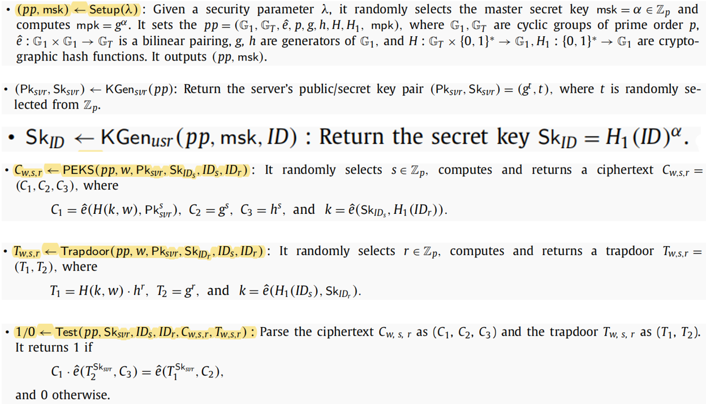

## pMatch

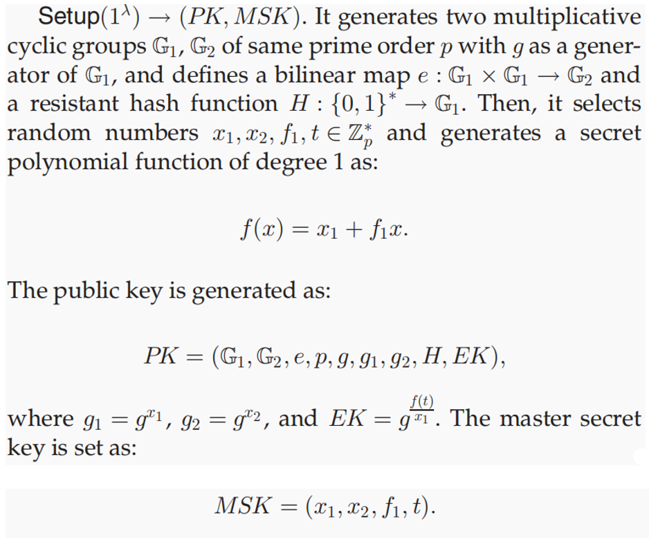

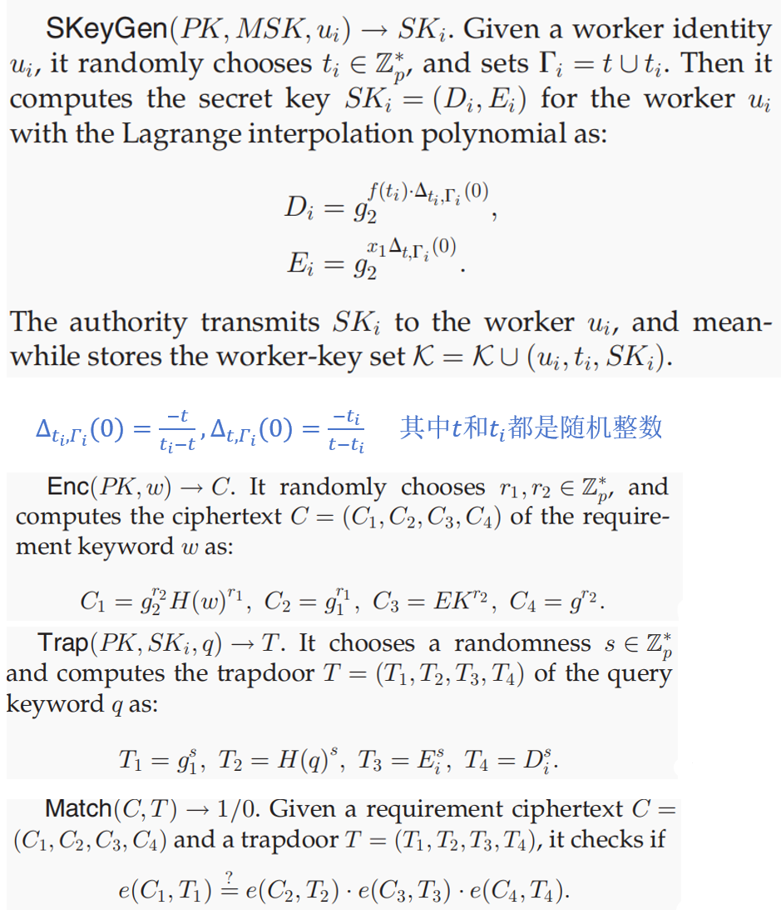

## CR-IMA

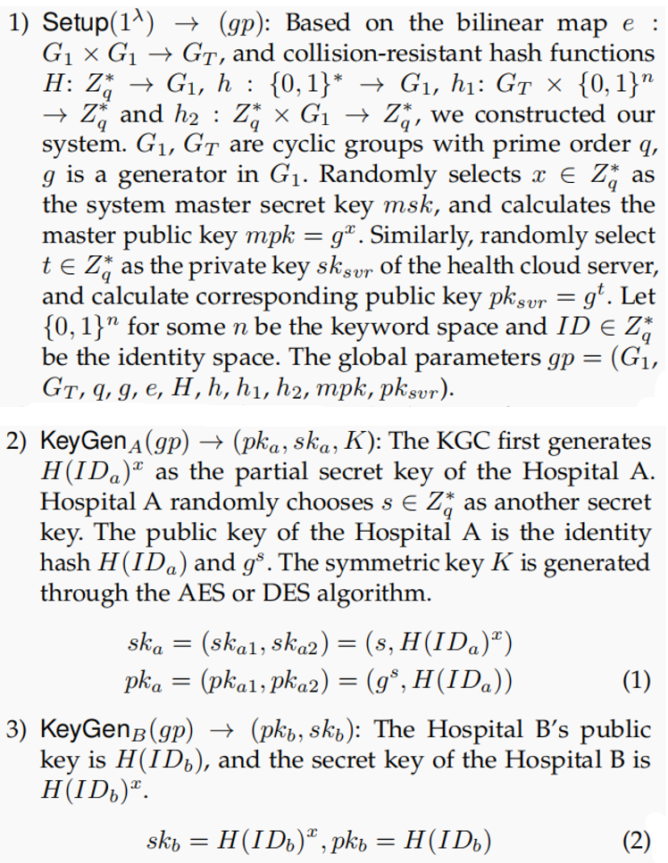

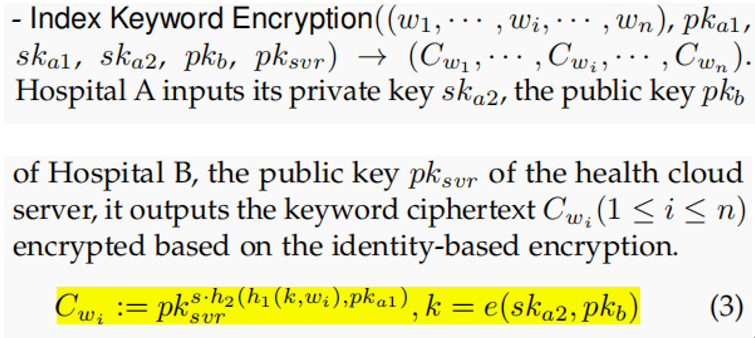

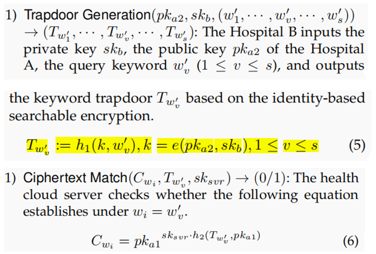

## 工具类

### AES

AESUtil.java 128 位密钥生成、加解密

```java
import javax.crypto.Cipher;
import javax.crypto.KeyGenerator;
import javax.crypto.SecretKey;
import javax.crypto.spec.SecretKeySpec;
import java.security.NoSuchAlgorithmException;
import java.security.SecureRandom;
import java.util.Base64;

public class AESUtil {

    public static byte[] getRandomKey() throws NoSuchAlgorithmException {
        KeyGenerator keyGenerator = KeyGenerator.getInstance("AES");

        // 设置密钥长度和随机源
        keyGenerator.init(128, new SecureRandom());
        // 生成密钥
        SecretKey secretKey = keyGenerator.generateKey();
        // 获取密钥内容
        byte[] key = secretKey.getEncoded();

        System.out.println(Base64.getEncoder().encodeToString(key));

        return key;
    }

    public static byte[] enc(byte[] data, byte[] key) throws Exception {
        SecretKeySpec secretKeySpec = new SecretKeySpec(key, "AES");
        Cipher cipher = Cipher.getInstance("AES/ECB/PKCS5Padding");
        cipher.init(Cipher.ENCRYPT_MODE, secretKeySpec);
        return cipher.doFinal(data);
    }

    public static byte[] dec(byte[] data, byte[] key) throws Exception {
        SecretKeySpec secretKeySpec = new SecretKeySpec(key, "AES");
        Cipher cipher = Cipher.getInstance("AES/ECB/PKCS5Padding");
        cipher.init(Cipher.DECRYPT_MODE, secretKeySpec);
        return cipher.doFinal(data);
    }
}
```

### 矩阵运算

MatrixUtil.java 矩阵求逆、乘法

```java
import it.unisa.dia.gas.jpbc.Field;
import java.math.BigInteger;

public class MatrixUtil {

    public static BigInteger[] getOneVector(int n){
        BigInteger[] b = new BigInteger[n];
        for(int i = 0; i < n; i++){
            b[i] = new BigInteger("1");
        }
        return b;
    }

    public static BigInteger determinant(BigInteger[][] matrix) {
        int n = matrix.length;
        if (n == 1) {
            return matrix[0][0];
        }
        BigInteger det = BigInteger.ZERO;
        BigInteger sign = BigInteger.ONE;
        for (int i = 0; i < n; i++) {
            BigInteger[][] subMatrix = getSubMatrix(matrix, 0, i);
            det = det.add(sign.multiply(matrix[0][i]).multiply(determinant(subMatrix)));
            sign = sign.negate();
        }
        return det;
    }


    public static BigInteger[][] getSubMatrix(BigInteger[][] matrix, int excludingRow, int excludingCol) {
        int n = matrix.length;
        BigInteger[][] subMatrix = new BigInteger[n - 1][n - 1];
        int r = -1;
        for (int i = 0; i < n; i++) {
            if (i == excludingRow) continue;
            r++;
            int c = -1;
            for (int j = 0; j < n; j++) {
                if (j == excludingCol) continue;
                subMatrix[r][++c] = matrix[i][j];
            }
        }
        return subMatrix;
    }

    // 方法：计算伴随矩阵
    public static BigInteger[][] adjugate(BigInteger[][] matrix) {
        int n = matrix.length;
        BigInteger[][] adj = new BigInteger[n][n];
        for (int i = 0; i < n; i++) {
            for (int j = 0; j < n; j++) {
                BigInteger[][] subMatrix = getSubMatrix(matrix, i, j);
                adj[j][i] = ((i + j) % 2 == 0 ? BigInteger.ONE : BigInteger.ONE.negate())
                        .multiply(determinant(subMatrix));
            }
        }
        return adj;
    }


    // 方法：计算逆矩阵
    public static BigInteger[][] inverse(Field Zr, BigInteger[][] matrix) {
        BigInteger det = determinant(matrix);
        det = det.mod(Zr.getOrder());
        System.out.println(det);
        System.out.println();
        if (det.equals(BigInteger.ZERO)) {
            throw new ArithmeticException("Matrix is not invertible.");
        }
        BigInteger[][] adj = adjugate(matrix);
        BigInteger[][] inv = new BigInteger[matrix.length][matrix[0].length];
        for (int i = 0; i < matrix.length; i++) {
            for (int j = 0; j < matrix.length; j++) {
                inv[i][j] = adj[i][j].divide(det);
//                System.out.println(adj[i][j].divide(det));
            }
        }
        return inv;
    }

    public static BigInteger[] mul(BigInteger[][] matrix, BigInteger[] vector){
        int n = matrix.length, m = vector.length;
        BigInteger[] res = new BigInteger[n];
        for(int i = 0; i < n; i++){
            BigInteger row = new BigInteger("0");
            for(int j = 0; j < m; j++){
                row = row.add(matrix[i][j].multiply(vector[j]));
            }
            res[i] = row;
        }
        return res;
    }
}
```

### 位运算

BitUtil.java 级联、异或

```java
import it.unisa.dia.gas.jpbc.Element;
import it.unisa.dia.gas.jpbc.Field;

import java.math.BigInteger;
import java.security.SecureRandom;
import java.util.*;

public class BitUtil {
    public static Element xor(Field Zr, Element e1, Element e2){
        BigInteger i1 = e1.toBigInteger();
        BigInteger i2 = e2.toBigInteger();
        BigInteger res = i1.xor(i2);

        return Zr.newElement(res.mod(Zr.getOrder())).getImmutable();
    }

    public static byte[] connect(byte[] b1, byte[] b2){
        BigInteger bi1 = new BigInteger(b1), bi2 = new BigInteger(b2);
        BigInteger shifted = bi1.shiftLeft(bi2.bitLength());
        BigInteger res =  shifted.or(bi2);
        return res.toByteArray();
    }

    public static Element connect(Field Zr, Element e1, Element e2, Element e3){
        BigInteger b1 = e1.toBigInteger(), b2 = e2.toBigInteger(), b3 = e3.toBigInteger();
        BigInteger shift1 = b1.shiftLeft(b2.bitLength());
        BigInteger or1 = shift1.or(b2);
        BigInteger shift2 = or1.shiftLeft(b3.bitLength());
        BigInteger or2 = shift2.or(b3);

        return Zr.newElement(or2).getImmutable();
    }

    public static Element split(Field Zr, Element msg, Element id, Element sk_id){
        BigInteger m = msg.toBigInteger(), i = id.toBigInteger(), sk = sk_id.toBigInteger();
        int ptLen = m.bitLength() - i.bitLength() - sk.bitLength();


        BigInteger shift = m.shiftRight(sk.bitLength());
        BigInteger mask = BigInteger.ONE.shiftLeft(ptLen).subtract(BigInteger.ONE);
        BigInteger and = shift.and(mask);

        return Zr.newElement(and).getImmutable();
    }


    public static Element random(Field Zr, int q){
        SecureRandom random = new SecureRandom();
        BigInteger randomBigInt = new BigInteger(q, random);
        return Zr.newElement(randomBigInt).getImmutable();
    }

    public static void main(String[] args) {
        int[] nums = {1,2,3,4};
        int n = nums.length;
        List<Integer> r = Arrays.asList(1,2,3,4);
        System.out.println();
        Map<Integer, Integer> map = new HashMap<>();
        
    }
}
```

### 映射

HashUtil.java 在循环群 G、GT、Zr 之间相互映射

```java
import it.unisa.dia.gas.jpbc.Element;
import it.unisa.dia.gas.jpbc.Field;

import java.math.BigInteger;

public class HashUtil {

    // 字符串映射，通过 ASCII 码将每个字符映射到 Zr 群上
    // 映射为 Zr 群上的整数数组，但文献上给的 {0,1} 串（可能是布隆过滤器）
    public static Element[] hashStr2ZrArr(Field Zr, String word, int n){
        Element[] W = new Element[n];
        for(int i = 0; i < n; i++){
            if(i >= word.length()){
                W[i] = Zr.newZeroElement().getImmutable();
                continue;
            }
            // ASCII 码
            int number = word.charAt(i);
            W[i] = Zr.newElement(number).getImmutable();
        }
        return W;
    }


    // 四个 G 上的元素通过累乘哈希为一个 G 上的元素
    public static Element hash4G(Element g1, Element g2, Element g3, Element g4){
        return g1.mul(g2).mul(g3).mul(g4).getImmutable();
    }

    // 将 Zr 群上的数组 w 通过 G 上的生成元 g 映射为 Zr 群上的单个元素
    public static Element hashZrArr2Zr(Field Zr, Element g, Element[] w){
        Element h = g.duplicate();
        for(Element e: w){
            h.powZn(e);
        }
//        System.out.println(h);
        return HashUtil.hashG2Zr(Zr, h);
    }

    // 将 G 上元素 e 映射到 Zr 群上
    public static Element hashG2Zr(Field Zr, Element e){
        byte[] hash = e.toBytes();
        return Zr.newElementFromHash(hash, 0, hash.length).getImmutable();
    }

    // 把 Zr 群上元素 r 通过 G 上生成元 g 映射到 G 上
    public static Element hashZr2G(Element g, Element r){
        return g.powZn(r).getImmutable();
    }

    // 通过生成元 g 把 {0,1}* 映射到 G 上
    public static Element hashZrArr2G(Element g, Element[] w){
        Element h = g.duplicate();
        for(Element e: w){
            h.powZn(e);
        }
        return h.getImmutable();
    }

    public static Element hashZrArr2GWithTwoFact(Element pk1, Element pk2, Element[] w){
        Element h = pk1.mul(pk2).duplicate();
        for(Element e: w){
            h.powZn(e);
        }
        System.out.println(h);
        return h;
    }


    // 将 GT 上元素 gt 和 Zr 群上数组 w 映射到群 G 上
    public static Element hashGT2GWithZrArr(Field G, Element gt, Element[] w){
        Element h = gt.duplicate();
        for(Element e: w){
            h.powZn(e);
        }
        byte[] bytes = h.toBytes();
        return G.newElementFromHash(bytes, 0, bytes.length).getImmutable();
    }

    public static Element hashGT2G(Field G, Element gt){
        byte[] bytes = gt.toBytes();
        return G.newElementFromHash(bytes, 0, bytes.length).getImmutable();
    }

    public static Element hashG2ZrWithZr(Field Zr, Element g, Element r){
        return hashG2Zr(Zr, g.powZn(r)).getImmutable();
    }

    // 将 GT 上元素 gt 映射为 log(q) 位的 Zr 上的整数元素
    public static Element hashGT2ZrWithQ(Field Zr, Element gt, int q){
        byte[] bytes = gt.toBytes();
        BigInteger b = new BigInteger(1, bytes);
        BigInteger qMask = BigInteger.ONE.shiftLeft(q).subtract(BigInteger.ONE); // log(q)位掩码
        BigInteger truncatedHash = b.and(qMask);
        return Zr.newElement(truncatedHash).getImmutable();
    }
}
```

