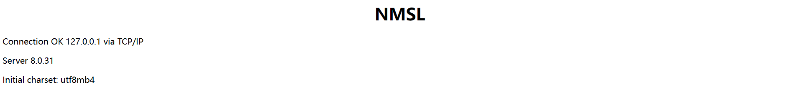

## 概述与安装

### PHP 概述

PHP（Hypertext Preprocessor），超文本预处理器，原名 Personal Home Page，是一种创建动态交互性站点的强有力的服务器端的开源脚本语言

- PHP 文件可包含文本、HTML、JavaScript代码和 PHP 代码
- PHP 代码在服务器上执行，结果以纯 HTML 形式返回给浏览器

有点像 JS？但功能更强大，可以面向过程和对象，属 C 语言系，内核为 C，效率不错

### 安装和配置

> 在windows下将Apache+PHP+Mysql 集成环境，拥有简单的图形和菜单安装和配置环境。PHP扩展、Apache模块，开启/关闭鼠标点点就搞定，再也不用亲自去修改配置文件了，WAMP它会去做。再也不用到处询问php的安装问题了，wampserver一切都搞定了。这个软件是完全免费的，可以在其官方网站下载到最新的版本。本文中使用的版本是WampServer 2.0f（发布日期2008年12月16日），其中包括Apache 2.2.11，PHP 5.2.8，MySQL 5.1.30

PHP 服务器组件：Windows 系统可以使用 WampServer，下载地址：http://www.wampserver.com/，支持32位和64位系统，根据自己的系统选择版本

下载完成后，启动 wampmanager.exe，这时将启动一系列服务


通过`localhost/index.php`将可以访问到 wamp 根目录 www 目录下的动态 html 文件（php 文件通过 apache 服务器渲染结果）

IDE：PhpStorm，下载地址：http://www.jetbrains.com/phpstorm/download/，收费

或者用 VSCode，相关插件


它甚至内置了 MySQL，是不是意味着我根本不需要再装了？我 Java 也用这个数据库就是了，这么舒服？

## 基础语法

就是在 HTML 页面里面嵌入 PHP 代码

test_mysql.php

```php
<?php
echo '<h1><center>NMSL<center></h1>';

$user = 'root';
$password = '';
$database = '';
$port = NULL;
$mysqli = new mysqli('127.0.0.1', $user, $password, $database, $port);

if ($mysqli->connect_error) {
    die('Connect Error (' . $mysqli->connect_errno . ') '
            . $mysqli->connect_error);
}
echo '<p>Connection OK '. $mysqli->host_info.'</p>';
echo '<p>Server '.$mysqli->server_info.'</p>';
echo '<p>Initial charset: '.$mysqli->character_set_name().'</p>';

$mysqli->close();
?>
```



## PHP-WebShell

