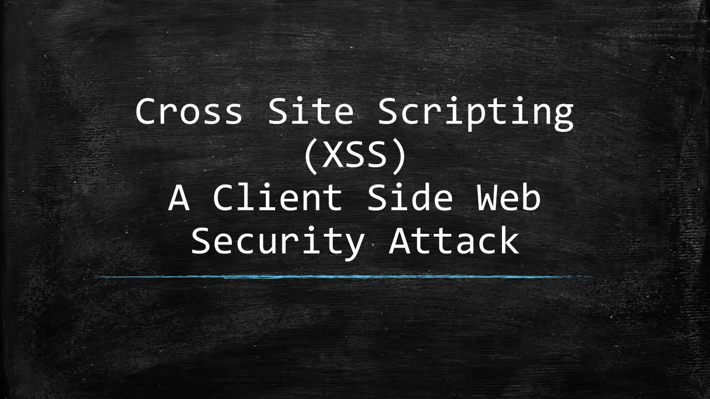

## Hacker 101

[Hacker101 CTF](https://ctf.hacker101.com/ctf)

### XSS

跨站脚本漏洞



#### Micro-CMS v1

CMS（Content Management System）：网站内容管理系统

通过js脚本直接注入html，这是最简单常用的POC（Proof of Concept，漏洞验证）

```html
<script>alert(\xss)</script>
```

通过 img 标签的错误事件（随便请求一张图片）注入js事件

```html
 
```

## We Chall

[WeChall](https://www.wechall.net/)

### Training

#### Training: Get Sourced

`F12`查看`HTML`源码，答案写在注释里，藏在`body`的右下方

~~~html
<!-- Now this is a comment! -->
<!-- You are looking for this password: html_sourcecode -->       
</body></html>
~~~

#### Training: Stegano Ⅰ

通过`html`代码找到图片源下载，得到`btegano1.bmp`，直接用记事本或者`notepad++`打开，或修改后缀为`.txt`打开，可得到答案

~~~
BMf       6   (               0                   Look what the hex-edit revealed: passwd:steganoI
~~~

可以用`notepad++`等编辑器打开`bmp`文件，在末尾加入文字信息（若用记事本直接修改将损坏文件）

### SQL

#### Training: MySQL Ⅰ

查看后端源码发现登录的`SQL`语句是这么写的，同时发现了管理员用户名`admin`

~~~php
$query = "SELECT * FROM users WHERE username='$username' AND password='$password'";
~~~

可以在传入用户名时动手脚

1、传入`admin'#`，这样`sql`语句的字符串将变成

~~~
"select * from users where username='admin''#..."
~~~

于是验证密码的部分被替换为`sql`注释，因为`admin`存在，返回一定为真

2、传入`admin' or '1`

~~~sql
select * from users where username='admin' or '1' and password='$password'
~~~

同样因为掺入了`1`，于是返回始终为真

### Crypto

#### Training:  Crypto-Caesar Ⅰ

简单的古典密码解密，给定一串码

~~~
PDA MQEYG XNKSJ BKT FQILO KRAN PDA HWVU ZKC KB YWAOWN WJZ UKQN QJEMQA OKHQPEKJ EO BWCYZILHHNKW
~~~

合理猜测每个字母加上一个相同的数变为当前码，如`A+2=C, Z+1=A`

于是编写程序列出总共26种可能性，同时将大写转小写便于阅读

python 代码

~~~python
code = "LZW IMAUC TJGOF XGP BMEHK GNWJ LZW DSRQ VGY GX USWKSJ SFV QGMJ MFAIMW KGDMLAGF AK YZJJKAKWUUKH"
i = 0
while i < 26:
    print(i+1, end='.')
    for c in code:
        if c == ' ':
            print(c, end='')
            continue
        print(chr(97+(ord(c)-65+i)%26),end="")
    i += 1
    print('\n')
~~~

从 26 句中找到有意义的一行

~~~
the quick brown fox jumps over the lazy dog of caesar and your unique solution is ghrrsiseccsp
~~~

密码为

~~~
ghrrsiseccsp
~~~

### Encode

#### Encodings: URL

给定一串`URL`码

~~~
%59%69%70%70%65%68%21%20%59%6F%75%72%20%55%52%4C%20%69%73%20%63%68%61%6C%6C%65%6E%67%65%2F%74%72%61%69%6E%69%6E%67%2F%65%6E%63%6F%64%69%6E%67%73%2F%75%72%6C%2F%73%61%77%5F%6C%6F%74%69%6F%6E%2E%70%68%70%3F%70%3D%64%64%6F%65%70%61%6C%68%65%61%73%68%26%63%69%64%3D%35%32%23%70%61%73%73%77%6F%72%64%3D%66%69%62%72%65%5F%6F%70%74%69%63%73%20%56%65%72%79%20%77%65%6C%6C%20%64%6F%6E%65%21
~~~

URL实际上就是16进制的ASCII码，每个字符通过%分隔开

直接在控制台用js当然也是可以的，调用`decodeURL()`函数

~~~js
url = '%59%69%70%70%65%68%21%20%59%6F%75%72%20%55%52%4C%20%69%73%20%63%68%61%6C%6C%65%6E%67%65%2F%74%72%61%69%6E%69%6E%67%2F%65%6E%63%6F%64%69%6E%67%73%2F%75%72%6C%2F%73%61%77%5F%6C%6F%74%69%6F%6E%2E%70%68%70%3F%70%3D%64%64%6F%65%70%61%6C%68%65%61%73%68%26%63%69%64%3D%35%32%23%70%61%73%73%77%6F%72%64%3D%66%69%62%72%65%5F%6F%70%74%69%63%73%20%56%65%72%79%20%77%65%6C%6C%20%64%6F%6E%65%21'
'%59%69%70%70%65%68%21%20%59%6F%75%72%20%55%52%4C%20%69%73%20%63%68%61%6C%6C%65%6E%67%65%2F%74%72%61%69%6E%69%6E%67%2F%65%6E%63%6F%64%69%6E%67%73%2F%75%72%6C%2F%73%61%77%5F%6C%6F%74%69%6F%6E%2E%70%68%70%3F%70%3D%64%64%6F%65%70%61%6C%68%65%61%73%68%26%63%69%64%3D%35%32%23%70%61%73%73%77%6F%72%64%3D%66%69%62%72%65%5F%6F%70%74%69%63%73%20%56%65%72%79%20%77%65%6C%6C%20%64%6F%6E%65%21'
answer = decodeURI(url)
'Yippeh! Your URL is challenge%2Ftraining%2Fencodings%2Furl%2Fsaw_lotion.php%3Fp%3Dddoepalheash%26cid%3D52%23password%3Dfibre_optics Very well done!'
~~~

#### Training: ASCII

给定一串ASCII码

~~~
84, 104, 101, 32, 115, 111, 108, 117, 116, 105, 111, 110, 32, 105, 115, 58, 32, 98, 109, 97, 108, 114, 110, 114, 97, 103, 103, 115, 114
~~~

js 解码

```js
ascii = [84, 104, 101, 32, 115, 111, 108, 117, 116, 105, 111, 110, 32, 105, 115, 58, 32, 98, 109, 97, 108, 114, 110, 114, 97, 103, 103, 115, 114]
res = ""
for(let i in ascii){
    res += String.fromCodePoint(ascii[i])
}
console.log(res);
```

得到

```
The solution is:bmalrnraggsr
```

故密码为

```
bmalrnraggsr
```

## Code Audit

> 什么年代，还在用传统方法审计

### PHP

#### 概述

PHP（Hypertext Preprocessor），超文本预处理器，原名 Personal Home Page，是一种创建动态交互性站点的强有力的服务器端的开源脚本语言

- PHP 文件可包含文本、HTML、JavaScript代码和 PHP 代码
- PHP 代码在服务器上执行，结果以纯 HTML 形式返回给浏览器

有点像 JS？但功能更强大，可以面向过程和对象，属 C 语言系，内核为 C，效率不错

#### 环境配置

> 在windows下将Apache+PHP+Mysql 集成环境，拥有简单的图形和菜单安装和配置环境。PHP扩展、Apache模块，开启/关闭鼠标点点就搞定，再也不用亲自去修改配置文件了，WAMP它会去做。再也不用到处询问php的安装问题了，wampserver一切都搞定了。这个软件是完全免费的，可以在其官方网站下载到最新的版本。本文中使用的版本是WampServer 2.0f（发布日期2008年12月16日），其中包括Apache 2.2.11，PHP 5.2.8，MySQL 5.1.30

PHP 服务器组件：Windows 系统可以使用 WampServer，下载地址：http://www.wampserver.com/，支持32位和64位系统，根据自己的系统选择版本

下载完成后，启动 wampmanager.exe，这时将启动一系列服务


通过`localhost/index.php`将可以访问到 wamp 根目录 www 目录下的动态 html 文件（php 文件通过 apache 服务器渲染结果）

IDE：PhpStorm，下载地址：http://www.jetbrains.com/phpstorm/download/，收费

或者用 VSCode，相关插件


它甚至内置了 MySQL，是不是意味着我根本不需要再装了？我 Java 也用这个数据库就是了，这么舒服？

#### 语法

就是在 HTML 页面里面嵌入 PHP 代码

test_mysql.php

```php
<?php
echo '<h1><center>NMSL<center></h1>';

$user = 'root';
$password = '';
$database = '';
$port = NULL;
$mysqli = new mysqli('127.0.0.1', $user, $password, $database, $port);

if ($mysqli->connect_error) {
    die('Connect Error (' . $mysqli->connect_errno . ') '
            . $mysqli->connect_error);
}
echo '<p>Connection OK '. $mysqli->host_info.'</p>';
echo '<p>Server '.$mysqli->server_info.'</p>';
echo '<p>Initial charset: '.$mysqli->character_set_name().'</p>';

$mysqli->close();
?>
```


#### WebShell

### Rust

#### 概述

> Rust 语言由 Mozilla 开发，最早发布于 2014 年 9 月。Rust 的编译器是在 MIT License 和 Apache License 2.0 双重协议声明下的免费开源软件
>
> [Rust 官方在线工具](https://play.rust-lang.org/)

Rust 语言是一种高效、可靠的通用高级语言。其高效不仅限于开发效率，它的执行效率也是令人称赞的，是一种少有的兼顾开发效率和执行效率的语言

Rust 语言可用于开发

- **传统命令行程序** - Rust 编译器可以直接生成目标可执行程序，不需要任何解释程序
- **Web 应用** - Rust 可以被编译成 WebAssembly，WebAssembly 是一种 JavaScript 的高效替代品
- **网络服务器** - Rust 用极低的资源消耗做到安全高效，且具备很强的大规模并发处理能力，十分适合开发普通或极端的服务器程序。
- **嵌入式设备** - Rust 同时具有 JavaScript 一般的高效开发语法和 C 语言的执行效率，支持底层平台的开发

#### 环境配置

Manjaro 下使用官方脚本

```sh
curl --proto '=https' --tlsv1.2 -sSf https://sh.rustup.rs | sh
```

更新环境变量

```sh
source ~/.profile
source ~/.cargo/env
```

测试

```sh
rustc --version
cargo --version
```

第一个 rust 程序：hello.rs

```rust
fn main() {
    println!("Hello World!");
}
```

编译执行

```bash
rustc hello.rs
./hello
```

下载 vscode

```sh
yay -S visual-studio-code-bin
```

下载插件：Chinese、rust-analyzer、Native Debug

#### Cargo

使用 Cargo 构建 rust 工程

新建文件夹`runoob-greeting`，通过 vscode 打开，新建终端，新建项目

```sh
cargo new greeing
cd greeing
cargo build
cargo run
```

在 greeing 工程目录下新建 .vscode 文件夹，新建 tasks.json

```json
{ 
    "version":"2.0.0", 
    "tasks":[{ 
        "label":"build", 
        "type":"shell", 
        "command":"cargo", 
        "args":["build"] 
    }] 
}
```

新建 launch.json

```json
{
    "version": "0.2.0",
    "configurations": [
        {
            "name": "Debug",
            "type": "gdb",
            "preLaunchTask":"build",
            "request": "launch",
            "target": "${workspaceFolder}/target/debug/${workspaceFolderBasename}",
            "cwd":"${workspaceFolder}"
        }
    ]
}
```

运行后，可执行文件将生成在 greeing/target/debug 目录下，直接执行即可

#### 语法
